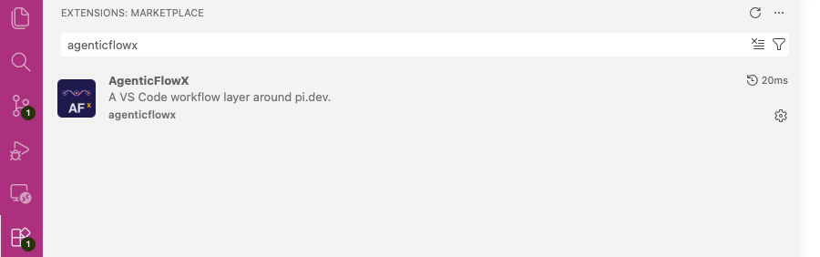
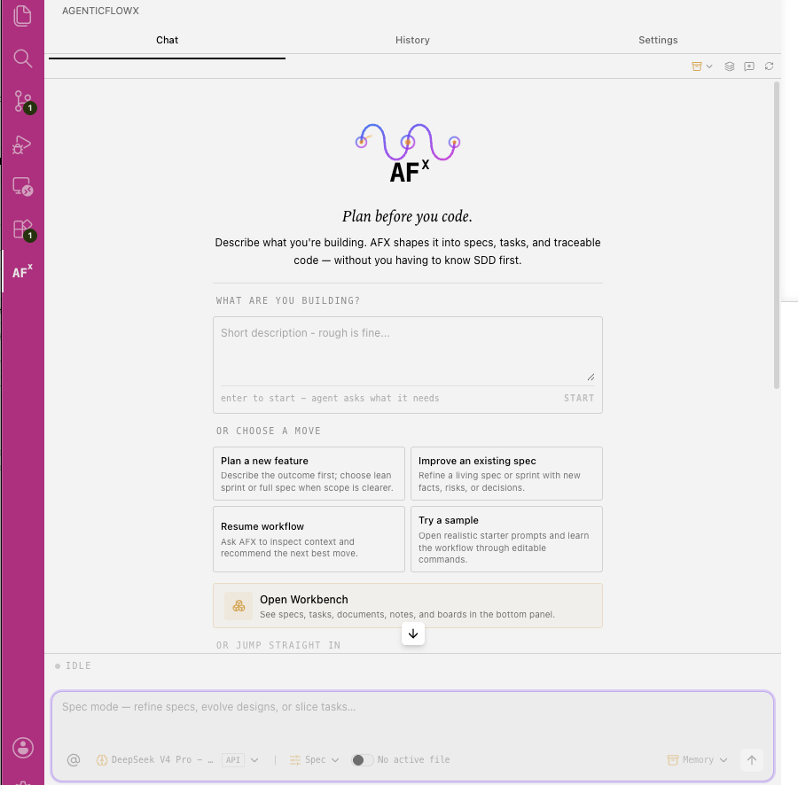
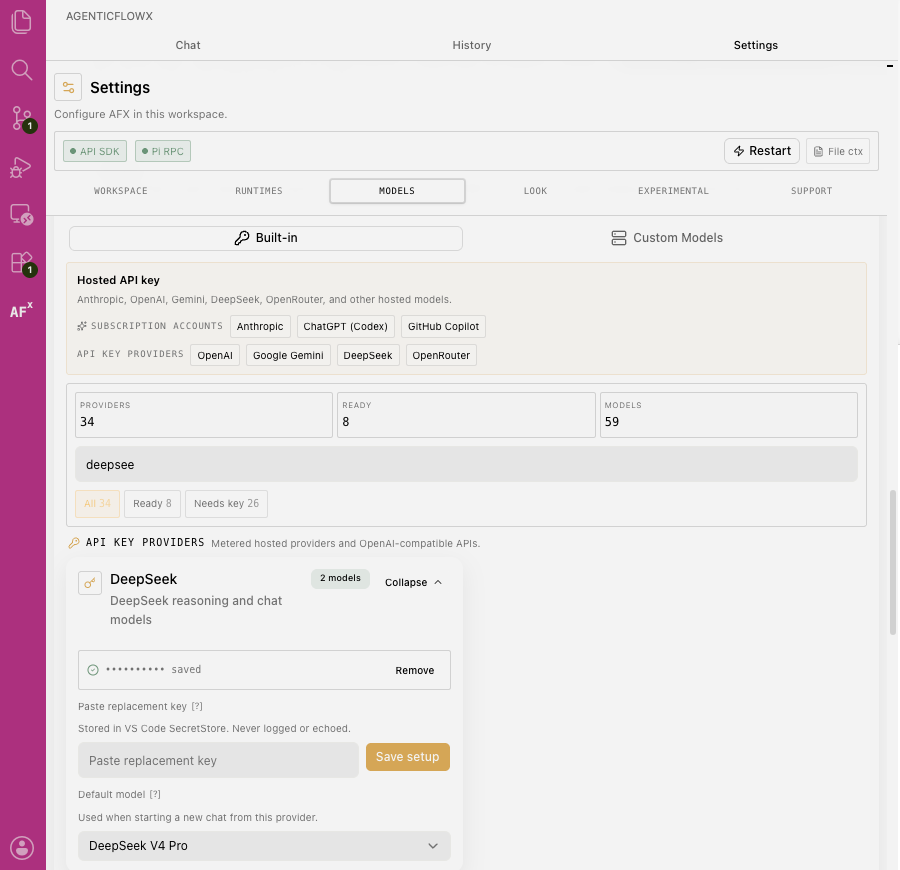
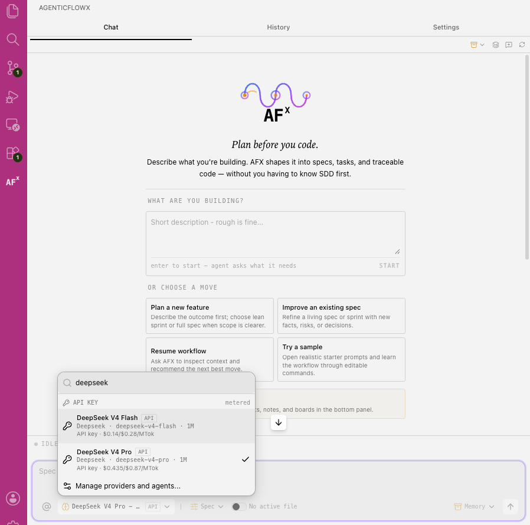

[English](./agenticflowx.md) | [简体中文](./agenticflowx.zh-CN.md) · [← Back](../README.zh-CN.md)

# 接入 AgenticFlowX

[AgenticFlowX](https://github.com/AgenticFlowX/agenticflowx)（AFX）是一款面向 VS Code 的规范驱动（spec-driven）AI 编程扩展。你既可以把它当作聊天优先的日常编程助手，也可以切换到 **Spec 模式**，进入规划优先的工作流 —— 需求、设计、任务与可追溯的日志全部保存在你的代码仓库中。DeepSeek 是其**内置 Provider**，因此只需一个 API Key，就能让整套工作流跑在 DeepSeek-V4 上。

- **GitHub：** <https://github.com/AgenticFlowX/agenticflowx>
- **官网：** <https://agenticflowx.github.io>

#### 1. 安装扩展

在扩展（Extensions）视图中搜索 **AgenticFlowX**，从 [VS Code Marketplace](https://marketplace.visualstudio.com/items?itemName=AgenticFlowX.agenticflowx) 或 [Open VSX](https://open-vsx.org/extension/agenticflowx/agenticflowx) 安装（需要 VS Code `1.105+`）。

安装完成后，点击活动栏中的 **AgenticFlowX** 图标打开聊天面板。

#### 2. 添加 DeepSeek API Key

DeepSeek 是内置 Provider —— 无需自定义接入地址、Base URL 或配置文件。

1. 在 AFX 聊天面板中打开 **Settings → Models → Built-in**。
2. 在 **API key providers** 分组下找到 **DeepSeek** 卡片并展开。
3. 前往 [DeepSeek 开放平台](https://platform.deepseek.com/api_keys) 获取 API Key，粘贴到密钥输入框，点击 **Save setup**。密钥保存在 VS Code SecretStorage 中 —— 不会被记录或回显。
4. 将 **Default model** 设置为 **DeepSeek V4 Pro**（`deepseek-v4-pro`）。同时也可选用 **DeepSeek V4 Flash**（`deepseek-v4-flash`），以获得更快、更低成本的响应。

DeepSeek 运行在 AFX 内置的 API Providers 运行时上，无需额外安装任何 CLI。

#### 3. 选择 DeepSeek 并开始编码

在聊天输入框的模型选择器中选择 **DeepSeek V4 Pro**（或 **DeepSeek V4 Flash**）—— 每个模型条目都会标注其 `1M` 上下文窗口与每百万 token（MTok）的价格。显示价格来自 AFX 内置的模型元数据；最新官方价格请以 [DeepSeek 价格页](https://api-docs.deepseek.com/zh-cn/quick_start/pricing) 为准。随后即可直接提问、用 `@path/to/file` 引用文件作为上下文，或在编辑器中右键选中代码并选择 **AgenticFlowX → Send Selection**。

#### 4. 推理强度与 100 万上下文

DeepSeek V4 原生支持最高 **100 万 token** 的上下文窗口 —— 在选择器中每个 DeepSeek 模型旁都会标注 `1M`，开箱即可使用完整窗口。

如需在复杂编码任务中获得最强推理表现，将 **Thinking level** 设为 **Extra High**（或用 **High** 获得更短的响应）。你可以在输入框模型选择器顶部按单次对话切换，也可以在 **Settings → Runtimes → Thinking level** 中设置工作区默认值。
