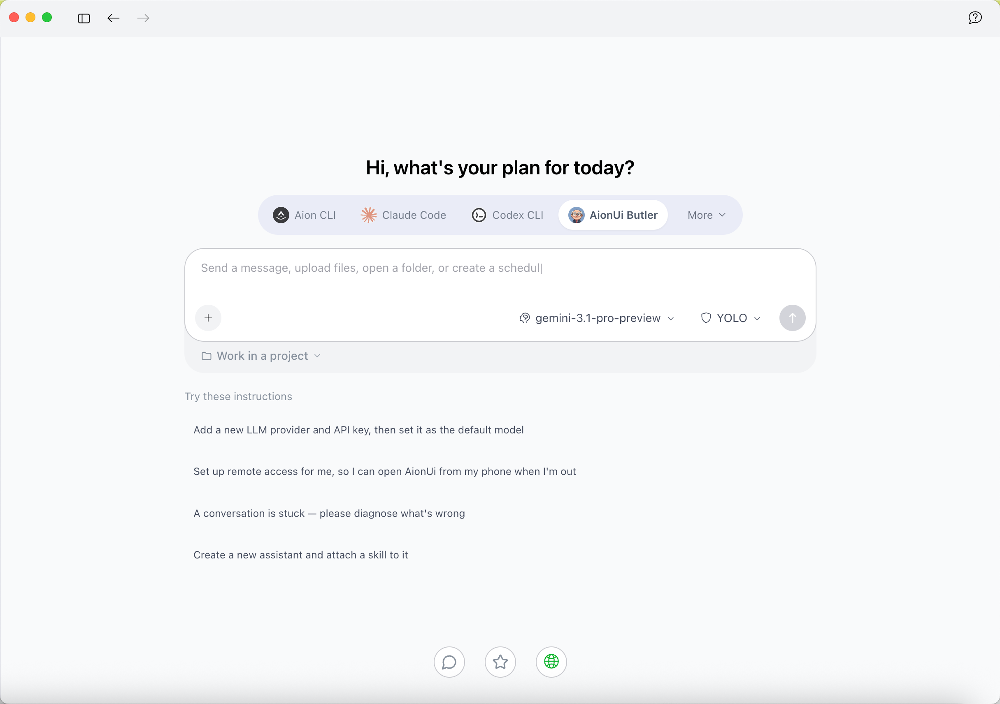
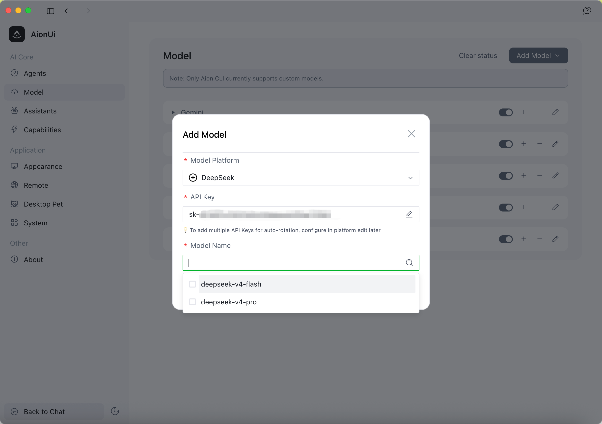
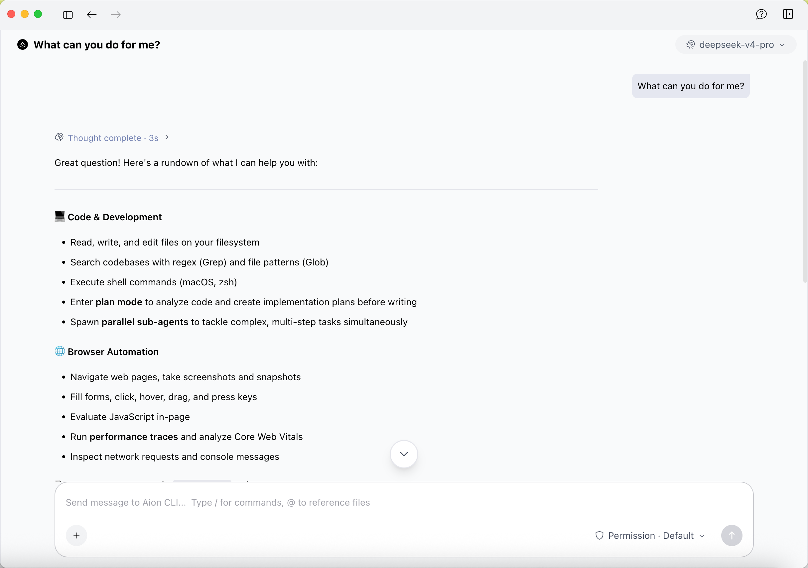

[English](./aionui.md) | [简体中文](./aionui.zh-CN.md) · [← Back](../README.md)

# Integrate with AionUi

[AionUi](https://github.com/iOfficeAI/AionUi) is a free, open-source **Cowork app with multiple AI Agents**, available on macOS, Windows, and Linux. Unlike a plain chat window, AionUi lets multiple agents work alongside you on your own computer — reading files, writing code, browsing the web, generating Office documents and slides, and running 24/7 automated tasks — while you watch every step and stay in control. It works with any API key, so you can drive your agents with DeepSeek in just a few minutes. Learn more on the [official website](https://www.aionui.com).

#### 1. Install AionUi

Download the latest release for your platform from the [AionUi Releases page](https://github.com/iOfficeAI/AionUi/releases) and install it. AionUi ships prebuilt binaries for macOS, Windows, and Linux — no extra setup required.

#### 2. Configure the DeepSeek Provider

1. Open **Settings → Model**, then click **Add Model**.
2. For **Model Platform**, select **DeepSeek** from the built-in list (the DeepSeek API host is configured for you).
3. Paste your **API Key** from the [DeepSeek open platform](https://platform.deepseek.com/).
4. For **Model Name**, pick a current DeepSeek model such as `deepseek-v4-pro` or `deepseek-v4-flash`.
5. Save. AionUi validates the key and loads the available models.

#### 3. Start Coworking

Create a new conversation, select your DeepSeek model, and start chatting. Because AionUi is a Cowork app, you can ask the agent to act — open and edit files, run shell commands, browse the web, or generate a slide deck — and review each action it takes before it runs.

#### 4. Going Further

- **Deep thinking & long context, out of the box**: AionUi talks to the DeepSeek API directly, so DeepSeek V4's native reasoning and its large context window are used as-is — AionUi does not cap the context or disable thinking.
- **24/7 automation**: Use AionUi's scheduled tasks to let your DeepSeek-powered agent run jobs on a cron schedule.
- **Remote access**: Reach your agents from any device through AionUi's built-in remote access.

#### Troubleshooting

- **API key rejected / 401 error**: Double-check the key on the [DeepSeek open platform](https://platform.deepseek.com/) and make sure your account has available balance.
- **Model list does not load after saving**: Confirm the machine can reach `https://api.deepseek.com`, then reopen the Add Model dialog and re-select the DeepSeek platform.
- **Rate limits on a busy key**: AionUi supports adding multiple API keys for automatic rotation — add them later in the DeepSeek platform's edit screen.
