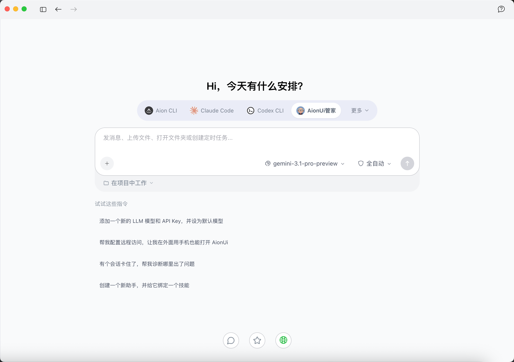
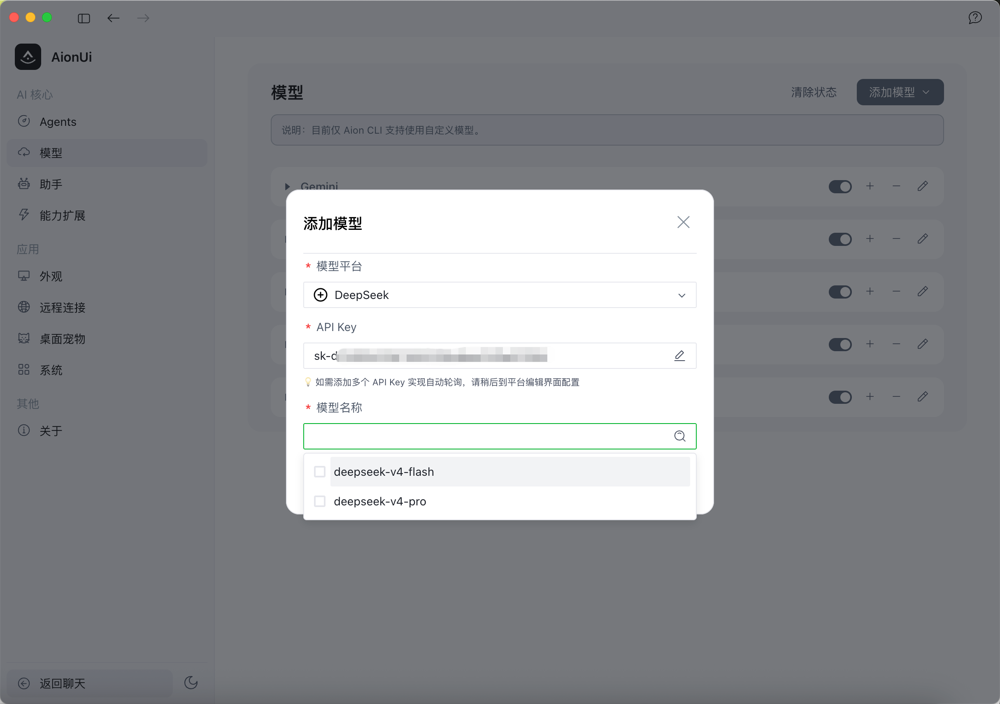
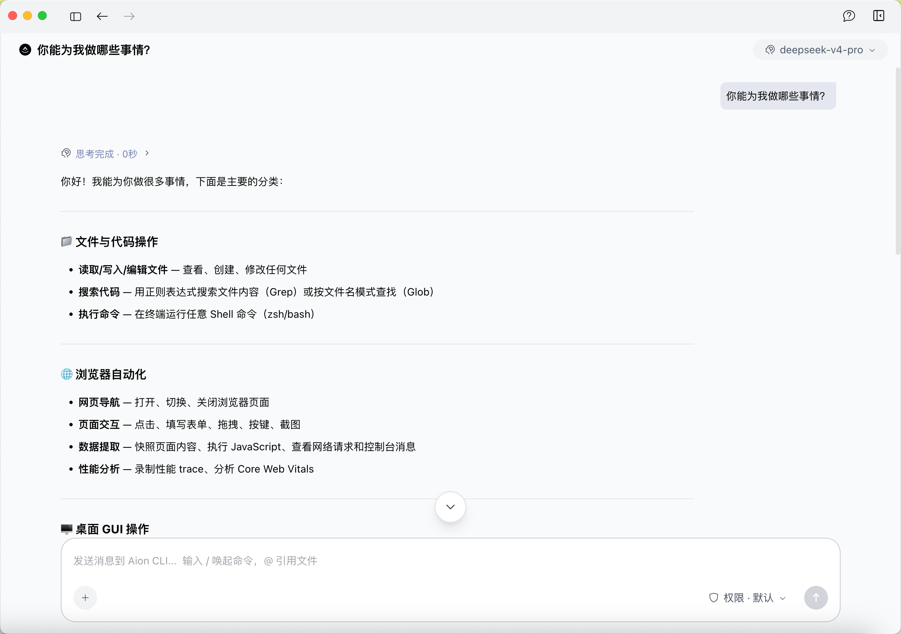

[English](./aionui.md) | [简体中文](./aionui.zh-CN.md) · [← 返回](../README.zh-CN.md)

# 接入 AionUi

[AionUi](https://github.com/iOfficeAI/AionUi) 是一款免费、开源的 **多 AI Agent Cowork（协作）应用**，支持 macOS、Windows 和 Linux。与普通聊天窗口不同，AionUi 让多个 agent 在你自己的电脑上与你协同工作——读写文件、编写代码、浏览网页、生成 Office 文档和幻灯片、运行 7×24 自动化任务——整个过程你都能看到每一步，并始终掌握控制权。它支持任意 API Key，只需几分钟即可用 DeepSeek 驱动你的 agent。更多信息见[官方网站](https://www.aionui.com)。

#### 1. 安装 AionUi

前往 [AionUi Releases 页面](https://github.com/iOfficeAI/AionUi/releases)，下载对应平台的最新版本并安装。AionUi 为 macOS、Windows、Linux 提供预编译安装包，无需额外配置。

#### 2. 配置 DeepSeek 服务商

1. 打开 **设置 → 模型**，点击 **添加模型**。
2. **模型平台** 选择内置列表中的 **DeepSeek**（DeepSeek 的 API Host 已为你配置好）。
3. 填入你在 [DeepSeek 开放平台](https://platform.deepseek.com/) 获取的 **API Key**。
4. **模型名称** 选择当前的 DeepSeek 模型，如 `deepseek-v4-pro` 或 `deepseek-v4-flash`。
5. 保存。AionUi 会校验 Key 并加载可用模型。

#### 3. 开始协作

新建一个会话，选择你的 DeepSeek 模型，即可开始对话。由于 AionUi 是一款 Cowork 应用，你可以直接让 agent 动手——打开并编辑文件、执行命令、浏览网页、生成幻灯片——并在每个操作执行前进行确认。

#### 4. 进阶用法

- **深度思考与长上下文，开箱即用**：AionUi 直连 DeepSeek API，因此 DeepSeek V4 原生的推理能力和大上下文窗口会被原样使用——AionUi 不会限制上下文，也不会关闭思考。
- **7×24 自动化**：使用 AionUi 的定时任务，让 DeepSeek 驱动的 agent 按 cron 计划自动运行。
- **远程访问**：通过 AionUi 内置的远程访问能力，在任意设备上使用你的 agent。

#### 常见问题

- **API Key 被拒 / 报 401**：到 [DeepSeek 开放平台](https://platform.deepseek.com/) 核对 Key 是否正确，并确认账户余额充足。
- **保存后模型列表加载不出来**：确认机器能访问 `https://api.deepseek.com`，然后重新打开「添加模型」弹窗并重新选择 DeepSeek 平台。
- **单个 Key 触发限流**：AionUi 支持添加多个 API Key 实现自动轮询——可稍后到平台编辑界面添加。
