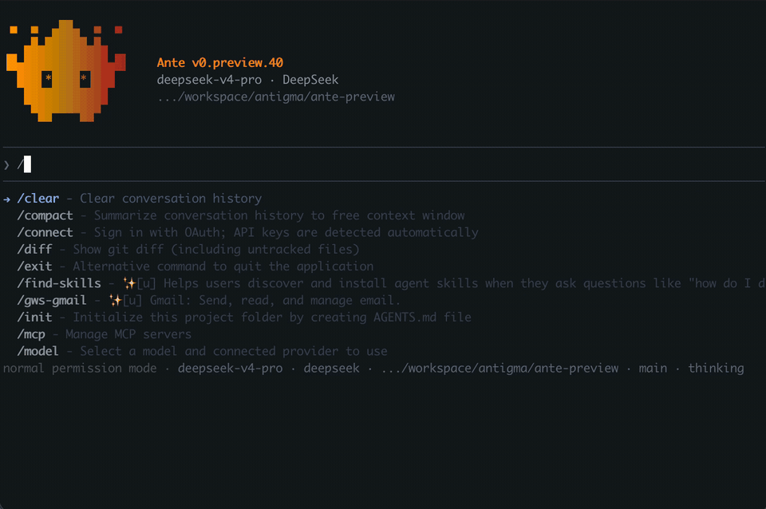

[English](./ante.md) | [简体中文](./ante.zh-CN.md) · [← Back](../README.md)

# Integrate with Ante

> **The agent harness that gets the most out of DeepSeek-V4** — top Terminal-Bench 2.1 results on DeepSeek-V4-Pro, from a 15 MB, dependency-free Rust binary.

Ante is an AI-native, local-first agent runtime by Antigma Labs, shipped as a single self-contained Rust binary with no external dependencies. It is provider-agnostic — every provider and model is resolved from a catalog at session start — and ships a **built-in `deepseek` provider** that talks to `api.deepseek.com` directly, serving **DeepSeek-V4-Pro** and **DeepSeek-V4-Flash** at the full 1M-token context window. You can authenticate via API key, OAuth, or a custom catalog entry, and switch models, providers, and reasoning effort mid-session.

**On Terminal-Bench 2.1, the harness makes the difference.** Independent evaluation by [vals.ai](https://www.vals.ai/benchmarks/terminal-bench-2-1) puts **DeepSeek-V4 at 50.19%** on Terminal-Bench 2.1. Ante drives **DeepSeek-V4-Pro to 64%** — and even **DeepSeek-V4-Flash to 62%** — on the same benchmark (public, reproducible runs on Harbor Hub: [Pro](https://hub.harborframework.com/jobs/b56ccc56-1e77-4ba9-b1b2-3b0df51c4d49), [Flash](https://hub.harborframework.com/jobs/f4c08d76-7d36-4b9e-afe6-0720f20b5269)). Both of Ante's results clear vals.ai's number, so whichever DeepSeek-V4 tier that 50.19% reflects, the harness is doing real work.[^vals] Most of the capability comes from the model, and Ante's job is to channel it faithfully — *improve the harness, not the prompt*. And because Ante is a lean ~15 MB binary with a fraction of the memory and disk footprint of comparable agents, it pairs naturally with DeepSeek's low token cost for cheap, high-volume agent runs.

<div align="center">
  
</div>

- **Docs:** <https://docs.antigma.ai> (alias: <https://ante.run>)
- **GitHub:** <https://github.com/AntigmaLabs/ante-preview>

#### 1. Install Ante

```sh
curl -fsSL https://ante.run/install.sh | bash
```

By default this installs to `~/.ante/bin`. To install elsewhere, set `ANTE_INSTALL_DIR`:

```sh
curl -fsSL https://ante.run/install.sh | ANTE_INSTALL_DIR=/usr/local/bin bash
```

Ante runs on macOS and Linux; on Windows, install from inside **WSL** (or a Git Bash shell).

#### 2. Get a DeepSeek API Key

Get your API Key from the [DeepSeek Platform](https://platform.deepseek.com/api_keys), then export it — the built-in `deepseek` provider reads `DEEPSEEK_API_KEY`:

```sh
export DEEPSEEK_API_KEY="sk-..."
```

#### 3. Run Ante with DeepSeek

The `deepseek` provider is built in, so no catalog edit is needed. Enter your project and launch:

```sh
cd /path/to/my-project

# Interactive TUI on DeepSeek-V4-Pro
ante --provider deepseek --model deepseek-v4-pro

# Or the faster, cheaper Flash model
ante --provider deepseek --model deepseek-v4-flash

# Headless one-shot
ante --provider deepseek --model deepseek-v4-pro -p "add error handling to src/main.rs"
```

Both models run at the **full 1M-token context** out of the box. To make DeepSeek your default (so a bare `ante` uses it), set `provider` and `model` in `~/.ante/settings.json`.

#### 4. Use max reasoning effort

DeepSeek-V4-Pro supports extended reasoning. For the best coding results, run at the **`max`** thinking level. Set it for the session with an environment override:

```sh
MODEL_THINKING=max ante --provider deepseek --model deepseek-v4-pro
```

`MODEL_THINKING` accepts `none`, `enabled`, `deep`, or `max`. To make it permanent, override the model in `~/.ante/catalog.json` (merged on top of the built-in presets at startup):

```json
{
  "models": {
    "deepseek-v4-pro": { "thinking": "Max", "context_limit": 1000000, "max_tokens": 64000 }
  }
}
```

You can also press `/model` inside the TUI to switch models/providers and adjust the thinking budget on the fly.

#### Anthropic wire protocol (alternative)

Ante also speaks the **Anthropic** wire protocol, so you can route through DeepSeek's [Anthropic-compatible endpoint](https://api-docs.deepseek.com/guides/anthropic_api). Add this provider to `~/.ante/catalog.json`:

```json
{
  "providers": {
    "deepseek-anthropic": {
      "id": "deepseek-anthropic",
      "display_name": "DeepSeek (Anthropic wire)",
      "base_url": "https://api.deepseek.com/anthropic",
      "wire_style": "AnthropicMessage",
      "auth": { "header": { "name": "x-api-key", "env_key": "DEEPSEEK_API_KEY" } },
      "preferred_models": [
        {
          "id": "claude-opus-4",
          "display_name": "DeepSeek-V4-Pro (Anthropic wire)",
          "description": "Maps to deepseek-v4-pro on DeepSeek's endpoint",
          "max_tokens": 64000,
          "thinking": "Max"
        }
      ]
    }
  }
}
```

```sh
# Selecting the provider picks the recommended default (claude-opus-4 → deepseek-v4-pro)
ante --provider deepseek-anthropic
```

**Why `claude-opus-4`?** DeepSeek's Anthropic endpoint resolves models by name: `claude-opus-*` → `deepseek-v4-pro`, `claude-sonnet-*` / `claude-haiku-*` → `deepseek-v4-flash`, and any unrecognized name falls back to `deepseek-v4-flash`. The recommended default above uses a `claude-opus-*` name so you reliably get **V4-Pro** rather than a silent downgrade to Flash. For the full **1M-token context**, prefer the native `deepseek` provider in Step 3 — it's the simpler path and the one this guide recommends.

#### Modes & extensions

Ante is more than an interactive TUI — all of these work with the `deepseek` provider selected:

- **Headless** — `ante -p "..."` runs a task and exits; pipe a file in via stdin (`cat src/lib.rs | ante -p "review this"`). See [Headless Mode](https://docs.antigma.ai/usage/headless).
- **Server** — `ante serve` runs a long-lived daemon you can drive programmatically over JSONL. See [Server Mode](https://docs.antigma.ai/usage/serve).
- **MCP** — connect [MCP servers](https://docs.antigma.ai/extend/mcp) to add tools and context.
- **Skills** — extend behavior with portable [Agent Skills](https://docs.antigma.ai/extend/skills).
- **Subagents** — delegate scoped, parallel work to [subagents](https://docs.antigma.ai/extend/subagents).
- **Offline inference** — run GGUF models locally via the built-in llama.cpp engine, no API key needed. See [Offline Mode](https://docs.antigma.ai/experimental/offline).

#### Pricing

Ante calls the DeepSeek API directly through the native `deepseek` provider, so you pay **DeepSeek's standard rates with no markup** — billed to your own DeepSeek account.

| Model | Input (cache miss) | Input (cache hit) | Output |
|---|---|---|---|
| `deepseek-v4-pro` | $0.435 | $0.003625 | $0.87 |
| `deepseek-v4-flash` | $0.14 | $0.0028 | $0.28 |

Per 1M tokens; see the [official DeepSeek pricing](https://api-docs.deepseek.com/quick_start/pricing) for current rates.

#### Configuration reference

| Setting | Where | Notes |
|---|---|---|
| `DEEPSEEK_API_KEY` | env var | API key for the built-in `deepseek` provider |
| `DEEPSEEK_BASE_URL` | env var | Override the API base URL (defaults to `https://api.deepseek.com`) |
| `MODEL_THINKING` | env var | Reasoning effort — `none` / `enabled` / `deep` / `max` |
| `provider` / `model` | `~/.ante/settings.json` | Defaults used when no `--provider`/`--model` flag is passed |
| `providers` / `models` | `~/.ante/catalog.json` | Add/override providers and model defaults (merged over built-ins) |

See the [Providers](https://docs.antigma.ai/configuration/providers) and [Catalog Reference](https://docs.antigma.ai/reference/catalog-reference) docs for the full schema.

[^vals]: Per the [vals.ai Terminal-Bench 2.1 leaderboard](https://www.vals.ai/benchmarks/terminal-bench-2-1), DeepSeek-V4 was evaluated with provider **DeepSeek** and these hyperparameters — Reasoning Effort `max`, Max Output Tokens 384,000, Temperature 1, Top-P / Top-K default. vals.ai doesn't label the V4 tier, but it doesn't matter here: Ante clears 50.19% on **both** tiers — V4-Pro at 64% and V4-Flash at 62%, each at `max` reasoning effort on the same benchmark (Ante builds evaluated 2026-06-16) — so the harness advantage holds regardless of which tier the 50.19% reflects.
