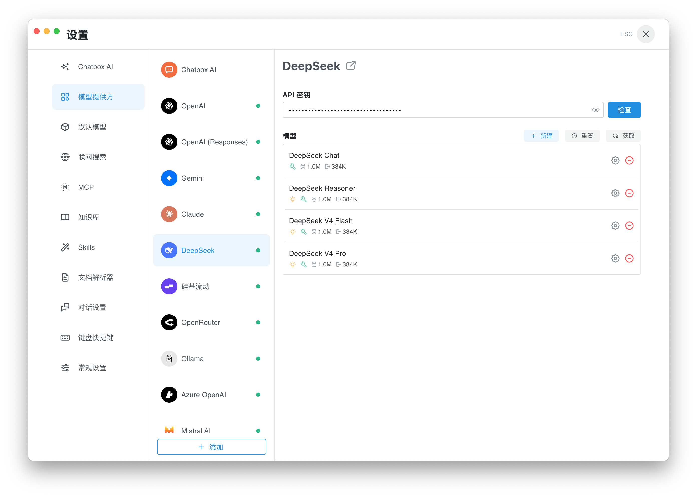

[English](./chatbox.md) | [简体中文](./chatbox.zh-CN.md) · [← Back](../README.md)

# Integrate with Chatbox

Chatbox is an open-source, local-first AI chat client for desktop, web, and mobile. It supports 30+ model providers, knowledge bases, file and link context, MCP servers, prompt management, and multi-model conversations.

- **GitHub:** <https://github.com/chatboxai/chatbox>
- **Website:** <https://chatboxai.app>

#### 1. Install Chatbox

Download Chatbox from the [official website](https://chatboxai.app) or the [GitHub releases page](https://github.com/chatboxai/chatbox/releases).

Available builds:

- Windows (`.exe`)
- macOS (`.dmg` — Intel and Apple Silicon)
- Linux (`.AppImage`)
- iOS / Android

#### 2. Configure the DeepSeek Provider

Open Chatbox, then open **Settings → Model Provider → DeepSeek**.

1. Paste your [DeepSeek API Key](https://platform.deepseek.com/api_keys) into **API Key**.
2. Keep the default DeepSeek API endpoint.
3. Click **Fetch** in the **Model** section if you want to refresh the provider model list.
4. Confirm that **DeepSeek V4 Pro** and **DeepSeek V4 Flash** are available in the model list.

Chatbox's default DeepSeek model list already includes the current V4 models with the right capabilities and limits, including the **1 million token** context window and 384K max output. No manual model-parameter configuration is required.

#### 3. Start Chatting

Return to the main chat view, open the model selector in the input box, and choose **DeepSeek → `deepseek-v4-pro`** or **DeepSeek → `deepseek-v4-flash`**.

Use **`deepseek-v4-pro`** for coding, agentic workflows, and complex reasoning. Use **`deepseek-v4-flash`** for faster everyday chat, summarization, and lightweight tool use.

DeepSeek V4 thinking is enabled by Chatbox when the selected model is marked with the **Reasoning** capability. For the strongest coding experience, keep **Reasoning** enabled on `deepseek-v4-pro`.

#### 4. Going Further

Once DeepSeek V4 is configured, you can use it across Chatbox:

- **Knowledge Bases.** Add local documents to a knowledge base and chat over them with DeepSeek V4.
- **Files and links.** Attach files or paste URLs so Chatbox can include parsed context in the conversation.
- **MCP Servers.** Add MCP servers under **Settings → MCP** so DeepSeek-powered chats can call external tools.
- **Prompt Library.** Save reusable prompts and run them with either DeepSeek V4 model.
