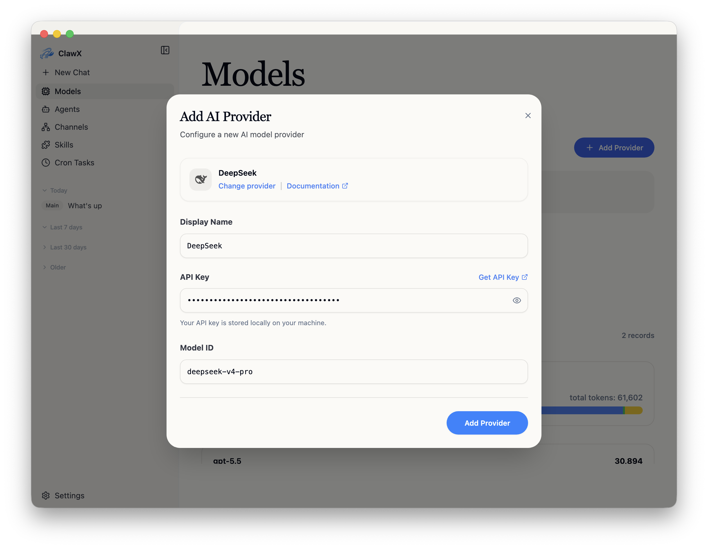
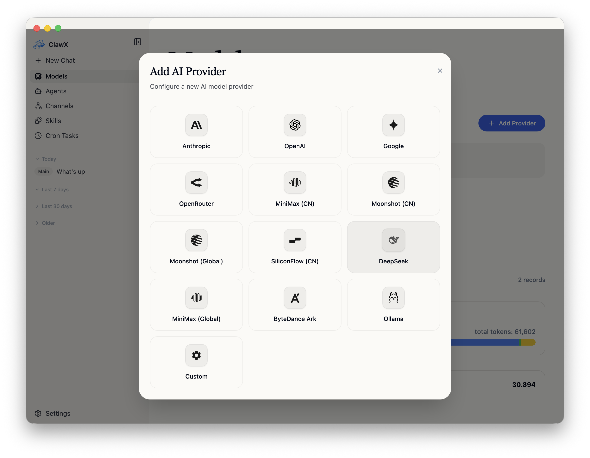
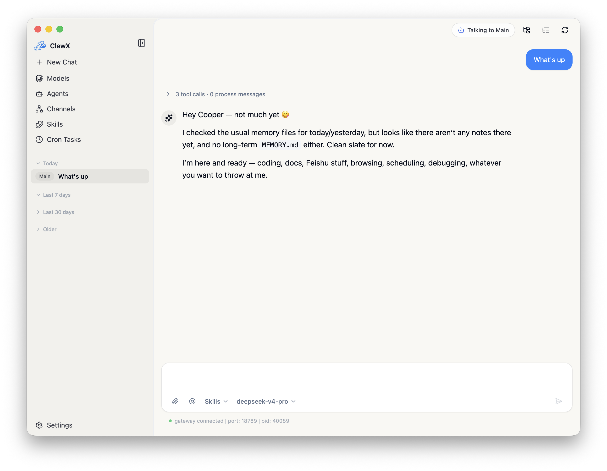

[English](./clawx.md) | [简体中文](./clawx.zh-CN.md) · [← Back](../README.md)

# Integrate with ClawX

ClawX is an open-source desktop Agent app for productivity scenarios. It deeply reworks OpenClaw to make it more stable and reliable.

- **GitHub:** <https://github.com/ValueCell-ai/ClawX>
- **China website:** <https://www.clawx.com.cn/>
- **Global website:** <https://claw-x.com/>

#### 1. Install ClawX

Download the installer for your platform from the [ClawX website](https://claw-x.com/) or the [ClawX GitHub releases page](https://github.com/ValueCell-ai/ClawX/releases).

Available builds depend on the current release. ClawX is a desktop app for common operating systems such as macOS, Windows, and Linux, and it does not require downloading extra dependencies.

#### 2. Add the DeepSeek Provider

Open ClawX and go to **Models** from the left sidebar. Click **Add Provider**, then select **DeepSeek** from the provider list.

Fill in the provider form:

1. Keep **Display Name** as `DeepSeek`, or use a name that is easy to recognize.
2. Paste your [DeepSeek API Key](https://platform.deepseek.com/api_keys) into **API Key**.
3. Set **Model ID** to **`deepseek-v4-pro`** or **`deepseek-v4-flash`**.
4. Click **Add Provider**.

#### 3. Start Chatting

Click **New Chat** in the left sidebar, then choose your DeepSeek model from the model selector in the chat input toolbar. Send a message to confirm that the gateway is connected and that the model can respond normally.

DeepSeek V4 runs with deep thinking enabled by default, and the full **1 million token** context window is available through the DeepSeek API. Use **`deepseek-v4-pro`** for stronger reasoning and complex agent work, or **`deepseek-v4-flash`** when you want lower latency and lighter cost.

#### 4. Going Further

Once DeepSeek V4 is configured, you can use it across ClawX's OpenClaw workflows:

- **Agents.** Create specialized agents and bind them to a DeepSeek model for coding, research, writing, operations, or personal assistant workflows.
- **Skills.** Install and enable skills from the built-in Skills page so your DeepSeek-powered agent can handle files, search, automation, and custom tool use.
- **Channels.** Connect chat channels such as WeCom, Feishu, WeChat, Telegram, or other OpenClaw-supported integrations, then route messages to your DeepSeek agent.
- **Cron Tasks.** Schedule recurring tasks so ClawX can run DeepSeek-powered monitoring, summaries, reminders, or report generation in the background.
