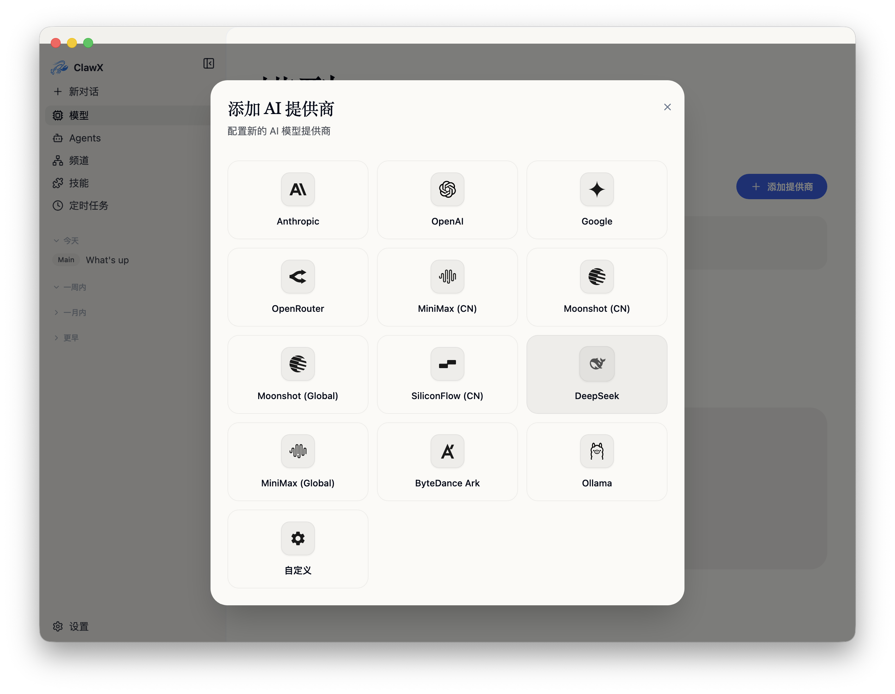
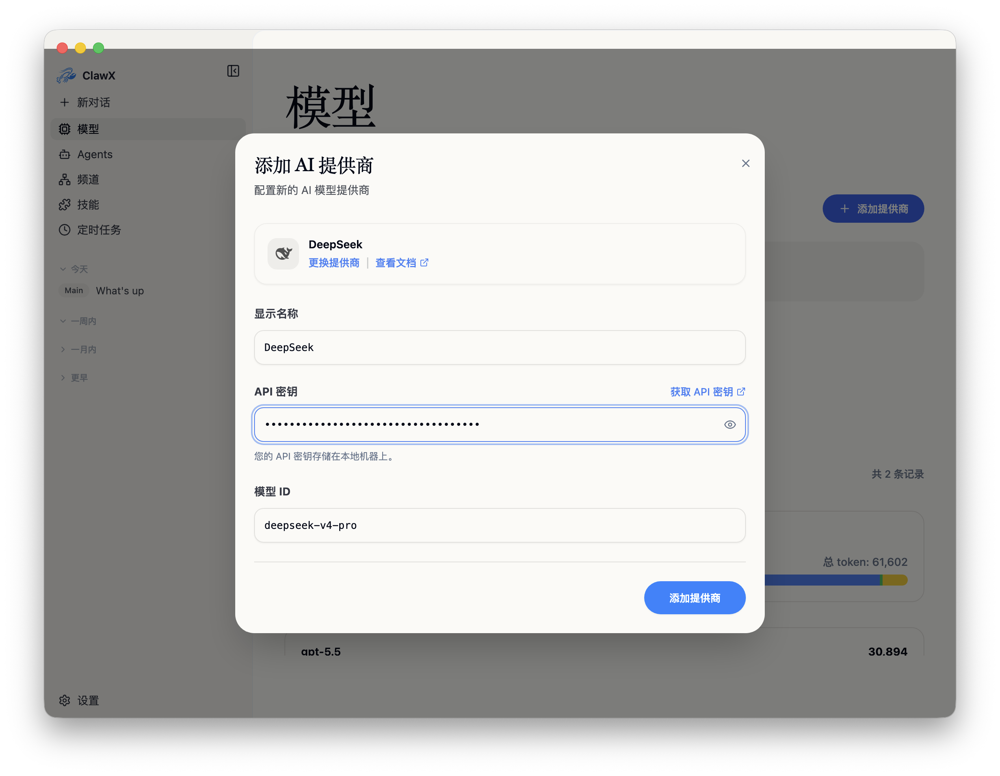
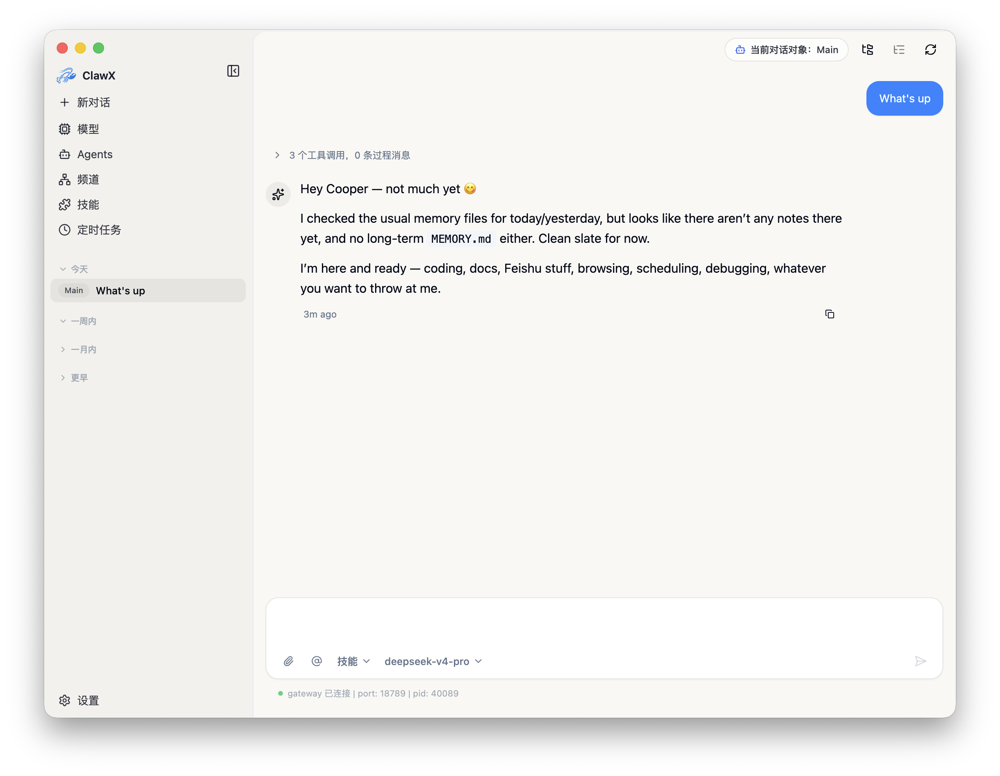

[English](./clawx.md) | [简体中文](./clawx.zh-CN.md) · [← Back](../README.zh-CN.md)

# 接入 ClawX

ClawX 是一个面向生产力场景的开源桌面 Agent 应用。它对 OpenClaw 进行了深度改造，使其更加稳定和可靠。

- **GitHub：** <https://github.com/ValueCell-ai/ClawX>
- **中国站：** <https://www.clawx.com.cn/>
- **海外站：** <https://claw-x.com/>

#### 1. 安装 ClawX

请从 [ClawX 中国站](https://www.clawx.com.cn/) / [海外站](https://claw-x.com/) 或 [ClawX GitHub Releases](https://github.com/ValueCell-ai/ClawX/releases) 下载对应平台的安装包。

实际安装包类型以当前 Release 为准；ClawX 是桌面应用，支持 macOS、Windows、Linux 等常见操作系统使用， 同时无需下载额外依赖。

#### 2. 添加 DeepSeek Provider

打开 ClawX，在左侧导航进入 **模型** 页面，点击 **添加提供商**，在 Provider 列表中选择 **DeepSeek**。

在配置表单中填写：

1. **显示名称** 可保持为 `DeepSeek`，也可以改成便于识别的名称。
2. 将 [DeepSeek API Key](https://platform.deepseek.com/api_keys) 粘贴到 **API 密钥**。
3. **模型 ID** 填写 **`deepseek-v4-pro`** 或 **`deepseek-v4-flash`**。
4. 点击 **添加提供商**。

#### 3. 开始对话

点击左侧 **新对话**，在输入框工具栏的模型选择器中选中刚刚配置的 DeepSeek 模型，然后发送消息，确认 gateway 已连接且模型能够正常回复。

DeepSeek V4 默认开启深度思考，并通过 DeepSeek API 原生支持最高 **100 万 token** 上下文窗口。复杂推理、代码与 Agent 任务建议使用 **`deepseek-v4-pro`**；如果更关注响应速度与成本，可以选择 **`deepseek-v4-flash`**。

#### 4. 进阶用法

完成 DeepSeek V4 配置后，可以在 ClawX 的 OpenClaw 工作流中复用它：

- **Agents**：创建不同职责的 Agent，并绑定 DeepSeek 模型，用于编程、调研、写作、运维或个人助理场景。
- **技能**：在内置 **技能** 页面安装并启用 Skill，让 DeepSeek 驱动的 Agent 具备文件处理、搜索、自动化与自定义工具调用能力。
- **渠道**：接入企业微信、飞书、微信、Telegram 或其他 OpenClaw 支持的聊天渠道，将消息路由给 DeepSeek Agent。
- **定时任务**：配置周期性任务，让 ClawX 在后台自动执行 DeepSeek 驱动的监控、摘要、提醒或报告生成。
