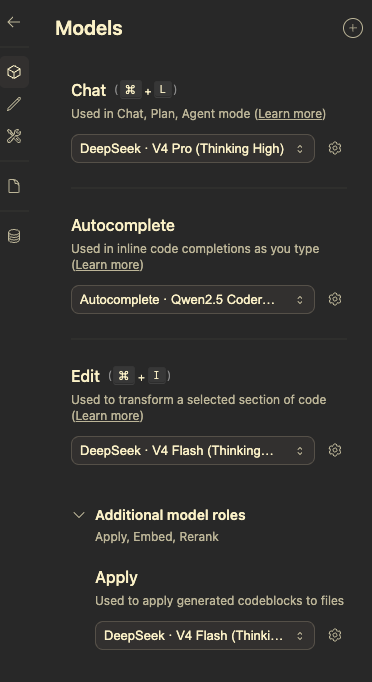

[English](./continue.md) | [简体中文](./continue.zh-CN.md) · [← Back](../README.md)

# Integrate with Continue

Continue is an open-source AI code assistant for VS Code and JetBrains, with customizable model providers and agentic workflows.

#### 1. Install Continue

- **VS Code:** Open the Extensions view (`Ctrl+Shift+X`), search for `Continue`, and install the extension by Continue Dot.
- **JetBrains:** Open Settings → Plugins → Marketplace, search for `Continue`, and install.

#### 2. Get a DeepSeek API Key

- Visit the [DeepSeek Platform](https://platform.deepseek.com/api_keys) and create an API Key.
- Copy the key (it starts with `sk-`).

#### 3. Open the Continue Config File

Continue uses a YAML configuration file located at:

- **VS Code:** `~/.continue/config.json` or `~/.continue/config.yaml`
- **JetBrains:** `~/.continue/config.json` or `~/.continue/config.yaml`

You can also open it from within VS Code by clicking the gear icon in the Continue sidebar and selecting **Open Config**.

#### 4. Add the DeepSeek Model Configuration

Paste the following configuration into your `~/.continue/config.yaml`:

```yaml
models:
  - name: DeepSeek · V4 Pro (Thinking None)
    provider: deepseek
    model: deepseek-v4-pro
    apiKey: ${{ secrets.DEEPSEEK_API_KEY }}
    roles:
      - chat
      - edit
      - apply
    capabilities:
      - tool_use
    requestOptions:
      extraBodyProperties:
        thinking:
          type: disabled

  - name: DeepSeek · V4 Pro (Thinking High)
    provider: deepseek
    model: deepseek-v4-pro
    apiKey: ${{ secrets.DEEPSEEK_API_KEY }}
    roles:
      - chat
      - edit
      - apply
    capabilities:
      - tool_use
    requestOptions:
      extraBodyProperties:
        reasoning_effort: high
        thinking:
          type: enabled

  - name: DeepSeek · V4 Pro (Thinking Max)
    provider: deepseek
    model: deepseek-v4-pro
    apiKey: ${{ secrets.DEEPSEEK_API_KEY }}
    roles:
      - chat
      - edit
      - apply
    capabilities:
      - tool_use
    requestOptions:
      extraBodyProperties:
        reasoning_effort: max
        thinking:
          type: enabled

  - name: DeepSeek · V4 Flash (Thinking None)
    provider: deepseek
    model: deepseek-v4-flash
    apiKey: ${{ secrets.DEEPSEEK_API_KEY }}
    roles:
      - chat
      - edit
      - apply
    capabilities:
      - tool_use
    requestOptions:
      extraBodyProperties:
        thinking:
          type: disabled

  - name: DeepSeek · V4 Flash (Thinking High)
    provider: deepseek
    model: deepseek-v4-flash
    apiKey: ${{ secrets.DEEPSEEK_API_KEY }}
    roles:
      - chat
      - edit
      - apply
    capabilities:
      - tool_use
    requestOptions:
      extraBodyProperties:
        reasoning_effort: high
        thinking:
          type: enabled

  - name: DeepSeek · V4 Flash (Thinking Max)
    provider: deepseek
    model: deepseek-v4-flash
    apiKey: ${{ secrets.DEEPSEEK_API_KEY }}
    roles:
      - chat
      - edit
      - apply
    capabilities:
      - tool_use
    requestOptions:
      extraBodyProperties:
        reasoning_effort: max
        thinking:
          type: enabled
```

> **Note on `${{ secrets.DEEPSEEK_API_KEY }}`:** Continue supports referencing secrets with `${{ secrets.VAR_NAME }}`. When it encounters this syntax, it resolves the value by searching these sources in order:
> 1. **Workspace `.env` file** — `<workspace-root>/.env`
> 2. **Workspace Continue `.env` file** — `<workspace-root>/.continue/.env`
> 3. **Global `.env` file** — `~/.continue/.env`
> 4. **Process environment variables** — system environment variables (only works with [Continue CLI](https://docs.continue.dev/cli/configuration))
>
> Create a `.env` file in one of the locations above with `DEEPSEEK_API_KEY=sk-your-key` (no quotes). Restart your IDE after adding or changing secrets.
>
> **Important:** VS Code and JetBrains extensions cannot read shell environment variables set via `export`. You must use a `.env` file for IDE extensions.
>
> Alternatively, you can replace `${{ secrets.DEEPSEEK_API_KEY }}` directly with your key string.

> **Tip:** You don't need to include all 6 profiles. Pick only the model names and thinking modes you actually use — for example, just one V4 Pro profile and one V4 Flash profile is enough to get started.

#### 5. Using the Model

- Open the Continue sidebar in VS Code (or the Continue tool window in JetBrains).
- Click the model selector at the bottom of the chat panel and choose one of the configured DeepSeek models.
- Start coding with Continue's agentic features — `tool_use` is enabled for all profiles above.

<div align="center">

</div>

#### Optional: 1M Context Window

DeepSeek V4 models support up to **1 million tokens** of context. Continue reads the context window limit from the provider by default. If you need to adjust it manually, add a `contextLength` field to the model config:

```yaml
  - name: DeepSeek · V4 Pro (Thinking Max)
    provider: deepseek
    model: deepseek-v4-pro
    apiKey: ${{ secrets.DEEPSEEK_API_KEY }}
    contextLength: 1000000
    ...
```

#### Optional: Thinking Effort Levels

DeepSeek V4 Pro supports three thinking modes configured via `extraBodyProperties`:

| Profile | `thinking.type` | `reasoning_effort` | Use Case |
|---------|----------------|-------------------|----------|
| **Thinking None** | `disabled` | *(omitted)* | Simple tasks, quick responses, lower cost |
| **Thinking High** | `enabled` | `high` | Complex coding with focused reasoning |
| **Thinking Max** | `enabled` | `max` | Deep reasoning, architecture, hardest tasks |

DeepSeek V4 Flash supports the same set of thinking levels for consistency.

> **Note:** `reasoning_effort: max` gives the best coding experience and is recommended for deep architectural work. Switch to `high` or `disabled` when you need faster responses.
