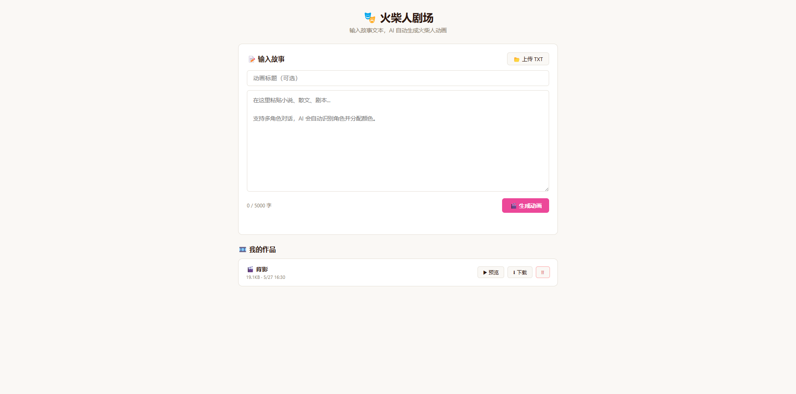
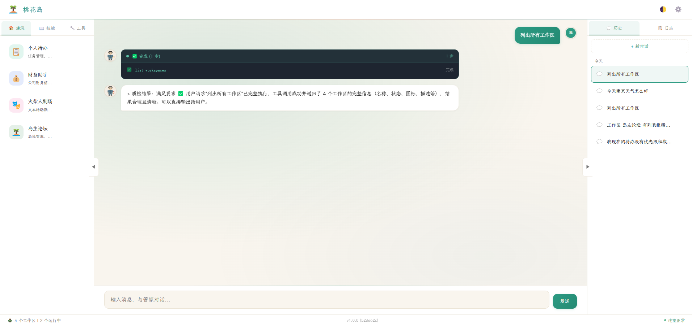

[English](./daozhu.md) | [简体中文](./daozhu.zh-CN.md) · [← 返回](../README.zh-CN.md)

# 集成 DaoZhu（岛主）

岛主是一个开源、本地优先的个人 AI 平台。最大亮点是**火柴人剧场**——给 DeepSeek 一句话，它写出完整剧本，CSS 动画火柴人自动演出，一句话变动画短片。

除了剧场，岛主还能管理隔离的「工作区」（待办、记账、论坛，或任何你描述的应用）——所有数据留在本地。

- GitHub：<https://github.com/wengshirui/DaoZhu>
- Gitee：<https://gitee.com/yumen2278/DaoZhu>

## 1. 安装岛主

**方式一：下载即用（Windows，推荐）**

从 [Gitee Releases](https://gitee.com/yumen2278/DaoZhu/releases) 下载最新版 zip，解压后双击 `岛主DaoZhu.exe`。自带 Git 和 uv，无需安装任何前置依赖。

**方式二：开发者运行**

```bash
git clone https://github.com/wengshirui/DaoZhu.git
cd DaoZhu
uv venv .venv --python 3.11
# Windows
.venv\Scripts\activate
# Linux / macOS
# source .venv/bin/activate
uv pip install -e .
python daozhu_main.py
```

## 2. 配置 DeepSeek

首次启动浏览器会打开引导页，选择 **DeepSeek** 作为 Provider，粘贴你的 [DeepSeek API Key](https://platform.deepseek.com/api_keys)。

如果已完成引导，点击**设置**（齿轮图标）修改：

| 字段 | 值 |
|------|-----|
| Provider | DeepSeek |
| 模型 | `deepseek-v4-pro`（或 `deepseek-v4-flash` 更省钱） |
| API Key | 你的 DeepSeek API Key |

岛主使用 OpenAI 兼容端点 `https://api.deepseek.com/v1`。DeepSeek V4 模型支持最高 **100 万 token** 上下文。

## 3. 体验火柴人剧场

在对话面板输入：

```
演一个火柴人剧场：小明迟到了，被老板追着跑
```

DeepSeek 会写出多幕剧本（含舞台指令），内置剧场引擎用 CSS 动画渲染火柴人自动演出——不需要任何视频工具。





## 4. 开始使用

配置完成后，你可以用自然语言和 AI 管理员对话：

- 创建工作区：*"帮我建一个读书笔记工作区"*
- 管理任务：*"添加一个待办：明天下午开会"*
- 一句话生成火柴人动画
- 查询和操作工作区数据

平台默认运行在 `http://localhost:7788`。
