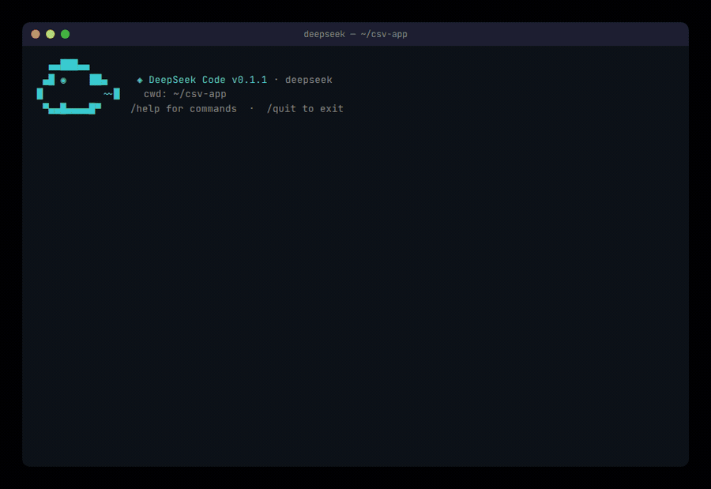

[English](./deepseek_code.md) | [简体中文](./deepseek_code.zh-CN.md) · [← Back](../README.zh-CN.md)

# 集成 DeepSeek Code

<div align="center">
  
</div>

DeepSeek Code 是一款开源的 DeepSeek 驱动终端编程 Agent，具备完整 TUI、多供应商支持、MCP、LSP 与 Agent Skills。支持 `deepseek-v4-pro` 和 `deepseek-v4-flash` 两个模型，均使用完整的 **1M token 上下文**窗口。

- **GitHub：** <https://github.com/Hermenics/deepseek-code>

<div align="center">
  
</div>

#### 1. 安装 DeepSeek Code

- 安装 [Node.js](https://nodejs.org/en/download/) 18+ 或 [Bun](https://bun.sh) 1.1+ 版本。
- 在终端中运行以下命令：

```sh
npm install -g @hermenics/deepseek-code
```

- 验证安装是否成功：

```sh
deepseek --version
```

#### 2. 配置 DeepSeek Code

首次运行时，DeepSeek Code 会引导你选择供应商。选择 **DeepSeek API** 并输入你的 API Key。

也可以直接设置环境变量：

```sh
export DEEPSEEK_API_KEY=sk-...
```

从 [DeepSeek 开放平台](https://platform.deepseek.com/api_keys) 获取你的 API Key。

密钥存储在 `~/.deepseek/config.json` 中。非敏感偏好设置使用 `settings.json`，优先级为 `User < Project < Local`。

**支持的供应商：**

| 供应商 | 环境变量 / 配置键 |
|----------|--------------------|
| DeepSeek API（默认） | `DEEPSEEK_API_KEY`、`DEEPSEEK_BASE_URL` |
| Amazon Bedrock | `AWS_REGION`、`AWS_PROFILE` |
| Google Vertex AI | `GCP_PROJECT`、`GCP_LOCATION`、`GCP_CREDENTIALS` |
| 本地模型（Ollama / LM Studio） | `LOCAL_BASE_URL`、`LOCAL_MODEL` |

**支持的模型：**

| 模型 | 上下文 | 思考模式 | 说明 |
|-------|---------|----------|------|
| `deepseek-v4-flash`（默认） | 1M | ✅ | 快速通用 |
| `deepseek-v4-pro` | 1M | ✅ | 高级推理 |

可随时使用 `/model` 切换模型。

**推理强度控制：**

DeepSeek Code 支持 `/effort` 命令来控制模型的推理深度：

| 级别 | 说明 |
|-------|------|
| `low` | 关闭思考模式 — 响应最快 |
| `high` | 开启思考模式，默认推理强度（默认） |
| `max` | 最深推理 — `reasoning_effort: max` |

```sh
/effort max
```

**价格（DeepSeek API，每百万 token）：**

| 模型 | 输入（缓存未命中） | 输入（缓存命中） | 输出 |
|-------|--------------------|-------------------|------|
| `deepseek-v4-flash` | $0.14 | $0.0028 | $0.28 |
| `deepseek-v4-pro` | $0.435 | $0.003625 | $0.87 |

来源：[DeepSeek API 定价](https://api-docs.deepseek.com/quick_start/pricing)

#### 3. 进入项目目录并启动 DeepSeek Code

```sh
cd /path/to/my-project
deepseek
```

自动化场景可使用无头管道模式：

```sh
echo "解释一下这个项目" | deepseek --pipe
```

#### 快捷键

| 按键 | 功能 |
|------|------|
| `Enter` | 发送消息 |
| `Shift+Enter` | 换行 |
| `Esc` | 中断当前模型回复 |
| `/` | 打开斜杠命令菜单 |
| `/model` | 切换模型 |
| `/agent` | 启动子 Agent |
| `/vim` | 切换 Vim 键位 |
| `/theme` | 切换颜色主题 |
| `/help` | 显示所有命令 |

#### 使用 Agent Skills

Agent Skills 从以下位置自动发现：

- **用户级别：** `~/.deepseek/skills/<name>/SKILL.md`
- **项目级别：** `./.deepseek/skills/<name>/SKILL.md`

#### 管道模式

```sh
cat src/index.tsx | deepseek --pipe --json "总结这个文件"
```
