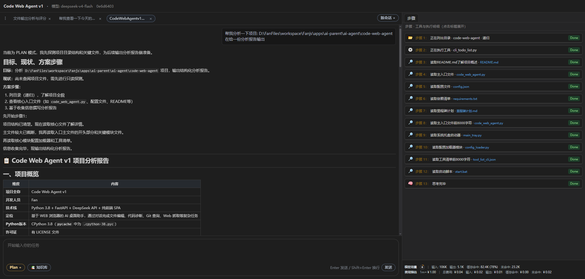
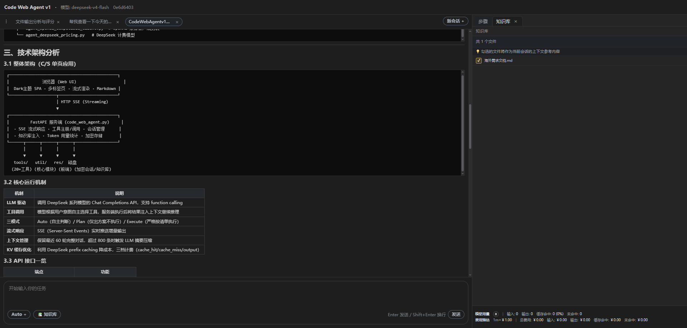

[English](./deepseek_code_agent.md) | [简体中文](./deepseek_code_agent.zh-CN.md) · [← 返回](../README.zh-CN.md)

# 接入 DeepSeek Code Agent

> 🌐 **本列表中唯一的 Web UI + 系统托盘 AI 桌面助手** —— 不止是终端 CLI。  
> 基于 DeepSeek-V4，内置 20+ 工具、RAG 知识库、ACL 文件保护、对话加密和多标签会话管理。

DeepSeek Code Agent 是一款开源的 AI 桌面助手，以 **Web 服务 + 系统托盘**形式运行。它以 DeepSeek-V4 为核心模型，内置 **20+ 工具**，支持文件操作、代码诊断、Git 查询、正则搜索、Web 抓取等功能，全部通过自然语言对话即可操控。

与纯终端 CLI 的 AI 编程助手不同，它提供了**丰富的图形界面**，任何浏览器均可访问，让 DeepSeek-V4 的 Agent 能力惠及开发者与**非技术用户**。

- **GitHub：** <https://github.com/Fan/DeepSeekCodeAgent>

---

### 为什么选择 DeepSeek Code Agent？

| 特性 | DeepSeek Code Agent | 纯 CLI 工具（Claude Code、Kilo Code 等） |
|------|-------------------|----------------------------------------|
| **交互界面** | 🌐 Web UI + 系统托盘 🖥️ | ⌨️ 仅终端 |
| **RAG 知识库** | ✅ 内置，支持 GUI 文件选择 | ❌ |
| **多标签会话** | ✅ 同时管理多个对话 | ❌ 单会话 |
| **文件浏览器** | ✅ GUI 文件选择器（@引用） | ❌ 手动输入路径 |
| **ACL 防篡改** | ✅ 自动锁定项目文件 | ❌ |
| **对话加密** | ✅ Windows DPAPI 加密存储 | ❌ |
| **目标用户** | 👥 开发者 + 非技术用户 | 👨‍💻 仅开发者 |

---

<div align="center">
  
  <p><em>Web 界面 — 对话、工具调用、多标签会话管理与实时流式响应</em></p>
</div>

<br>

#### 1. 安装 DeepSeek Code Agent

- 安装 [Python](https://www.python.org/downloads/) 3.8+
- 克隆仓库：

```bash
git clone https://github.com/Fan/DeepSeekCodeAgent.git
cd deepseek-code-agent
```

- 安装依赖：

```bash
pip install -r requirements.txt
```

#### 2. 配置 DeepSeek

编辑项目根目录下的 `config.json`：

```json
{
    "AGENT_MODEL_API_BASE_URL": "https://api.deepseek.com",
    "AGENT_MODEL_API_KEY": "sk-...",
    "AGENT_SERVER_PORT": 8802
}
```

在 [DeepSeek 开放平台](https://platform.deepseek.com/api_keys) 获取 API Key。

**配置项说明：**

| 配置项 | 说明 |
|--------|------|
| `AGENT_MODEL_API_BASE_URL` | API 地址，默认 `https://api.deepseek.com` |
| `AGENT_MODEL_API_KEY` | DeepSeek API 密钥 |
| `AGENT_SERVER_PORT` | Web 界面端口（默认 8802） |
| `AGENT_WORKSPACE_DIR` | 默认工作目录 |
| `AGENT_KNOWLEDGE_BASE_DIR` | 知识库目录（RAG） |
| `CHAT_API_MODELS` | 允许使用的模型列表，默认 `deepseek-v4-pro,deepseek-v4-flash` |

#### 3. 启动 DeepSeek Code Agent

**Windows（推荐）：**

双击 `start.bat` — 自动请求管理员权限（ACL 防篡改保护）、激活虚拟环境、安装依赖、启动服务。

**Linux / macOS：**

```bash
chmod +x start.sh && ./start.sh
```

**或手动启动：**

```bash
python main_tray.py
```

打开浏览器访问 `http://127.0.0.1:8802`。

#### 4. 开始对话

用自然语言下达指令，AI 会自动调用工具完成任务：

> "读取桌面上的 test.txt 文件内容"
> "查看这个项目的 Git 日志"
> "当前目录有哪些文件？"
> "分析 main.py 的代码质量"

#### 5. DeepSeek 集成特性

| 特性 | 说明 |
|------|------|
| **Function Calling** | DeepSeek-V4 驱动全部 20+ 内置工具调用 |
| **KV 缓存优化** | 流式响应携带 `cache_hit_tokens`，计费区分缓存命中/未命中 |
| **流式响应** | 基于 SSE 的流式输出，支持 `reasoning_content` 推理过程显示 |
| **上下文管理** | 超过 800 条消息自动摘要压缩，保留关键信息 |
| **模型选择** | 每会话可独立指定模型 |

#### 6. 知识库（RAG）

<div align="center">
  
  <p><em>知识库面板 — 勾选本地文件，AI 自动注入对话上下文作为 RAG 参考</em></p>
</div>

在界面右侧打开 📚 **知识库**面板，勾选需要 AI 参考的文件，Agent 会自动将其内容注入对话上下文，实现基于本地知识库的智能响应。

#### 使用技巧

| 操作 | 说明 |
|------|------|
| 输入 `/plan` | 切换到 Plan 模式（只出方案，不执行写操作） |
| 输入 `/execute` | 切换到 Execute 模式（严格按照执行清单执行） |
| 输入 `@文件路径` | 在消息中引用本地文件 |
| 点击 📁 按钮 | 打开文件浏览器选择文件 |
| 📚 知识库面板 | 勾选知识库文件注入对话上下文（RAG） |

#### 内置工具（20+）

`cli_structured_edit` · `cli_python_inline` · `cli_directory_list` · `cli_web_fetch` · `cli_git_workspace` · `cli_regex_locate` · `cli_find_replace` · `cli_file_ops` · `cli_ip_geolocate` · `cli_open_meteo_weather` · `cli_unified_diagnose` · `cli_test_report` · `cli_text_diff` · `cli_patch_apply` · `cli_user_confirm` · `cli_orch_dispatch` · 等。
