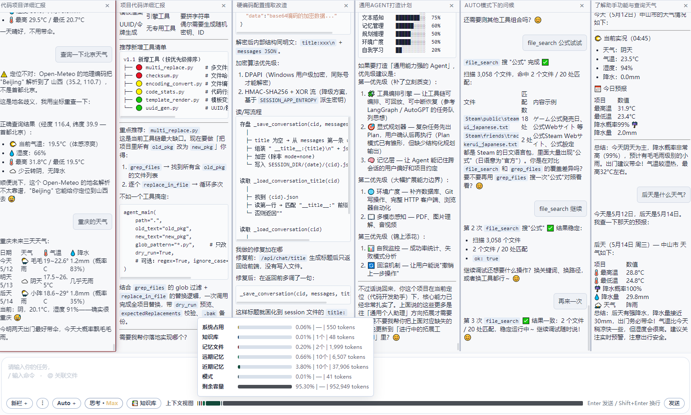
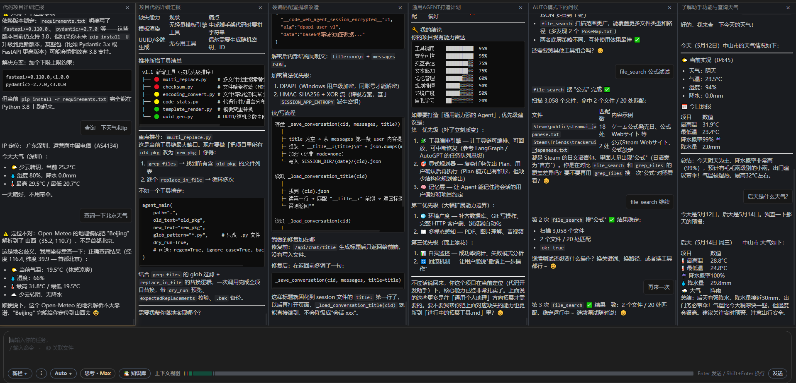
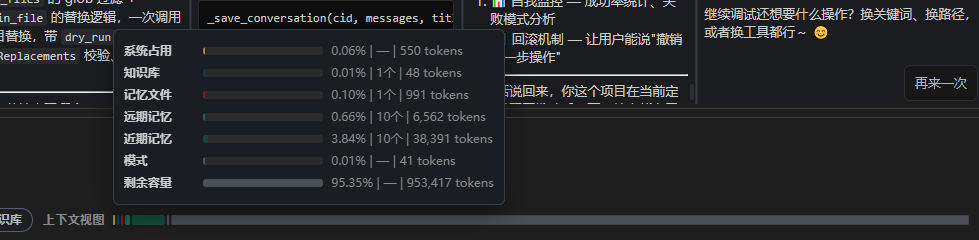

[English](./deepseek_code_agent.md) | [简体中文](./deepseek_code_agent.zh-CN.md) · [← 返回](../README.zh-CN.md)

# 接入 DeepSeek Code Agent

在浏览器中使用 DeepSeek：编辑文件、执行命令、浏览工作区、挂载参考资料，并在对话中切换模型。

**仓库：** [github.com/diky87688973/deepseek-code-agent](https://github.com/diky87688973/deepseek-code-agent)

### 功能亮点

- 本地浏览器打开即用：配置 `config.ini` 中的密钥与目录即可，不必搭一整套 IDE 插件链。
- 同一窗口多会话标签；需要并排跟进时可切到 `/immersive` 多列布局，可全拼沉浸式交互。
- 工具执行步骤固定在侧栏，与对话并列，便于核对「做了什么」而不用翻原始日志。
- 知识库目录一次设定，按会话勾选文件，长文档不必反复复制进输入框。
- `/plan` 与 `/execute` 可与 Todo 面板配合：先审方案再动手，或按清单一步步执行。
- 浅色 / 深色主题，输入区旁带上下文占用条，长对话时仍能把握体量。
- 会话文件可选加密，保护对话隐私。
- 可根据使用场景在界面中切换不同的 DeepSeek 模型（pro或flash）。

---

### 适用场景

- 希望用网页完成交互，而不是绑定重型 IDE 插件。
- 习惯「对话 + 文件侧能力」，而非纯终端流程。
- 需要同时保留多个会话，并排跟进多条工作事项。
- 适合初学者或热衷AI，支持并看好国产模型的人群。
---

### 能力说明

| 项目 | 说明 |
|------|------|
| 对话与标签 | 同一窗口管理多个会话 |
| 工具 | 文件、搜索、Git、命令类操作；进度在侧栏展示 |
| 知识库 | 指定文本目录，按会话勾选文件 |
| `@` 路径 | 通过选择器或手工输入路径引用文件 |
| 模式 | `/plan` 先给方案；`/execute` 按清单推进 |
| 布局 | 根路径 `/`；多列布局 `/immersive` |
| 主题 | 浅色或深色 |
| 上下文条 | 输入区旁的占用概览 |

Windows 下可用 `start.bat` 启动；运行期间对安装目录启用只读保护。

---


*主界面*

#### 1. 安装

需要 Python 3.8 及以上。

```bash
git clone https://github.com/diky87688973/deepseek-code-agent.git
cd deepseek-code-agent
pip install -r requirements.txt
```

#### 2. 配置

编辑仓库根目录 **`config.ini`**：填写接口与密钥、监听端口、工作区路径、数据目录、知识库路径等，其余项以**文件内注释**为准。

API Key：[DeepSeek 开放平台](https://platform.deepseek.com/api_keys)。

#### 3. 启动

- **Windows：** 运行 `start.bat`
- **Linux / macOS：** `chmod +x start.sh && ./start.sh`
- **手动：** `python main_tray.py`

浏览器访问 `http://127.0.0.1:8801` 或 `http://127.0.0.1:8801/immersive`，地址与端口须与 `config.ini` 一致。

---

#### 4. 知识库


*知识库面板*

在 `config.ini` 中配置知识库目录后，于面板内勾选文件。

---

#### 5. 主题、沉浸布局、上下文概览



*浅色主题*



*多列布局*



*上下文概览*

---

#### 快捷操作

| 输入 / 控件 | 作用 |
|-------------|------|
| `/plan` | 先给方案，暂缓写盘 |
| `/execute` | 按当前清单执行 |
| `@…` | 引用文件 |
| 文件按钮 | 插入 `@` 路径 |
| 知识库面板 | 勾选参考资料 |
| 主题 | 浅色或深色 |
| 经典 ↔ 沉浸 | 顶栏切换 |

---

#### 示例指令

> 读取桌面上的 test.txt  
> 查看本仓库最近的 Git 记录  
> 列出当前目录下的文件
