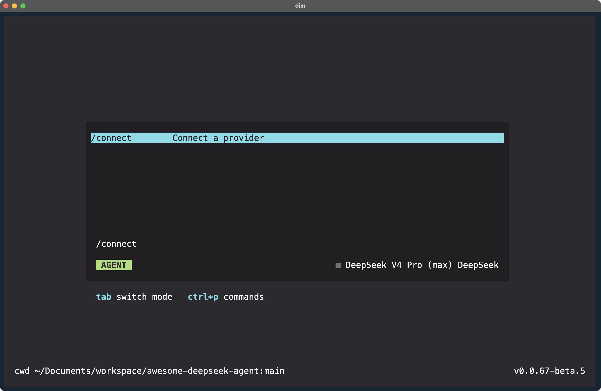
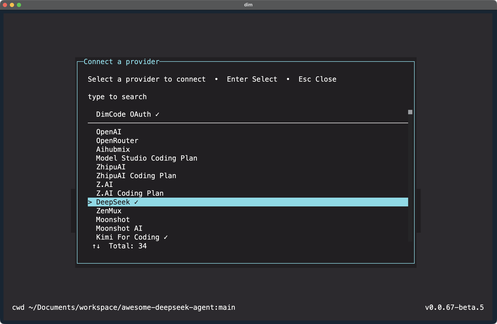
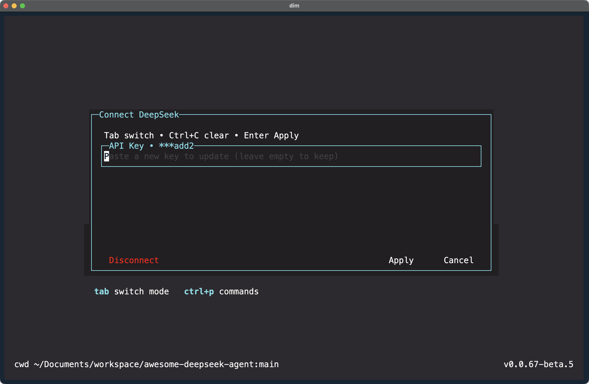
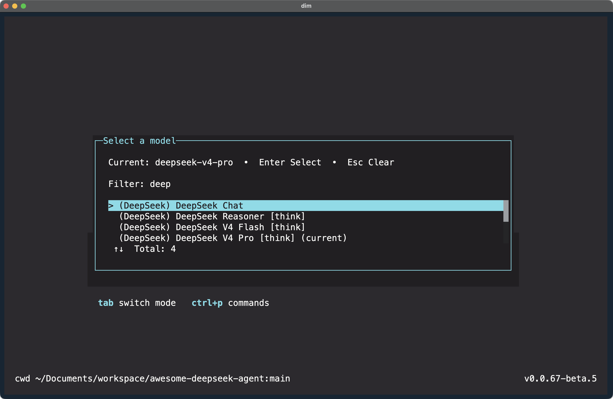
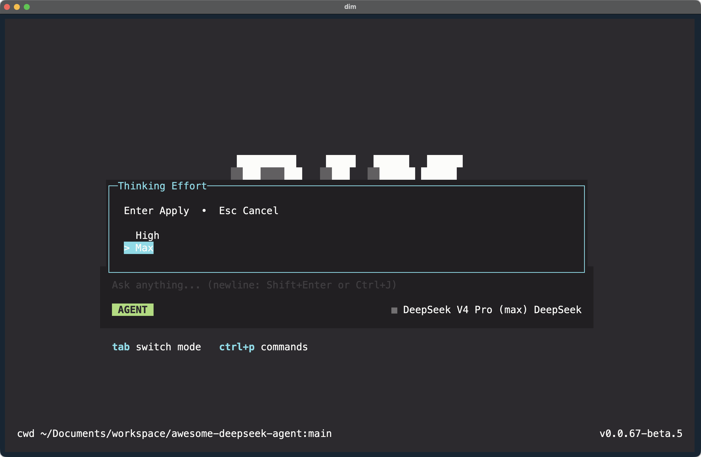

[English](./dimcode.md) | [简体中文](./dimcode.zh-CN.md) · [← Back](../README.md)

# Integrate with DimCode

[DimCode](https://dimcode.dev/) is a multi-model AI coding agent available as a desktop app and terminal TUI, with sessions, provider connections, tool permissions, MCP, and ACP editor integrations.

#### 1. Install DimCode CLI

- Install [Node.js](https://nodejs.org/en/download/).
- Run the following command in your terminal to install DimCode CLI:

```
npm install -g dimcode@latest
```

- After installation, run the following command. If the version number is displayed, the installation is successful:

```
dim --version
```

#### 2. Run DimCode

Enter the project directory and run `dim`:

```
cd /path/to/my-project
dim
```

#### 3. Connect the DeepSeek Provider

- Type `/connect` in the command bar to open the **Connect Provider** panel.

<div align="center">

</div>

- Select **DeepSeek** from the provider list.

<div align="center">

</div>

- Enter your [DeepSeek API Key](https://platform.deepseek.com/api_keys), then apply the provider configuration.

<div align="center">

</div>

#### 4. Select a DeepSeek Model

- Type `/models` to open the model selector.
- Search for `deep` and select one of the available DeepSeek models:
  - DeepSeek Chat
  - DeepSeek Reasoner
  - DeepSeek V4 Flash
  - DeepSeek V4 Pro

<div align="center">

</div>

#### 5. Set Thinking Effort

- For DeepSeek thinking models, choose **High** or **Max** when DimCode asks for thinking effort.

<div align="center">

</div>
