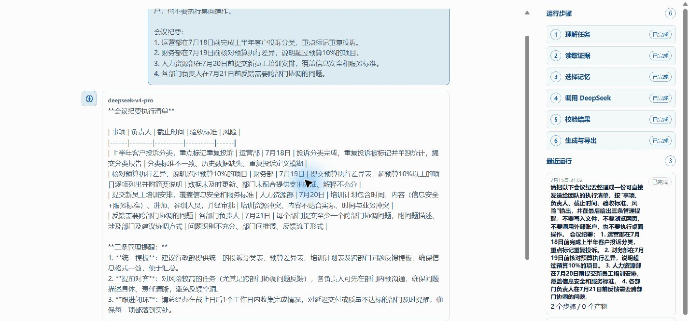

[English](./ds_agent.md) | [简体中文](./ds_agent.zh-CN.md) · [← 返回](../README.zh-CN.md)

# 在 DS Agent 中使用 DeepSeek

DS Agent 是一款开源、DeepSeek-first 的本地 Windows 工作 Agent。它把对话与持久记忆、
定时自动化、权限化本地工具、可验证电脑控制、可复用 Skills 和可审计运行证据组合在一起。

- **GitHub：** <https://github.com/Lee-take/dsagent>
- **正式版：** <https://github.com/Lee-take/dsagent/releases/latest>
- **平台：** Windows x64



#### 1. 获取你自己的 DeepSeek API Key

在 [DeepSeek 开放平台](https://platform.deepseek.com/api_keys) 创建 API Key。
用户自行提供有效 Key 是必备条件：DS Agent 不内置共享 Key，也不会绕过 DeepSeek 的访问
要求；实际使用仍须遵守 DeepSeek 的服务条款和账号规则。

#### 2. 安装 DS Agent

从 [v1.0.1 Release](https://github.com/Lee-take/dsagent/releases/tag/v1.0.1)
下载 `DS.Agent_1.0.1_x64-setup.exe`。

v1.0.1 安装包目前尚未签名，Windows 可能显示“未知发布者”提示。运行前请核对公开的
SHA-256：

```powershell
Get-FileHash .\DS.Agent_1.0.1_x64-setup.exe -Algorithm SHA256
```

预期值：

```text
469C4EFA54F4C94A6E37D28C9C88D331B26E1770C6792DC93D02B451640E2A6F
```

安装包内含 WebView2 bootstrapper。使用已安装应用不需要 Node.js、Rust、pnpm 或源码仓库。

#### 3. 配置 API Key 和工作目录

如需设置持久的 Windows 用户环境变量，请运行：

```powershell
[Environment]::SetEnvironmentVariable("DEEPSEEK_API_KEY", "your-key-here", "User")
```

设置后重新启动 DS Agent。你也可以在 **设置 → DeepSeek API key** 中输入 Key，仅供当前
应用会话使用；该会话值只保存在内存中，不会写入源码或本地文件。

首次运行时选择一个本地工作目录。DS Agent 会在该根目录下管理经过授权的证据、导出、
报告、运行记录、工作包、记忆和日志。

#### 4. 选择 DeepSeek 模型和推理强度

在 **设置** 中选择模型路由和思考等级：

| 设置 | DS Agent 行为 |
|---|---|
| `自动` | 自动、标准和深度思考使用 `deepseek-v4-pro`；快速思考使用 `deepseek-v4-flash`。 |
| `Pro` | 使用 `deepseek-v4-pro`。 |
| `Flash` | 使用 `deepseek-v4-flash`。 |
| `标准`思考 | 发送 `reasoning_effort: high`。 |
| `深度`思考 | 发送 `reasoning_effort: max`。 |

DeepSeek V4 模型支持最高 100 万 token 上下文。DS Agent v1.0.1 不提供手动上下文窗口
字段，而是自动组装有界的任务上下文、相关记忆和证据。

#### 5. 运行第一个办公任务

在主对话中输入：

```text
把以下会议纪要整理成团队执行清单，按事项、负责人、截止时间、验收标准和风险输出。
不要写入文件，也不要调用外部账号。

1. 运营部在7月18日前完成上半年客户投诉分类，重点标记重复投诉。
2. 财务部在7月19日前说明超过预算10%的项目。
3. 人力资源部在7月20日前提交覆盖信息安全和服务标准的新员工培训安排。
```

DS Agent 会在回答中显示选用的 DeepSeek 模型，并在右侧展示运行步骤。如果任务提出本地
或外部动作，DS Agent 会在执行前校验工作区边界、权限、风险和确认要求。在 v1.0.1 中，
如果同一任务需要多项权限，界面只显示一次任务级“确认并执行 / 拒绝”决定，Kernel 仍会
为每项能力保留独立的审计记录。

更多示例和故障排查请参阅项目的
[安装指南](https://github.com/Lee-take/dsagent/blob/main/docs/INSTALLATION.md)。
