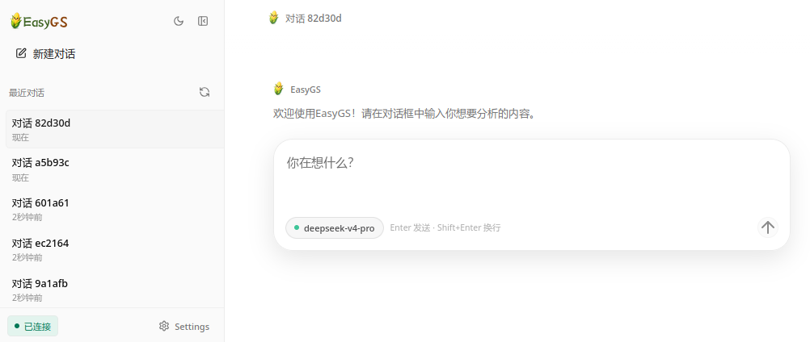
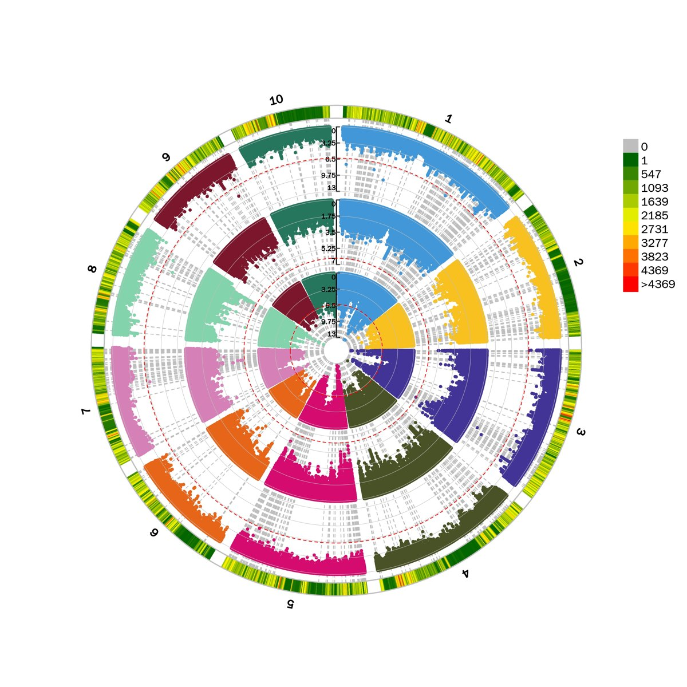
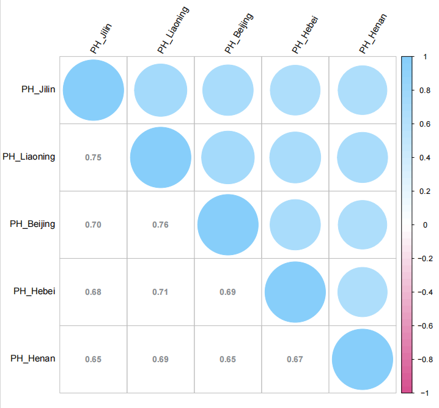

[English](./easygs.md) | [简体中文](./easygs.zh-CN.md) · [← 返回](../README.zh-CN.md)

# 接入EasyGS

对于非计算机背景的生物科研人员来说，大模型智能体究竟能做什么？EasyGS希望给出一个直接的答案：它把常见的作物基因组选择分析交给AI协助完成，让生物信息学科研进入人工智能时代。EasyGS是一个面向作物基因组选择分析的AI Agent，支持接入DeepSeek模型，帮助用户通过自然语言轻松完成GS分析。

- **GitHub:** <https://github.com/lukegood/EasyGS>

#### 1. 安装EasyGS

EasyGS需要Python3.11或更高版本、conda或mamba，以及DeepSeek APIKey。

安装已发布的wheel：

```
pip install https://github.com/lukegood/EasyGS/releases/download/v0.1.5/easygs-0.1.5-py3-none-any.whl
```

检查安装：

```
easygs --version
```

如需运行GS分析工具，请从源码仓库创建conda环境：

```
git clone https://github.com/lukegood/EasyGS.git
cd EasyGS
conda env create -f env_all/EasyGS_1.yml
conda env create -f env_all/EasyGS_2.yml
conda env create -f env_all/EasyGS_3.yml
conda env create -f env_all/EasyGS_4.yml
```

#### 2. 配置DeepSeek Provider

初始化EasyGS配置：

```
easygs onboard
```

编辑`~/.easygs/config.json`：

```json
{
  "providers": {
    "deepseek": {
      "apiKey": "<你的DeepSeek APIKey>",
      "apiBase": "https://api.deepseek.com"
    }
  },
  "agents": {
    "defaults": {
      "model": "deepseek-v4-pro",
      "maxTokens": 384000,
      "reasoningEffort": "max"
    }
  }
}
```

需要更强推理能力时使用`deepseek-v4-pro`，需要更低延迟时可使用`deepseek-v4-flash`。`maxTokens`用于控制单次回复的最大生成长度，`reasoningEffort`用于设置DeepSeek V4 Pro的推理强度。DeepSeek V4模型侧支持最高1M上下文和最高384000个token输出；EasyGS无`contextWindow`控制项，会将当前对话、工具结果和分析上下文交给所选模型处理。

EasyGS会把`reasoningEffort`传递给OpenAI兼容请求，并保留模型返回的`reasoning_content`。使用DeepSeek V4 Pro时，推荐将`reasoningEffort`设置为`max`以获得更强的推理能力。

检查配置：

```
easygs status
```

#### 3. 启动EasyGS

在`~/.easygs/config.json`中启用Web UI通道：

```json
{
  "channels": {
    "websocket": {
      "enabled": true,
      "port": 25685
    }
  }
}
```

启动服务：

```
easygs gateway
```

打开Web UI：

```
http://127.0.0.1:25685
```

也可以在命令行中运行EasyGS：

```
easygs agent -m "Please check the basic statistics for /data/example.vcf.gz"
```

或启动交互式会话：

```
easygs agent
```

#### 4. 界面预览

<div align="center">
<table>
  <tr>
    <td align="center">
      
      <br />
      <sub>EasyGS Web UI</sub>
    </td>
  </tr>
</table>
</div>

#### 5. 分析结果示例

<div align="center">
<table>
  <tr>
    <td align="center" valign="top" width="50%">
      
      <br />
      <sub>GS分析结果</sub>
    </td>
    <td align="center" valign="top" width="50%">
      
      <br />
      <sub>相关性分析结果</sub>
    </td>
  </tr>
</table>
</div>
