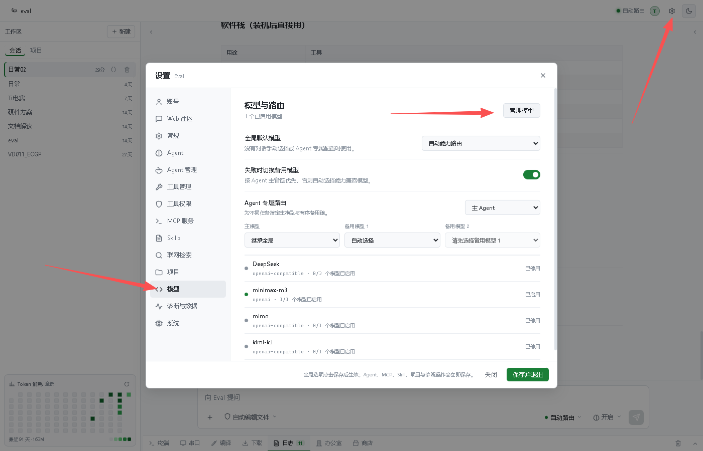
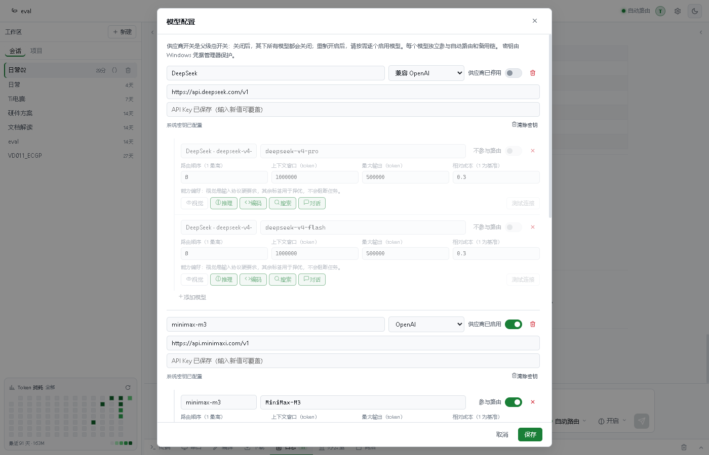

[English](./eval_agent.md) | [简体中文](./eval_agent.zh-CN.md) · [← 返回](../README.zh-CN.md)

# 接入 Eval Agent

[Eval Agent](https://eval.zailink.space/) 是一套面向嵌入式研发的 Agent 系统，内置模型路由，并通过 DeepSeek 的 OpenAI 兼容 API 支持 DeepSeek 模型。系统将 17 个专业 Agent 与 25 个工程工具编排到 5 条工作流中，覆盖原理图分析、系统架构、固件实现、编译、烧录、串口与 SWD 调试、测试和文档交付。

#### 1. 安装 Eval Agent

打开 [Eval Agent 下载页面](https://eval.zailink.space/#downloads)，下载最新稳定版安装程序。公开下载无需账号。

当前公开版本提供 **Windows x64** `.exe` 安装包。运行安装程序并启动 Eval Agent；如果界面提示，请登录或注册 Eval 账号。

#### 2. 获取 DeepSeek API Key

前往 [DeepSeek 开放平台](https://platform.deepseek.com/api_keys) 创建 API Key。请妥善保管，不要将其提交到项目仓库，也不要粘贴到提示词中。

#### 3. 打开模型管理

在 Eval Agent 工作区中：

1. 点击右上角的**齿轮图标**。
2. 在设置侧边栏中选择**模型**。
3. 在**模型与路由**页面点击**管理模型**。

#### 4. 配置 DeepSeek Provider 与模型

找到或添加 **DeepSeek** Provider，并填写以下参数：

| Provider 字段 | 值 |
| --- | --- |
| Provider 名称 | `DeepSeek` |
| 协议 | 兼容 OpenAI |
| API Base URL | `https://api.deepseek.com/v1` |
| API Key | 你的 DeepSeek API Key |
| 供应商开关 | 启用 |

添加并启用当前两个 DeepSeek V4 模型：

| 模型 | 模型 ID | 上下文窗口 | 最大输出 token | 推理 |
| --- | --- | ---: | ---: | --- |
| DeepSeek V4 Pro | `deepseek-v4-pro` | `1000000` | `384000` | 启用；复杂任务使用 `max` 推理强度 |
| DeepSeek V4 Flash | `deepseek-v4-flash` | `1000000` | `384000` | 启用 |

为需要加入自动路由的模型打开**参与路由**。保留推理、编程、搜索、对话能力标签；DeepSeek V4 API 模型是纯文本模型，因此不要启用视觉能力。完成后保存模型配置。

截图用于展示现有本地配置中的字段位置。请打开 Provider 和参与路由开关，并使用上表中的当前参数，尤其是将最大输出 token 设为 `384000`。

DeepSeek V4 支持 **100 万 token 上下文窗口**，DeepSeek V4 Pro 支持 `max` 推理强度。Eval Agent 还提供上下文压力监测、自动压缩、Checkpoint 与任务恢复能力，适合持续时间较长的工程工作流。

#### 5. 在模型路由中选择 DeepSeek

返回**设置 → 模型**：

1. 将**全局默认模型**设为**自动能力路由**，或直接选择一个 DeepSeek 模型。
2. 在 **Agent 专属路由**中，将 `deepseek-v4-pro` 分配给系统架构、疑难调试等角色，日常工程任务可使用响应更快的 `deepseek-v4-flash`。
3. 如需在主模型失败时自动切换，可启用备用模型。
4. 点击**保存并退出**。

#### 6. 运行第一个由 DeepSeek 驱动的任务

1. 打开或创建一个项目工作区。
2. 选择需要的 Agent，或保留自动路由。
3. 根据任务选择执行范围。Eval Agent 提供四级执行权限，以及工具级 `allow` / `ask` / `deny` 控制。
4. 输入一个工程目标，例如：

   > 分析这份原理图，识别 MCU 和调试接口，然后生成带 Checkpoint 的固件编译与验证计划。烧录硬件前先向我确认。

5. 审核执行计划，并批准需要确认的敏感工具操作。通过实时事件、工具日志与 Checkpoint 跟踪执行进度。

DeepSeek 模型负责推理与工具选择，Eval Agent 则编排完成和验证任务所需的专业 Agent 与工程工具。

#### 常见问题

- **身份验证失败或返回 `401`：** 在 DeepSeek 开放平台重新创建 Key，并确保粘贴时没有多余空格。
- **找不到模型或返回 `404`：** 请严格使用当前模型 ID：`deepseek-v4-flash` 或 `deepseek-v4-pro`。
- **连接测试无法访问 DeepSeek：** 确认 API Base URL 为 `https://api.deepseek.com/v1`，并检查当前网络能否访问 DeepSeek API。
- **DeepSeek 没有出现在自动路由中：** 启用 Provider 和模型，并打开对应模型的**参与路由**开关。
- **复杂任务过早停止：** 选择 `deepseek-v4-pro`，使用 `max` 推理强度，并确认上下文窗口为 `1000000`。
- **硬件操作一直等待：** 检查 Eval Agent 的审批队列。烧录、调试等敏感工具可能会按照当前权限策略要求显式确认。

产品下载与更新请访问 [Eval Agent 官网](https://eval.zailink.space/)。
