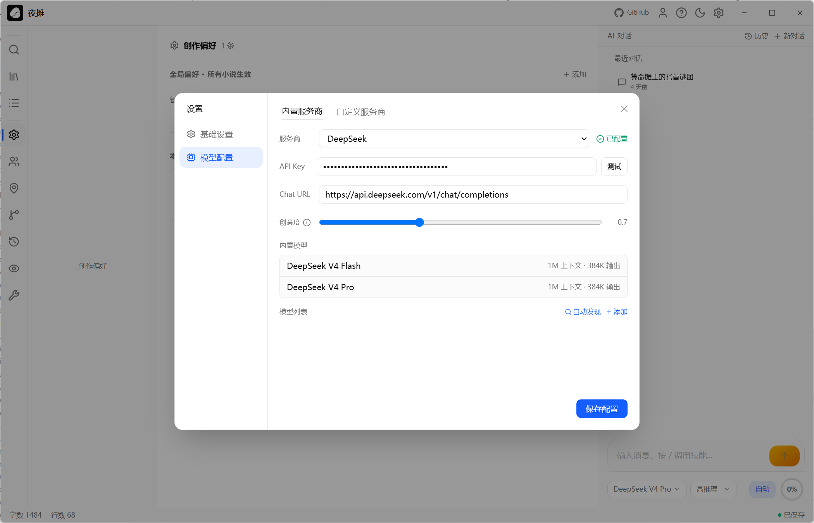

[English](./goink.md) | [简体中文](./goink.zh-CN.md) · [← 返回](../README.zh-CN.md)

# 接入 Goink

Goink 是一款面向 Windows / macOS / Linux 的开源桌面 AI 长篇写作系统。内置 ReAct Agent 引擎 + 结构化记忆数据库——角色关系、伏笔回收、故事弧线、地点图谱、读者认知追踪——加上离线语义搜索、Git 版本管理和 30+ MCP 工具。Wails（Go + React）构建，安装包不到 60 MB。

- **GitHub：** <https://github.com/sigpanic/goink>

#### 1. 安装 Goink

请从 [Goink Releases](https://github.com/sigpanic/goink/releases) 下载对应平台的安装包：

- Windows（`.exe`）
- macOS（`.dmg`，Apple Silicon）
- Linux（`.AppImage`）

启动应用，首次运行会看到引导界面，可选择主题并配置模型服务。

#### 2. 配置 DeepSeek 模型服务

打开 Goink，点击左下角齿轮图标进入 **设置**。

1. 在 **模型服务** 选项卡中，从左侧内置 Provider 列表选择 **DeepSeek**。
2. 将 [DeepSeek API Key](https://platform.deepseek.com/api_keys) 粘贴到 **API Key** 输入框。API 地址默认 `https://api.deepseek.com/v1`，无需修改。
3. 打开你想使用的模型开关。推荐使用 **`deepseek-v4-pro`** 获得长篇写作中最佳推理质量；**`deepseek-v4-flash`** 速度更快、成本更低。
4. 点击 **保存** 确认配置。

#### 3. 开始写作

Goink 以对话驱动创作：

1. 点击侧边栏 **新建小说**，填写书名和类型，点击 **创建**。
2. 在对话面板中开始对话——描述你的故事构思、角色设定或大纲。Goink 的 ReAct Agent 会自动调用工具查询已有设定、搜索前文章节，并在写作过程中维护故事状态。
3. DeepSeek V4 Pro 的深度思考模式默认开启。Agent 在写作和状态维护时会使用结构化思维链，你可以在对话界面中实时查看思考过程。
4. 借助 DeepSeek V4 的 **100 万 token** 上下文窗口，Goink 可以在单次会话中引用大量小说上下文，保持长篇叙事的跨章节连贯性。

#### 4. 进阶用法

完成 DeepSeek V4 配置后，你可以在 Goink 中充分使用以下功能：

- **结构化记忆。** 每章完成后，Agent 自动检查并更新角色变化、伏笔回收进度、故事弧线节点和读者认知状态——所有变更以 Diff 形式呈现，逐行审批确认后写入。
- **离线语义搜索。** Goink 内置 ONNX Runtime + 本地 BGE 中文语义模型。搜「主角第一次展露能力」能找到措辞完全不同的相关段落——全程本地运行，无需联网。
- **Git 版本管理。** 每次 AI 对话自动 commit。所有 AI 生成的改动以 Diff 逐行对比，确认才写入，不满意一键 Revert——每个字都可追溯。
- **更多模型。** Goink 内置 7 个模型 Provider（DeepSeek、GLM、Kimi、Qwen、豆包、MiniMax、MiMo），同时支持自定义 OpenAI 兼容接口。
