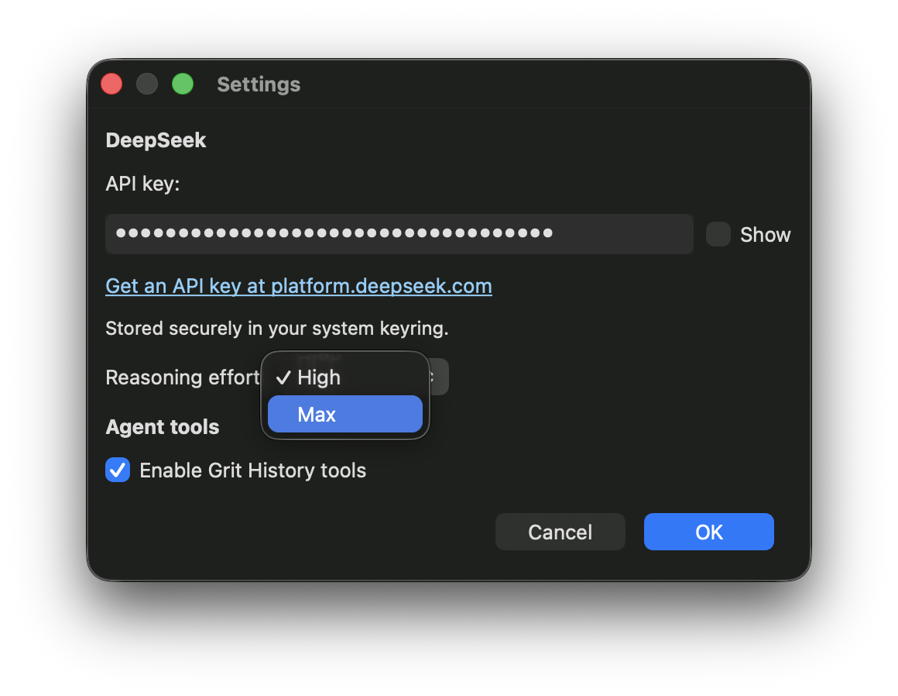
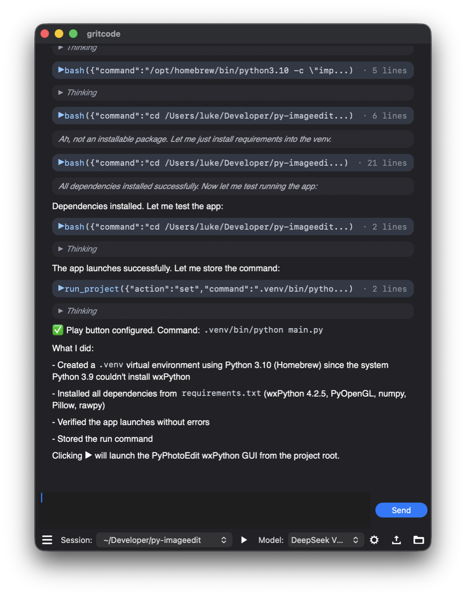

[English](./gritcode.md) | [简体中文](./gritcode.zh-CN.md) · [← 返回](../README.zh-CN.md)

# 接入 Gritcode

Gritcode 是一款开源的原生桌面 AI 编程 Agent，支持 macOS 与 Linux。它使用 C++ 和 wxWidgets 编写（非 Electron），整个应用只有约 10 MB。在 Agent 对话之外，它保留了真正必要的功能：项目文件树、带语法高亮的编辑器，以及按项目文件夹保存的会话。

- **GitHub：** <https://github.com/lszl84/gritcode>
- **官网：** <https://gritcode.ai>

#### 1. 安装 Gritcode

从 [Gritcode Releases 页面](https://github.com/lszl84/gritcode/releases/latest) 下载最新版本：

- macOS（`.dmg` —— Apple Silicon，macOS 14 及以上；已签名并经过公证）
- Linux（`.deb` —— 基于 Ubuntu 24.04 构建）

在 Debian / Ubuntu 上，使用 apt 安装：

```bash
sudo apt install ./gritcode-*-Linux.deb
```

#### 2. 配置 DeepSeek

点击工具栏中的齿轮按钮，打开 **Settings**（设置）。

1. 在 **DeepSeek** 下的 **API key** 输入框中粘贴你的 [DeepSeek API Key](https://platform.deepseek.com/api_keys)。密钥会保存在系统钥匙串（keyring）中。
2. 将 **Reasoning effort**（推理强度）设为 **Max**，以获得最强的编程推理能力。（**High** 是 DeepSeek 的默认值，速度更快。）
3. 点击 **OK**。

<div align="center">

</div>

Gritcode 直接调用 DeepSeek 的 OpenAI 兼容接口（`https://api.deepseek.com`），无需代理或配置文件。设置密钥后，它会通过 `/models` 接口实时加载可用模型，因此 DeepSeek 推出新模型时无需更新应用即可使用。

#### 3. 开始编程

1. 打开工具栏中的会话下拉菜单，选择 **New Session…**，然后选择你的项目文件夹。
2. 在旁边的模型下拉菜单中，选择 **DeepSeek V4 Pro**（`deepseek-v4-pro`）或 **DeepSeek Flash**（`deepseek-flash`，即 DeepSeek V4.1 Flash）。
3. 输入任务并点击 **Send**。

<div align="center">

</div>

DeepSeek V4 默认开启思考模式，Gritcode 围绕这一点做了适配：

- 开箱即用完整的 **100 万 token** 上下文窗口，无需任何配置。
- 每个请求都会携带 `reasoning_effort`（来自设置中的 `high` 或 `max`）。在 **Max** 模式下，Gritcode 会将输出上限提高到 384K token，避免长推理被截断。
- 按照 DeepSeek [思考模式](https://api-docs.deepseek.com/zh-cn/guides/thinking_mode) 的要求，在工具调用过程中将 `reasoning_content` 回传到对话历史中。
- 模型的推理过程显示在折叠的 **Thinking** 区块中——展开即可实时查看推理内容。

#### 4. 更多用法

- **无需密钥的免费模型。** 模型下拉菜单中的 **OpenCode Free** 使用 OpenCode Zen 免费额度，方便在添加 DeepSeek 密钥之前先试用 Gritcode。
- **按文件夹管理会话。** 每个项目文件夹都有独立的会话历史，可通过会话下拉菜单切换项目。
- **Grit History。** 在设置中开启 **Enable Grit History tools** 后，Agent 可以跨项目搜索你过去的会话。
