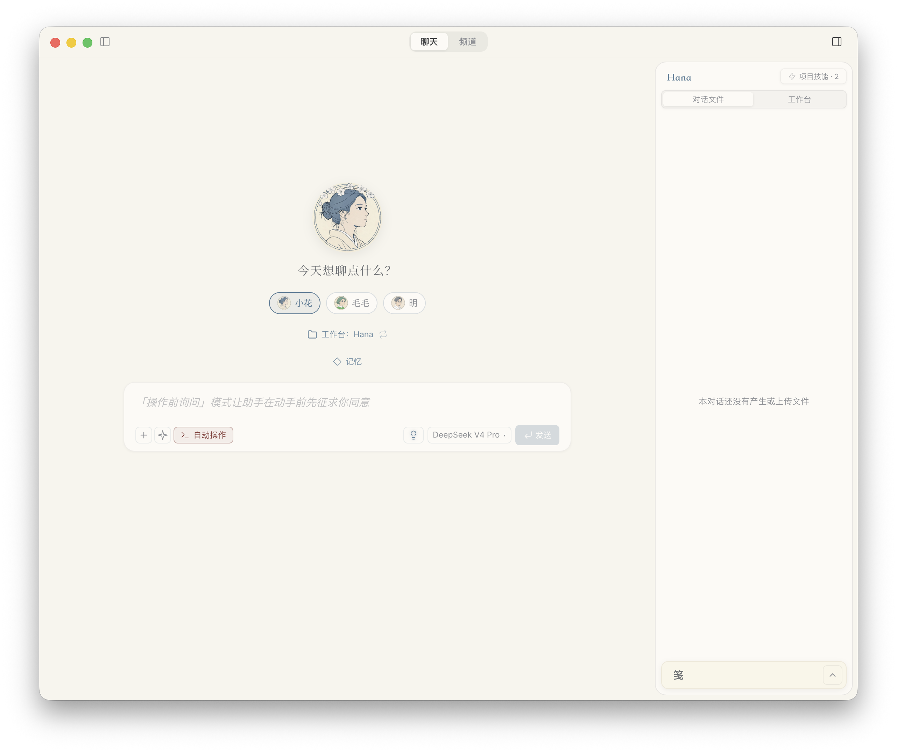
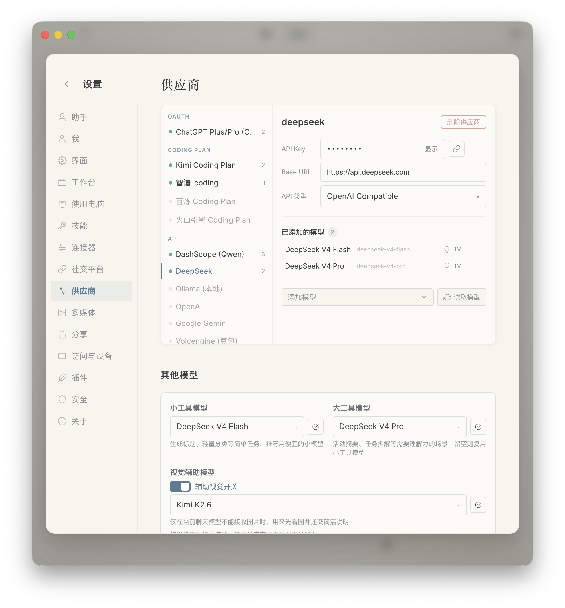
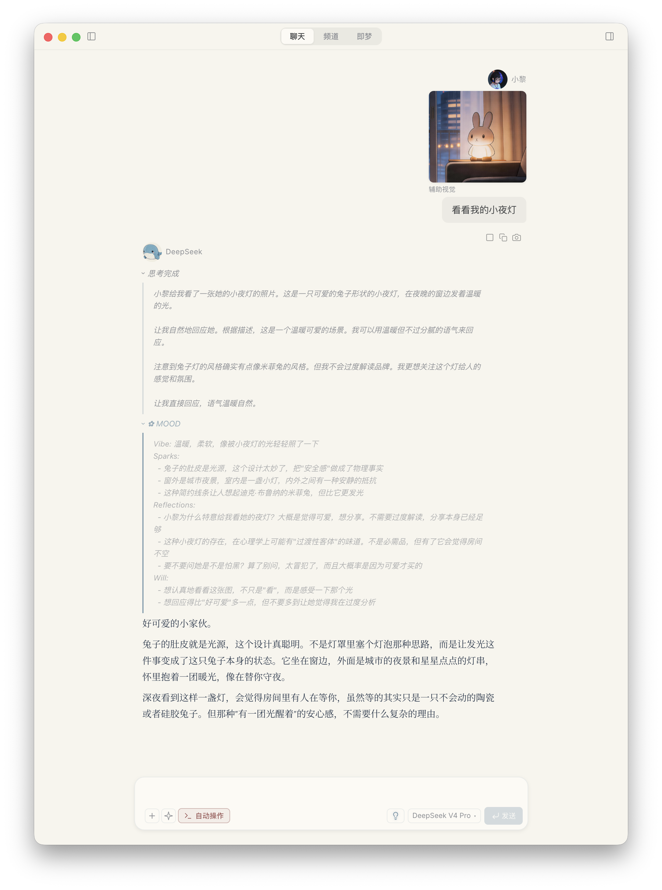

[English](./hanaagent.md) | [简体中文](./hanaagent.zh-CN.md) · [← 返回](../README.zh-CN.md)

# 接入 HanaAgent/OpenHanako

HanaAgent/OpenHanako 是一个开源跨平台私人 AI Agent，支持记忆、人格、多 Agent 协作、插件、聊天平台 Bridge、沙盒工具和图形化桌面体验。桌面应用名是 **HanaAgent**，开源项目与仓库名仍是 **OpenHanako**。

HanaAgent/OpenHanako 支持 macOS、Windows、Linux，也支持连接同一个 HanaAgent Server 的移动端 PWA。

#### 对 DeepSeek 的专门优化

- **内置 DeepSeek 路径**：HanaAgent 内置 DeepSeek Provider 预设，也内置 `deepseek-v4-pro` 与 `deepseek-v4-flash` 的模型元数据。
- **DeepSeek 思考模式**：HanaAgent 的思考强度选择器会映射到 DeepSeek 的 `high` 和 `max` 推理强度，并在工具调用轮次保留 DeepSeek 要求的 `reasoning_content`。
- **缓存友好的提示词冻结**：HanaAgent 会尽量把稳定的系统提示词和工具定义固定在提示词前面，把记忆、工作目录、时间等经常变化的信息放到后面。这样重复会话更容易复用前缀缓存，缓存命中率更容易管理。
- **辅助视觉**：当主模型仍然使用 DeepSeek，但图片需要先被理解时，HanaAgent 可以让一个视觉模型先看图，再把简洁的视觉说明交给 DeepSeek 继续推理。



#### 1. 安装 HanaAgent

从 [HanaAgent/OpenHanako Releases](https://github.com/liliMozi/openhanako/releases) 下载最新版桌面安装包：

- **macOS**：下载 `.dmg`。
- **Windows**：下载 `.exe` 安装包。
- **Linux**：下载 `.AppImage` 或 `.deb`。

安装完成后启动 HanaAgent，并完成首次引导。

#### 2. 获取 DeepSeek API Key

前往 [DeepSeek 开放平台](https://platform.deepseek.com/api_keys)，创建并复制 API Key。

#### 3. 配置 DeepSeek Provider

在首次引导中，或之后进入 **设置 → 模型 / Provider**，选择 **DeepSeek** 作为 Provider。

使用以下配置：

| 字段 | 值 |
| ---- | -- |
| Provider | `DeepSeek` |
| API 类型 | `OpenAI Compatible` |
| Base URL | `https://api.deepseek.com` |
| API Key | 你的 DeepSeek API Key |

HanaAgent 已内置 DeepSeek Provider 预设，选择 DeepSeek 后会自动填入 base URL 和 API 类型。

#### 4. 选择 DeepSeek V4 模型

HanaAgent 使用多个模型槽位，让 Agent 的不同任务使用更合适的模型：

| HanaAgent 模型槽位 | 推荐 DeepSeek 模型 |
| ------------------ | ------------------ |
| 对话模型 | `deepseek-v4-pro` |
| 小工具模型 | `deepseek-v4-flash` |
| 大工具模型 | `deepseek-v4-pro` |

`deepseek-v4-pro` 和 `deepseek-v4-flash` 都支持 100 万 token 上下文与最高 384K 输出。HanaAgent 内置了这两个模型的元数据，因此上下文窗口、输出上限、推理能力和 max effort 支持都会进入 UI 与运行时。



#### 5. 启用 DeepSeek 思考模式

DeepSeek V4 支持思考模式和推理强度控制。HanaAgent 在聊天输入栏提供思考强度选择器：

- **Auto**：使用 HanaAgent 当前会话默认设置。
- **High**：使用 DeepSeek `high` 推理强度。
- **XHigh**：使用 DeepSeek `max` 推理强度。


在 Agent 工具调用场景中，DeepSeek 思考模式要求后续轮次保留 `reasoning_content`。HanaAgent 已在 DeepSeek 兼容层中处理这条协议要求，因此使用工具的会话可以跨多轮推理和工具调用继续工作，不会丢失必要的思考历史。

#### 6. 可选：使用辅助视觉

DeepSeek V4 Pro 和 Flash 是强文本与推理模型。如果希望 HanaAgent 理解图片，可以在 **设置 → 模型** 中启用 **辅助视觉**，并选择一个具备视觉能力的模型。

启用辅助视觉后，HanaAgent 会先把图片附件交给视觉模型理解，再把提取出的视觉上下文交还给 DeepSeek 作为主推理模型继续处理。这样可以让 DeepSeek 继续担任 Agent 的主脑，同时处理截图、文档图片、界面捕获等图像输入场景。



#### 7. 开始使用 HanaAgent

打开聊天，让 HanaAgent 使用 DeepSeek 处理你的项目、文件、桌面或已连接的聊天平台。

首次测试可以这样问：

```text
请使用 DeepSeek V4 Pro 作为主推理模型，检查这个项目，概括它的结构，并给出接下来最值得做的三个改进。
```

如果你已经启用辅助视觉并上传了图片，也可以这样问：

```text
请看这张截图，解释它发生了什么，然后用 DeepSeek 推理下一步应该怎么做。
```

#### 说明

- 新配置建议使用 `deepseek-v4-pro` 或 `deepseek-v4-flash`。
- 旧版 V3 兼容别名不建议用于新的 HanaAgent 配置。
- DeepSeek API 文档：[DeepSeek API Docs](https://api-docs.deepseek.com/zh-cn/)。
- HanaAgent/OpenHanako 仓库：[liliMozi/openhanako](https://github.com/liliMozi/openhanako)。
