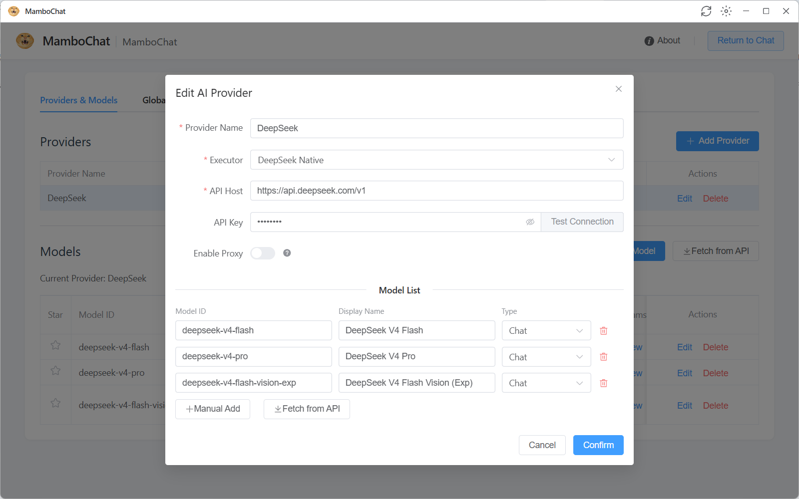
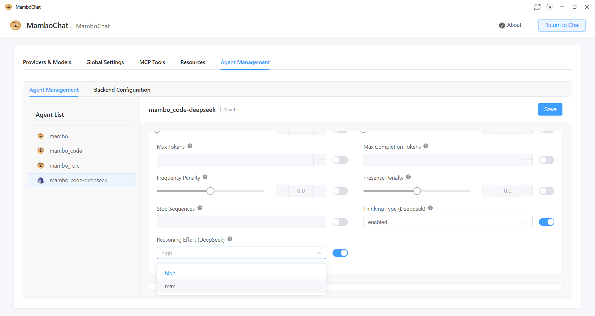
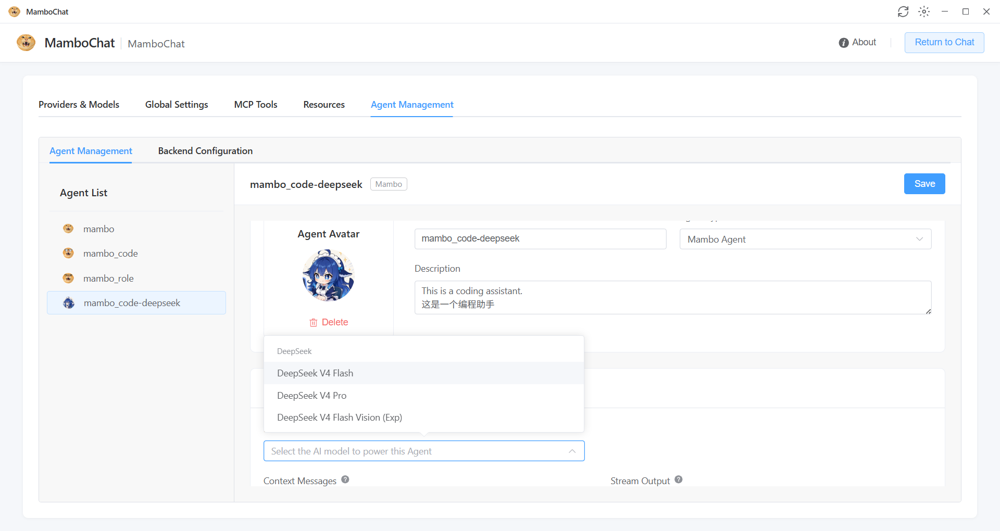

[English](./mambochat.md) | [简体中文](./mambochat.zh-CN.md) · [← 返回](../README.zh-CN.md)

# 接入 MamboChat

**MamboChat**（曼波茶）是一款开源的 Web Harness 平台，支持 Linux/Windows 部署，可集成多服务商 API，实现电脑与手机网页端同步访问。内置 **Mambo Agent** 具备文件读写、命令执行、嵌套子智能体等复杂任务执行能力，同时支持 RAG 知识库、MCP 工具与 Skill 技能包。

- **GitHub：** <https://github.com/RAmenLch/mambochat>
- **部署方式：** Docker Compose / Windows 桌面客户端 / 源码开发

#### 1. 准备 MamboChat 与 DeepSeek API Key

按需选择一种方式部署或启动 MamboChat：

- **Docker 部署**：

  ```bash
  git clone https://github.com/RAmenLch/mambochat.git
  cd mambochat
  docker compose up -d --build
  ```

  完成后访问 `http://localhost:24911`。

- **Windows 桌面客户端**：从 [Releases](https://github.com/RAmenLch/mambochat/releases) 页面下载最新安装包（`MamboChat-Setup-x.x.x.exe`），双击按向导安装，从桌面快捷方式启动即可。安装包已内嵌完整的 Python 运行时、前端资源与后端代码，开箱即用，无需手动配置 Python 环境。

然后前往 [DeepSeek 开放平台](https://platform.deepseek.com/api_keys) 创建 API Key。

#### 2. 新增 DeepSeek 服务商

1. 点击页面左下角的 **配置** 按钮（齿轮图标），进入系统配置页面。
2. 在 **服务商管理** 区域点击 **新增服务商**，选择预设的 **DeepSeek**（API Host 自动填为 `https://api.deepseek.com/v1`，Worker 类型为 DeepSeek Native）。
3. 将 DeepSeek API Key 粘贴到 **API Key** 字段，保存。

> **模型能力自动识别**：MamboChat 内置 DeepSeek 模型预置，接入 `api.deepseek.com` 域名时会自动识别模型能力（上下文长度、思考模式等），无需手动填写。

  

#### 3. 获取并确认 DeepSeek V4 模型

1. 在服务商详情中点击 **获取模型**，从 DeepSeek 拉取模型列表。
2. 确认列表中包含 **`deepseek-v4-pro`** 与 **`deepseek-v4-flash`**（另有视觉实验模型 `deepseek-v4-flash-vision-exp`）。
3. 模型列表会展示 **上下文** 列——DeepSeek V4 系列已预设 **100 万 token 上下文**（`context_length=1_000_000`，最大输出 `384_000` tokens），无需额外配置。

#### 4. 开始对话

1. 在左侧会话列表中右键，选择 **新建会话**。
2. 点击输入区上方工具栏的 **设置** 图标，在会话设置中为当前会话选择模型：编码、长程规划和 Agent 工作流建议选择 **DeepSeek V4 Pro**；日常对话和低延迟场景选择 **DeepSeek V4 Flash**。
3. 发送消息即可开始对话。

#### 5. 配置思考模式（推理强度）

DeepSeek V4 的思考模式通过 **动态参数** 配置（在会话设置或 Agent 编辑器的模型配置中启用）：

- **Thinking Type (DeepSeek)**：`enabled` / `disabled`，默认 `enabled`。启用后模型会先进行思维链推理再输出最终回答。
- **Reasoning Effort (DeepSeek)**：`high`（常规深度思考）/ `max`（最强推理，适合复杂 Agent 场景）。日常使用保持默认 `high`，复杂编码、规划与多步骤 Agent 任务建议调整为 **`max`**。

  

#### 6. 进阶：Mambo Agent / MCP / 知识库

MamboChat 内置的 Agent 能力均可在 DeepSeek V4 上运行：

- **Mambo Agent**：文件读写、命令执行、嵌套子智能体、AI 安全预审、长期记忆、任务循环等。
- **MCP 支持**：可在 Agent 中挂载 MCP 服务器，扩展工具调用能力（支持人工审核 Human-in-the-Loop）。
- **本地知识库 (RAG)**：上传 Markdown/TXT/PDF/Word 等文档并向量化后，挂载到会话，AI 自动检索回答。

  
更详细的功能说明见 [MamboChat 使用教程](https://github.com/RAmenLch/mambochat/blob/master/doc/使用教程.md)。

#### 常见问题

- `401` 或鉴权失败：检查 API Key 是否正确，并确认它填在 **API Key** 字段。
- 找不到 V4 模型：点击 **获取模型** 刷新模型列表，确认启用的模型 id 是 `deepseek-v4-pro` / `deepseek-v4-flash`。
- 看不到思考模式参数：确认当前模型是 **DeepSeek V4 Pro** 或 **DeepSeek V4 Flash**，并在会话设置的 **动态参数** 中启用 Thinking Type / Reasoning Effort。
- 需要 1M 上下文：DeepSeek V4 系列已预设 100 万上下文，无需手动设置；可在模型列表的 **上下文** 列核对。
