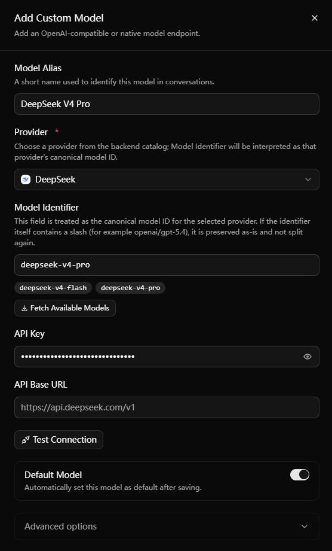
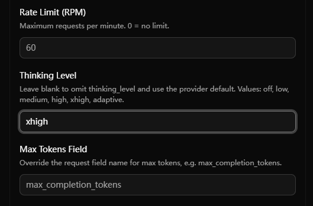

[English](./picoclaw.md) | [简体中文](./picoclaw.zh-CN.md) · [← Back](../README.md)

# Integrate with PicoClaw

PicoClaw is an ultra-lightweight personal AI assistant built around a Gateway runtime plus a Launcher Web UI. This guide uses the Launcher Web UI for the entire setup flow, which is friendlier for most users.

#### 1. Install PicoClaw

Download the latest version from [picoclaw.io](https://picoclaw.io), or follow the instructions in the [PicoClaw Docs](https://docs.picoclaw.io).

After installation:

- On Windows, run `picoclaw-launcher.exe`.
- On Linux or macOS, run `picoclaw-launcher`.

#### 2. Open the Launcher Web UI

After starting `picoclaw-launcher`, your browser will open `http://localhost:18800` automatically. On first launch, you need to create a Dashboard password. Later sign-ins use the normal Launcher login page.

The Launcher is PicoClaw's main control entry. You can configure models, start or restart the Gateway, and open the Chat page here.

#### 3. Add a DeepSeek V4 model

Open **Models** from the left sidebar, click **Add Model** in the top-right corner, and fill out the form as follows:

- Provider: `DeepSeek`
- Model Alias: a local display name, for example `DeepSeek V4 Pro`
- Model Identifier: `deepseek-v4-pro` or `deepseek-v4-flash`
- API Key: your [DeepSeek API Key](https://platform.deepseek.com/api_keys)
- API Base URL: normally leave this unchanged; unless you explicitly need a proxy or compatible gateway, keep the default DeepSeek endpoint
- Default Model: enable this if you want to use it as the primary chat model

Click **Test Connection** to verify connectivity, then save the model.

PicoClaw's Web UI already lists `deepseek-v4-pro` and `deepseek-v4-flash` as common DeepSeek models. For coding and agent workloads, `deepseek-v4-pro` is the recommended default model. If you care more about lower cost or faster responses, you can also add `deepseek-v4-flash`.

#### 4. Set the highest reasoning effort for DeepSeek V4 Pro

Edit the model you just saved, expand **Advanced options**, and set **Thinking Level** to `xhigh` when using `deepseek-v4-pro`.

In PicoClaw, `high` is automatically mapped to DeepSeek `high`, and `xhigh` is mapped to DeepSeek `max`. `off` automatically maps to DeepSeek with thinking disabled.

#### 5. Start or restart the Gateway

After saving the model, click **Start Gateway** in the top bar. If the Gateway is already running and you just changed model settings, click **Restart Gateway** so the new configuration takes effect.

PicoClaw Chat works only when the Gateway is running.

#### 6. Start chatting

Open the **Chat** page in the Launcher to start using PicoClaw. If the page says no default model is configured, return to the **Models** page and fix it before trying again.

#### Notes

- DeepSeek V4 supports up to 1M tokens of context. If you need to adjust runtime budgets such as **Context Window** or **Max Tokens**, use the **Config** page in the PicoClaw Web UI.
- For most users, `deepseek-v4-pro` as the default model is the safest starting point.
- For more detailed deployment, authentication, and platform-specific notes, see the [PicoClaw Docs](https://docs.picoclaw.io).