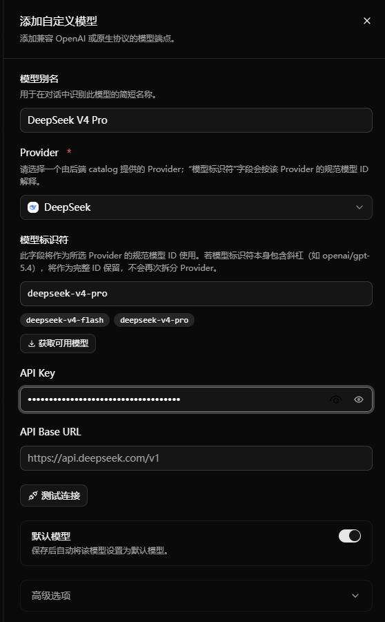
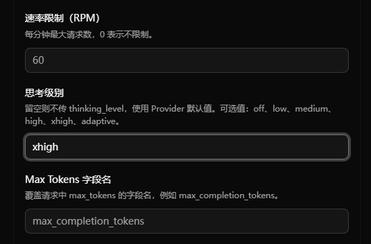

[English](./picoclaw.md) | [简体中文](./picoclaw.zh-CN.md) · [← 返回](../README.zh-CN.md)

# 接入 PicoClaw

PicoClaw 是一个超轻量级的个人 AI 助手，采用 Gateway 运行时加 Launcher Web UI 的架构。本指南全程使用 Launcher Web UI 完成配置，对大多数用户友好。

#### 1. 安装 PicoClaw

从 [picoclaw.io](https://picoclaw.io) 下载最新版本，或按 [PicoClaw 文档](https://docs.picoclaw.io) 中的说明完成安装。

安装完成后：

- Windows 用户运行 `picoclaw-launcher.exe`。
- Linux 或 macOS 用户运行 `picoclaw-launcher`。

#### 2. 打开 Launcher Web UI

启动 `picoclaw-launcher` 后，浏览器会自动打开 `http://localhost:18800`。首次启动时需要先创建 Dashboard 密码；后续再次登录时则进入常规的 Launcher 登录页面。

Launcher 是 PicoClaw 的控制入口。你可以在这里配置模型、启动或重启 Gateway，并进入 Chat 页面。

#### 3. 添加 DeepSeek V4 模型

在左侧边栏进入**模型**，在右上角点击**添加模型**，然后按下面的方式填写表单：

- Provider：`DeepSeek`
- 模型别名：本地显示名称，例如 `DeepSeek V4 Pro`
- 模型标识符：`deepseek-v4-pro` 或 `deepseek-v4-flash`
- API Key：你的 [DeepSeek API Key](https://platform.deepseek.com/api_keys)
- API Base URL：一般不修改，除非你明确要接入代理或兼容网关，否则保持 DeepSeek 默认地址
- 默认模型：如果要作为主聊天模型，请开启

点击**测试连接**验证连接，然后保存模型。

PicoClaw 的 Web UI 中已将 `deepseek-v4-pro` 和 `deepseek-v4-flash` 作为 DeepSeek 的常用模型展示出来。对于编程和 Agent 场景，建议把 `deepseek-v4-pro` 设为默认模型。若更看重降低成本或提升响应速度，可添加 `deepseek-v4-flash` 模型。

#### 4. 为 DeepSeek V4 Pro 设置最高推理强度

编辑刚保存的模型，展开**高级选项**，在使用 `deepseek-v4-pro` 时将**思考级别**设为 `xhigh`。

在 PicoClaw 中，`high` 将会被自动映射到 DeepSeek 的 `high`，`xhigh` 则会映射到 DeepSeek 的 `max`。而 `off` 将会自动映射使 DeepSeek 关闭思考。

#### 5. 启动或重启 Gateway

保存模型后，点击顶部栏的**启动服务**。如果 Gateway 已经在运行，且你刚修改过模型设置，则点击**重启服务**让新配置生效。

只有在 Gateway 运行时，PicoClaw Chat 页面才能正常工作。

#### 6. 开始对话

在 Launcher 中打开**对话**页面开始使用。如果页面提示默认模型未配置，请返回**模型**页面修正后再试。

#### 说明

- DeepSeek V4 支持最高 1M token 上下文。如果你需要调整**上下文窗口**、**最大 Token 数**等运行时预算，可在 PicoClaw Web UI 的**配置**页面调整。
- 对大多数用户，`deepseek-v4-pro` 作为默认模型，是最稳妥的起点。
- 更详细的部署、认证与平台差异说明，请参考 [PicoClaw 文档](https://docs.picoclaw.io)。