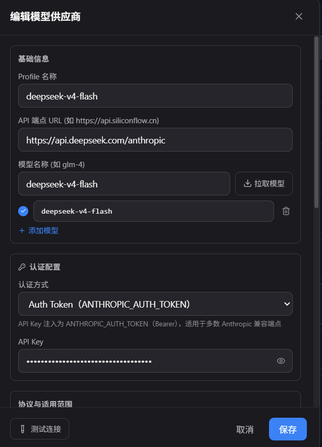
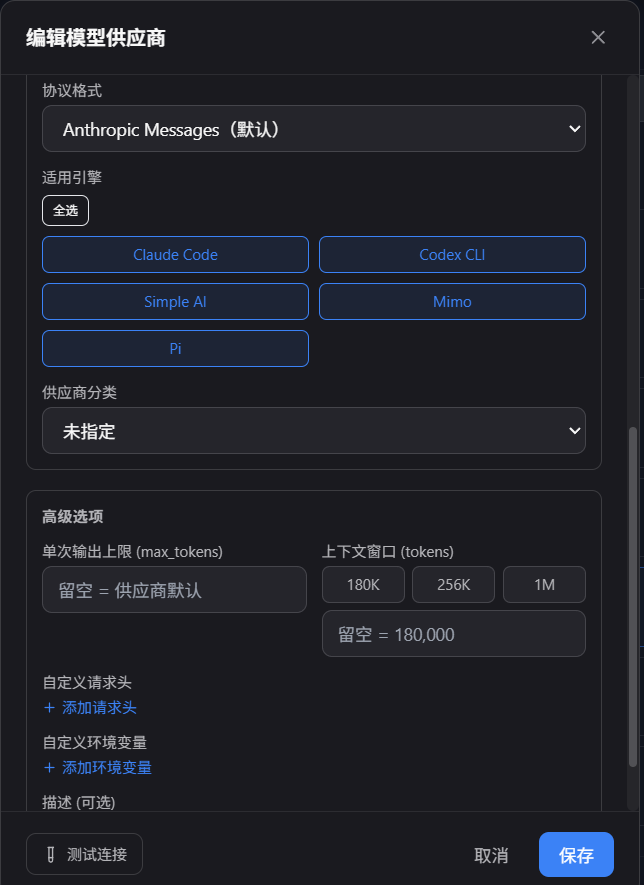
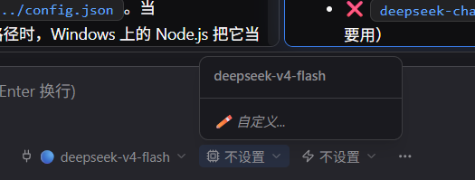

[English](./polaris.md) · [← 返回](../README.zh-CN.md)

# 接入 Polaris

Polaris 是一个跨平台 AI 开发工作台，内置 Claude Code、Codex、Simple AI、Pi、Mimo 等多个编程 Agent 引擎，并提供灵活的模型供应商（Model Provider）系统。DeepSeek 模型通过这一供应商层接入，无需任何引擎级代码改动。

**项目地址**：[https://github.com/misxzaiz/Polaris](https://github.com/misxzaiz/Polaris)

DeepSeek 同时支持 Polaris 模型供应商暴露的三种协议线路：**Anthropic Messages**、**OpenAI Chat Completions** 和 **OpenAI Responses**，用户可根据工作流偏好自由选择。

#### 1. 打开模型供应商设置

打开 Polaris 的 **设置 → 模型供应商**，所有模型供应商 Profile 均在此管理。

#### 2. 获取 DeepSeek API Key

前往 [DeepSeek 开放平台](https://platform.deepseek.com/api_keys) 获取 API Key。

#### 3. 添加 DeepSeek 模型供应商

1. 点击 **添加供应商**（或编辑已有 Profile）。
2. 填写配置信息：

   | 字段 | 值 |
   |------|-----|
   | Profile 名称 | `deepseek-v4-flash`（或 `deepseek-v4-pro`） |
   | 模型名称 | `deepseek-v4-flash`（或 `deepseek-v4-pro`） |
   | 认证方式 | `Auth Token`（Bearer） |
   | API Key | （粘贴你的 DeepSeek API Key） |

3. 根据你偏好的协议线路，选择对应的 **API 端点 URL** 和 **协议格式**：

   | 协议格式 | API 端点 URL | 说明 |
   |----------|--------------|------|
   | Anthropic Messages（默认） | `https://api.deepseek.com/anthropic` | 原生推理/思考模式，支持 `thinking: { type: "enabled" }` |
   | OpenAI Chat Completions | `https://api.deepseek.com/v1/chat/completions` | 标准 OpenAI 兼容聊天接口 |
   | OpenAI Responses | `https://api.deepseek.com/v1/responses` | Responses API |

4. 在 **适用引擎** 中选择该供应商可被哪些引擎调用（如 Simple AI、Pi、Claude Code、Codex CLI、Mimo）。
5. 在 **高级选项 → 上下文窗口** 中选择 **1M**，以启用 DeepSeek V4 的 1M 上下文能力。
6. 点击 **测试连接** 确认无误后，点击 **保存**。

#### 4. 选择 DeepSeek 作为模型

1. 打开 Polaris 的聊天面板。
2. 在引擎选择下拉框（引擎开关旁的模型选择器）中，选择你配置好的 DeepSeek 模型 Profile（如 `deepseek-v4-flash`）。
3. 开始对话——DeepSeek V4 现已驱动你的 Polaris Agent。

#### 注意事项

- **模型名称**：请使用 `deepseek-v4-pro` 或 `deepseek-v4-flash`（当前 V4 命名）。旧版 V3 名称（`deepseek-chat`、`deepseek-reasoner`）已废弃。
- **1M 上下文窗口**：DeepSeek V4 支持最高 1M tokens 的上下文。请在高级选项中将上下文窗口设为 **1M** 以充分利用。
- **推理/思考模式**：DeepSeek V4 Pro 支持多档推理强度。使用 Anthropic Messages 端点时，可通过 `thinking` 参数原生启用推理模式；推理强度可在聊天面板的模型选择器设置中配置。
- **引擎选择**：Polaris 的五款内置引擎（Claude Code、Codex CLI、Simple AI、Pi、Mimo）均可通过 DeepSeek 供应商路由。引擎决定 Agent 循环和工具调用行为；供应商决定底层调用的模型 API。
- **Windows 说明**：Polaris 原生支持 Windows。无需额外设置环境变量——API Key 直接在模型供应商设置界面中配置即可。
