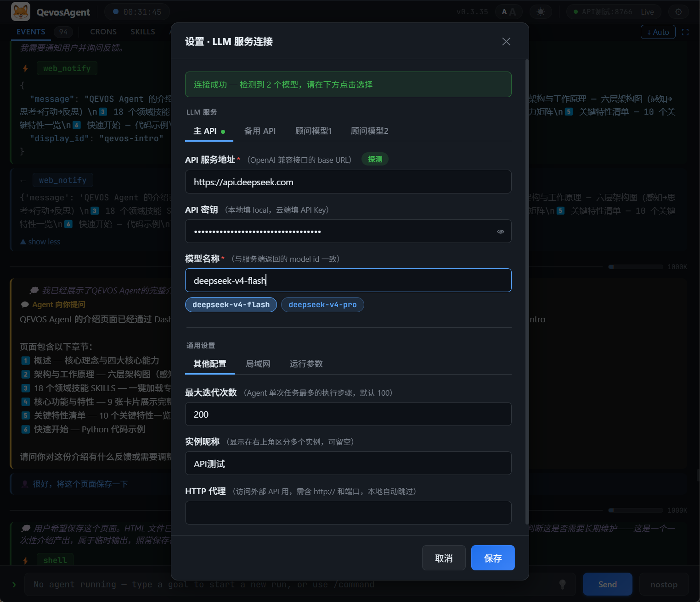
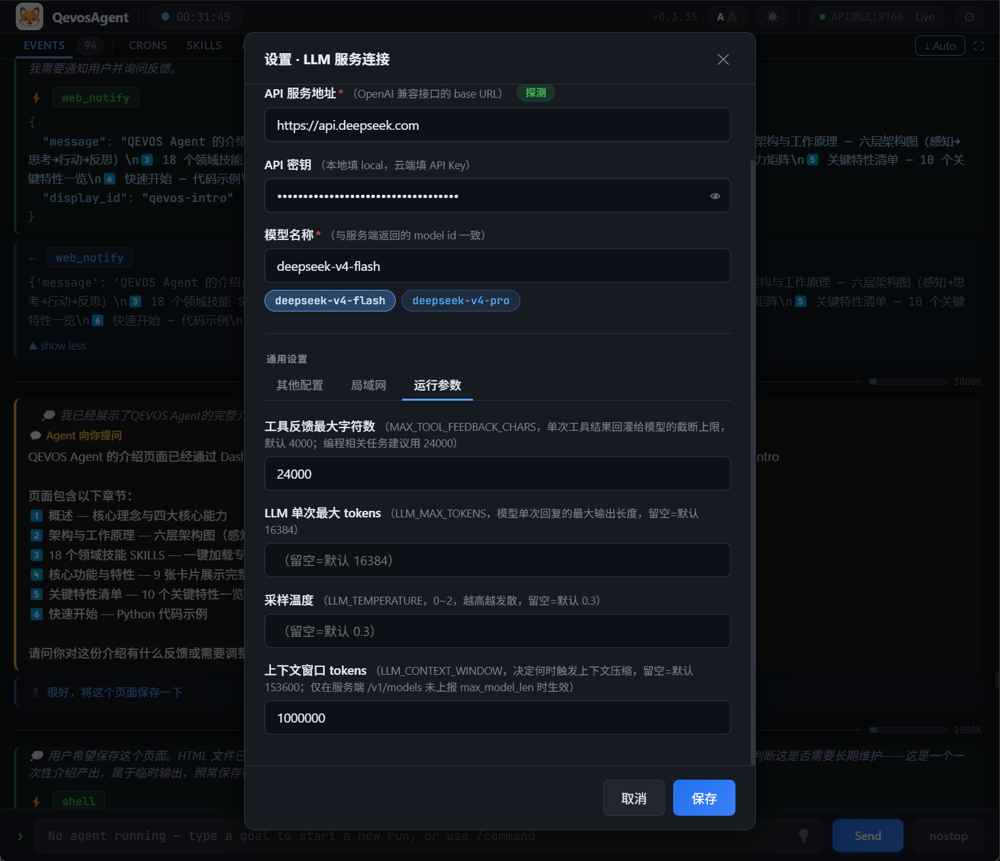

# QevosAgent + DeepSeek

[QevosAgent](https://github.com/QHYCCD/QevosAgent) is a practical and minimal open-source autonomous AI Agent framework with a desktop application for Windows, macOS, and Linux. It features a Web Dashboard, multi-model support, self-evolving tools, senior advisor perspective, and long-term memory. One-click installation, easy deployment.

- **Official Website**: <https://qevos.ai>
- **Download**: <https://github.com/QHYCCD/QevosAgent/releases>

This guide shows how to configure QevosAgent to use DeepSeek models in **two steps**.

---

## Step 1: Configure API Connection

1. Open QevosAgent Dashboard (default: `http://localhost:8765`)
2. Click the **Settings** icon (⚙️) in the top-right corner
3. Go to the **LLM Service** section and fill in:

   - **API Base URL**: `https://api.deepseek.com`
   - **API Key**: Your DeepSeek API Key (get it from [DeepSeek Platform](https://platform.deepseek.com/api_keys))
   - **Click the "Detect" button**

4. If detection succeeds, it will show a connection success message and display available model names (`deepseek-v4-pro` or `deepseek-v4-flash`). Click the model button to auto-fill the model name field.
5. Click **Save**

## Step 2: Enable 1M Context Window

DeepSeek V4 supports up to 1 million tokens of context. To enable it:

1. In **Settings** → **LLM Service** → **Runtime Params** tab
2. Set **Context Window Tokens** to `1000000`
3. Click **Save**

---

## Troubleshooting

- **Connection failed**: Verify API Key is valid and check network connectivity to `https://api.deepseek.com`
- **Model not found**: Use exact model names: `deepseek-v4-pro` or `deepseek-v4-flash`
- **Proxy issues on Linux**: Set `HTTPS_PROXY` and `HTTP_PROXY` in `.env` file

## Resources

- [QevosAgent GitHub](https://github.com/QHYCCD/QevosAgent)
- [DeepSeek API Docs](https://api-docs.deepseek.com/)
- [DeepSeek Platform](https://platform.deepseek.com/)
