[English](./qoder.md) | [简体中文](./qoder.zh-CN.md) · [← 返回](../README.zh-CN.md)

# 接入 Qoder

Qoder 是由 Qoder 团队打造的 AI 编程 Agent 平台。DeepSeek 作为**内置一方模型**直接可用 —— 付费版可从模型列表中直接选择，账户开启 BYOK 后亦可自带 API Key 接入。

Qoder 提供多种产品形态：

- **QoderWork** —— 面向所有人的桌面级 Agentic 助手
- **Qoder CLI** —— 面向命令行开发者的 AI 编程 Agent 工具
- **Qoder** —— 面向真实软件开发场景的自主开发桌面应用

Qoder CLI 与 Qoder Desktop 支持 DeepSeek-V4-Pro 和 DeepSeek-V4-Flash，最大 **100 万 token 上下文窗口**，支持**最高思考深度**。DeepSeek 内置选择目前仅在 **QoderWork CN** 上线。

- **官网:** [https://qoder.com](https://qoder.com)
- **文档:** [https://docs.qoder.com](https://docs.qoder.com)

---

## 安装

### QoderWork（CN）

在 QoderWork CN 官方站点 [https://qoder.com.cn/qoderwork](https://qoder.com.cn/qoderwork) 下载并安装。DeepSeek 内置模型选择目前仅在此 CN 版本中提供。

### Qoder CLI

**macOS / Linux:**

```bash
curl -fsSL https://qoder.com/install | bash
```

**Windows PowerShell:**

```bash
irm https://qoder.com/install.ps1 | iex
```

**Windows CMD:**

```bash
curl -fsSL https://qoder.com/install.cmd -o install.cmd && install.cmd
```

验证安装：

```bash
qodercli --version
```

### Qoder Desktop

从 [https://qoder.com/download](https://qoder.com/download) 下载对应平台的安装包（macOS 10.15+、Windows 10+、Linux .deb/.rpm）。

---

## 登录

启动 Qoder 并登录。CLI 中：

```bash
qodercli
```

在交互界面中输入：

```
/login
```

按照提示通过浏览器或个人访问令牌完成身份认证。

Desktop 首次启动时按内置引导登录即可。

---

## 使用内置 DeepSeek 模型（付费版）

所有付费计划（Pro、Pro+、Ultra、Teams）均可直接使用 DeepSeek-V4-Pro 和 DeepSeek-V4-Flash，无需 API Key。

### 在 QoderWork 中（仅限 CN 版）

QoderWork CN 版本中，打开任务输入框的模型选择器，选择 `DeepSeek-V4-Pro` 或 `DeepSeek-V4-Flash`。选中后会在输入框下方显示模型的上下文窗口和 Credit 消耗倍率。

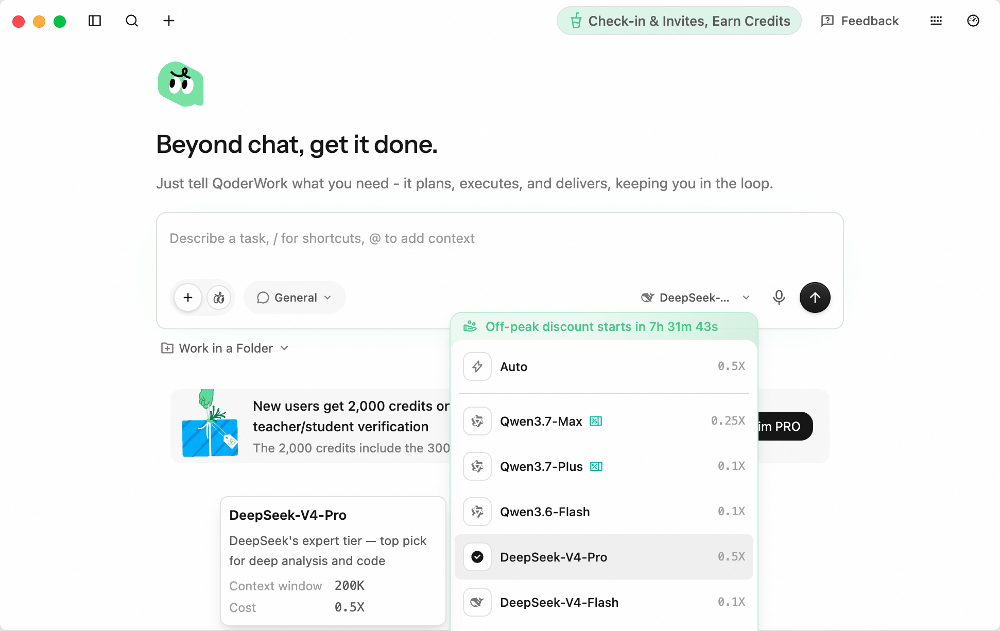

### 在 CLI 中

输入 `/model` 命令，切换到 **New Models** 标签：

```
/model
```

选择 `DeepSeek-V4-Pro` 或 `DeepSeek-V4-Flash`，按回车确认。

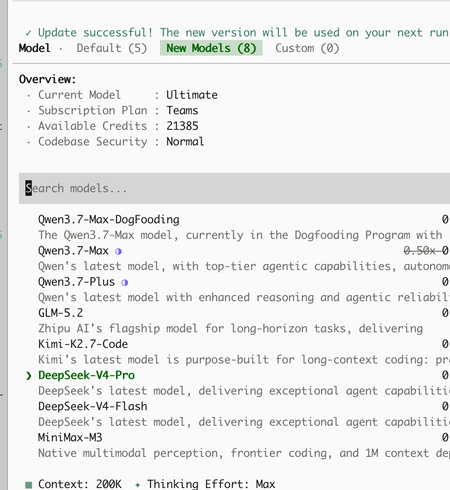

### 在 Desktop 中

点击 AI Chat 输入框的模型选择下拉菜单，切换到 **New Models** 标签，选择 `DeepSeek-V4-Pro` 或 `DeepSeek-V4-Flash`。选中模型后右侧面板可直接调整 **上下文窗口**（200K / 400K / 1M）和 **思考深度**（high / max）。

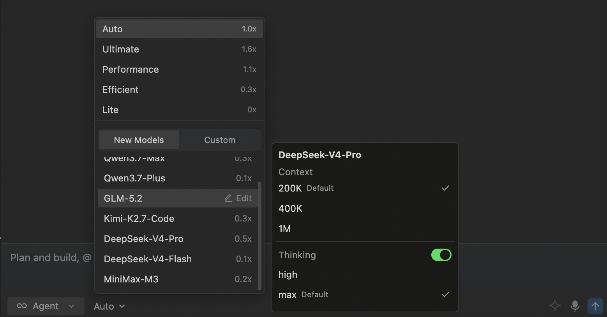

### 模型详情

| 模型 | Credit 消耗倍率 | 说明 |
|------|----------------|------|
| DeepSeek-V4-Pro | 0.5x | 擅长复杂推理、代码生成与工程任务 |
| DeepSeek-V4-Flash | 0.1x | 快速推理、低成本、综合能力均衡 |

两个模型均支持最大 **100 万 token 上下文窗口**和**最高思考深度**。

---

## 自带 API Key 使用 DeepSeek（BYOK）

DeepSeek 是内置的 BYOK 供应商 —— 账户开启 BYOK 权限后，可直接填入自有 API Key，无需配置自定义端点。先到 [DeepSeek 开放平台](https://platform.deepseek.com/api_keys) 申请一个 Key。

### 在 CLI 中

1. 输入 `/model` 切换到 **Custom** 标签，光标定位到 `[+] Add custom model...` 后回车。

   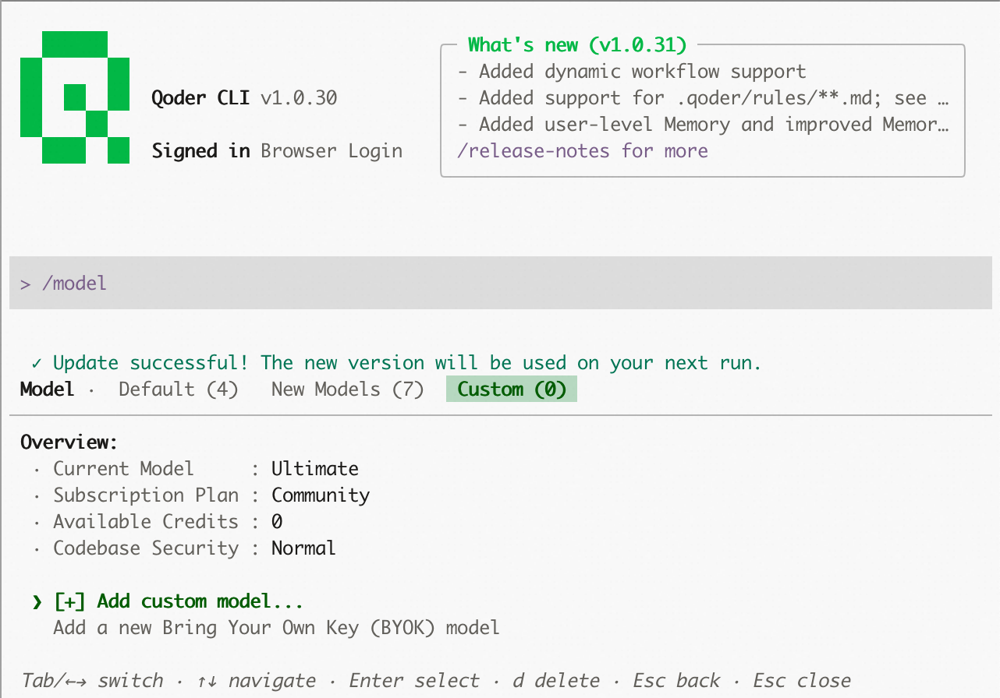

2. **第 1 步 供应商：** 从列表中选择 `DeepSeek`。

   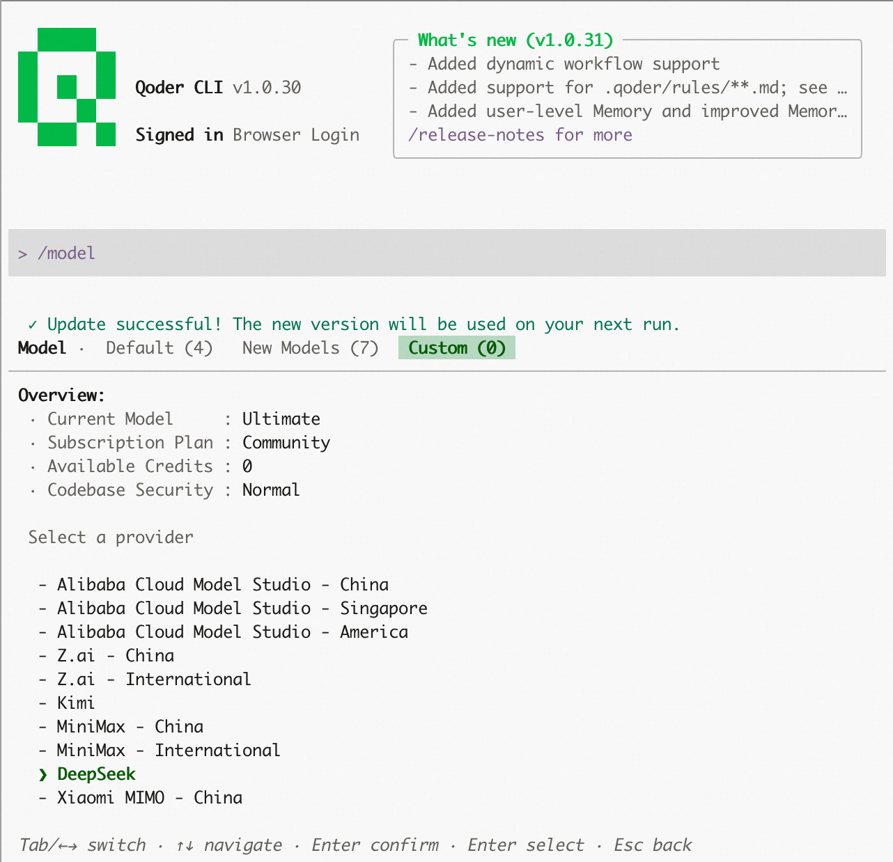

3. **第 2 步 模型：** 在 *Pay As You Go* 分组下选择 `DeepSeek-V4-Pro` 或 `DeepSeek-V4-Flash`。

   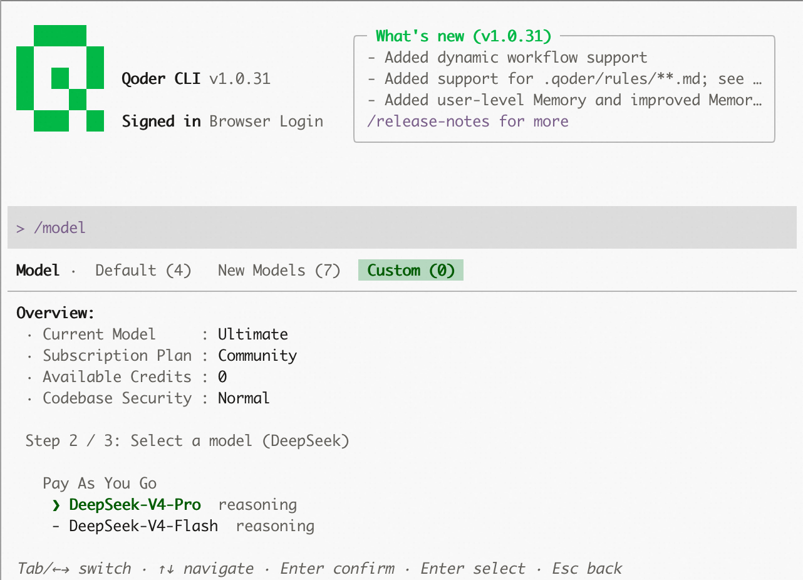

4. **第 3 步 凭证：** 粘贴 DeepSeek API Key，按回车提交。CLI 会先调用服务端校验，校验通过才落盘。

   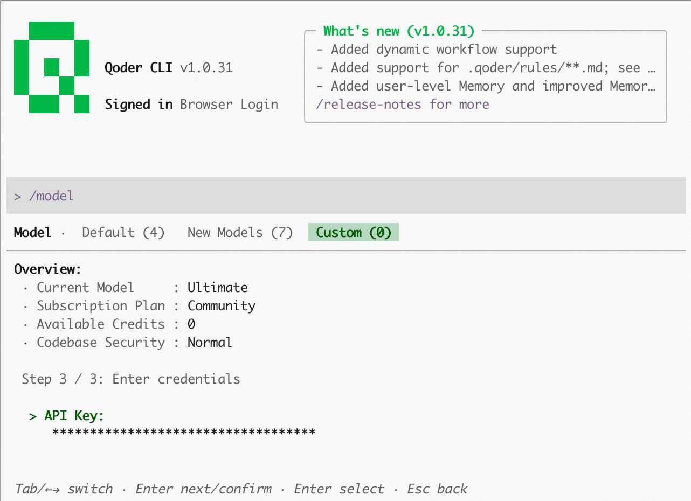

5. 新模型出现在 **Custom** 标签列表中。按回车切换为当前模型；按 `d` 删除。

   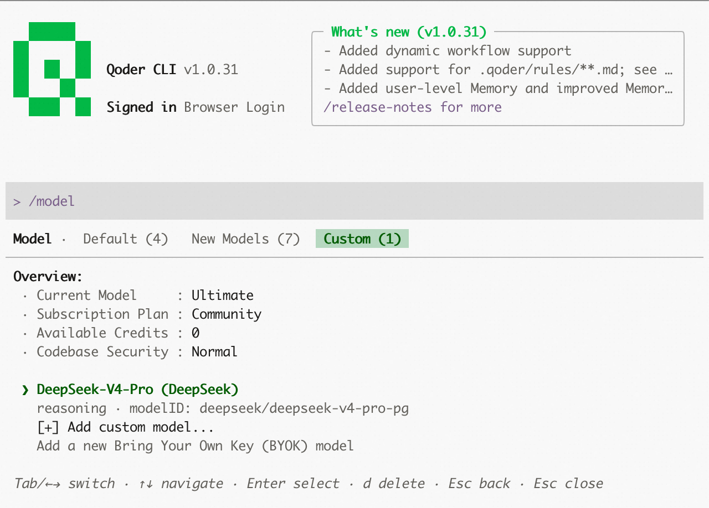

6. 切换后，底部当前模型栏会变为 `DeepSeek-V4-Pro (DeepSeek)`，所有请求都通过你自己的 Key 转发。

   ")

### 在 Desktop 中

1. 打开 **Settings → Models**。如果尚未配置过 BYOK，会显示 *No custom models yet*。

   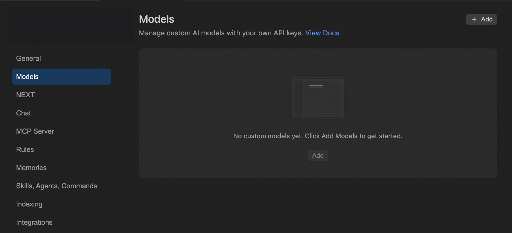

2. 点击 **+ Add**。在弹出的对话框中，Provider 选 `DeepSeek`，Type 保持 `Pay As You Go`，Models 多选 *DeepSeek-V4-Pro* 和 *DeepSeek-V4-Flash*，粘贴 API Key。

   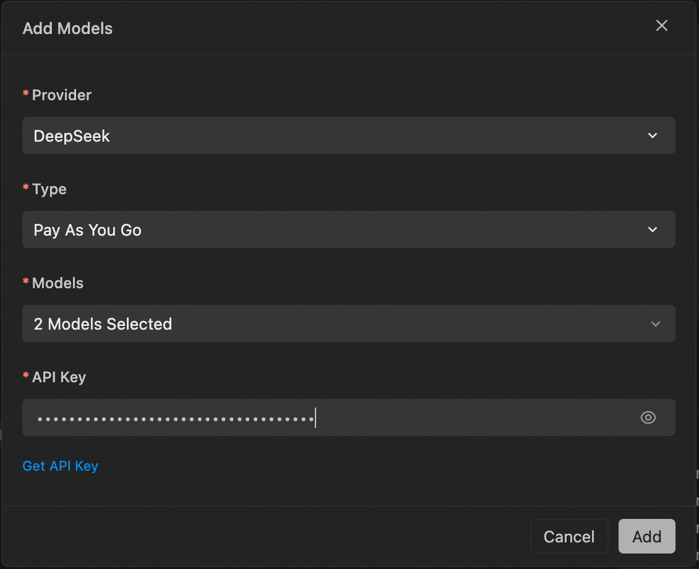

3. 点击 **Add** 后，两个模型都会出现在 Models 列表中，可通过开关启用或停用。

   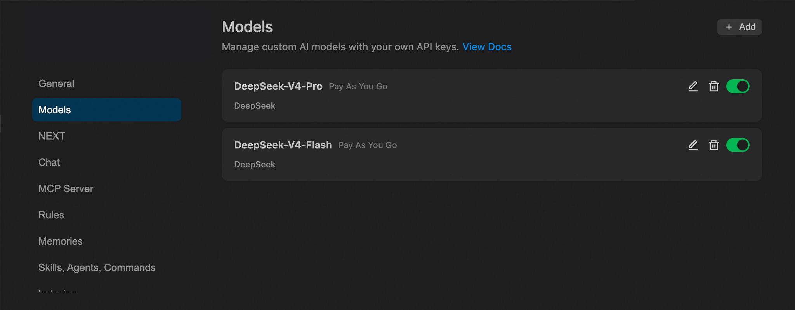

4. 回到 Chat 输入框，打开模型选择器并切换到 **Custom** 标签，刚才的 BYOK DeepSeek 模型在这里。点击即可使用。

   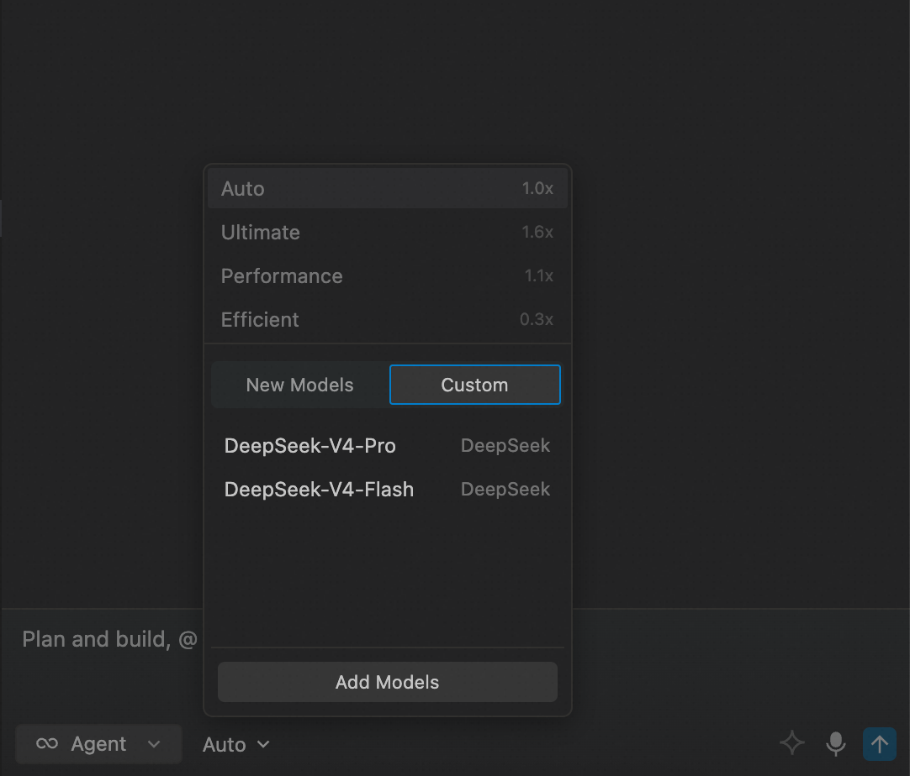

> **关于 BYOK 权限：** BYOK 是否可用由账户权限决定。DeepSeek 已在内置 BYOK 供应商列表中，不需要更高的"自定义 URL"权限（后者用于任意 OpenAI 兼容端点）。如 CLI 中看不到 "Add custom model" 或 Desktop 看不到 "+ Add"，请检查计划或工作区设置。

---

## 配置模型参数

DeepSeek V4 模型支持可配置的参数：

**上下文窗口：**

| 选项 | 说明 |
|------|------|
| 200K | 标准窗口，满足大多数任务 |
| 400K | 扩展窗口，适合较大代码库 |
| 1M | 最大窗口，适合超大规模项目 |

**思考深度：**

| 选项 | 说明 |
|------|------|
| low | 最少推理，响应最快 |
| medium | 适中的推理深度 |
| high | 深度推理，适合复杂任务 |
| xhigh | 深度分析高难度问题 |
| max | 最大推理深度 |

### CLI 命令

```bash
# 启动时指定模型
qodercli --model deepseek-v4-pro
qodercli --model deepseek-v4-flash

# 调整参数
qodercli --reasoning-effort max --context-window 1000000
```

或在交互会话中使用斜杠命令：

```
/model
/effort max
/context-window
```

> **提示：** 随时使用 `/model` 切换模型，选择会自动保存并跨会话持久化。
