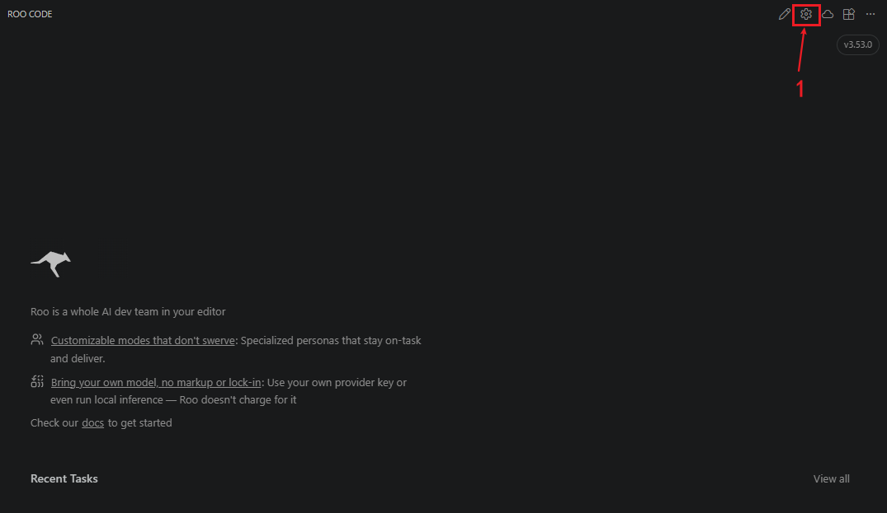
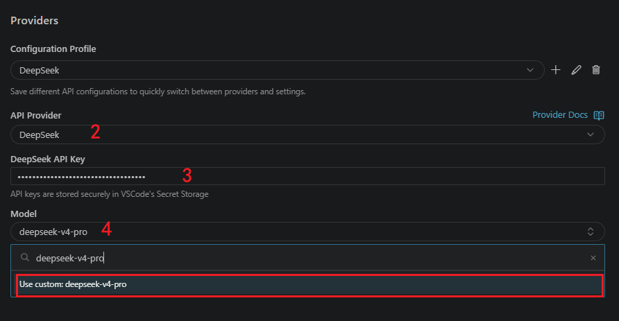

[English](./roocode.md) | [简体中文](./roocode.zh-CN.md) · [← 返回](../README.zh-CN.md)

# 在 Roo Code 中使用 DeepSeek

Roo Code 是一个支持多提供商插件的 IDE / CLI 编程助手。本文介绍如何在 Roo Code 中配置并使用 DeepSeek V4 模型（`deepseek-v4-pro` / `deepseek-v4-flash`）。

### 安装 Roo Code

- VS Code 扩展：在市场中安装（Marketplace 链接：https://marketplace.visualstudio.com/items?itemName=RooVeterinaryInc.roo-cline）
- 如需 CLI 或其他安装方式，请参阅 Roo Code 官方文档：https://docs.roocode.org.cn/

### 获取 DeepSeek API Key

- 前往 DeepSeek 平台： https://platform.deepseek.com/
- 打开 `API Keys` 页面，创建新密钥并复制。请妥善保存。

### 在 Roo Code 中配置（UI）



1. 打开 Roo Code 面板并点击齿轮图标（⚙设置）。



2. 在提供商下拉菜单中选择 `DeepSeek`。
3. 将 DeepSeek API Key 粘贴到 “DeepSeek API Key” 字段。
4. 从模型下拉中选择：`deepseek-v4-pro`（推荐）或 `deepseek-v4-flash`（更低成本）。

**注意**

- deepseek-chat 与 deepseek-reasoner 两个模型名将于 2026/07/24 弃用。出于兼容考虑，二者分别对应 deepseek-v4-flash 的非思考与思考模式。
- Roo Code 默认只有 `deepseek-chat` 和 `deepseek-reasoner` 这两个模型可选 , 因此我们需要手动指定我们需要的模型 , 例如 `deepseek-v4-pro`

### 验证 API（可选）

在配置 Roo Code 前后，可以用 curl 测试 DeepSeek API 是否可用：

OpenAI 兼容示例（非流式）:

```bash
curl https://api.deepseek.com/chat/completions \
  -H "Content-Type: application/json" \
  -H "Authorization: Bearer $DEEPSEEK_API_KEY" \
  -d '{
    "model": "deepseek-v4-pro",
    "messages": [
      {"role": "system", "content": "You are a helpful assistant."},
      {"role": "user", "content": "Hello!"}
    ],
    "thinking": {"type": "enabled"},
    "reasoning_effort": "max",
    "stream": false
  }'
```

有关 Anthropic 风格的示例，请参阅 DeepSeek 文档：https://api-docs.deepseek.com/guides/anthropic_api

### 首次运行

保存 Roo Code 提供商设置后，打开 Roo Code 面板并新建会话。发送简单提示（例如 “重构此函数”）以确认响应来自 DeepSeek。

### 提示与注意事项

- 使用 `deepseek-v4-pro` 以获得最佳推理体验；使用 `deepseek-v4-flash` 在快速迭代时节省成本。
- 避免使用已弃用模型名称（`deepseek-chat`(将于 2026/07/24 弃用) 、`deepseek-reasoner`(将于 2026/07/24 弃用) ），请改用 `deepseek-v4-pro` / `deepseek-v4-flash`。
- 定期核对 DeepSeek 的价格与能力： https://api-docs.deepseek.com/quick_start/pricing
- 如果 Roo Code 暴露 token 限制设置，建议调整以配合 DeepSeek 的大上下文能力，避免提示被截断。

更多信息请参阅 Roo Code 的提供商文档：https://docs.roocode.org.cn/providers/deepseek
