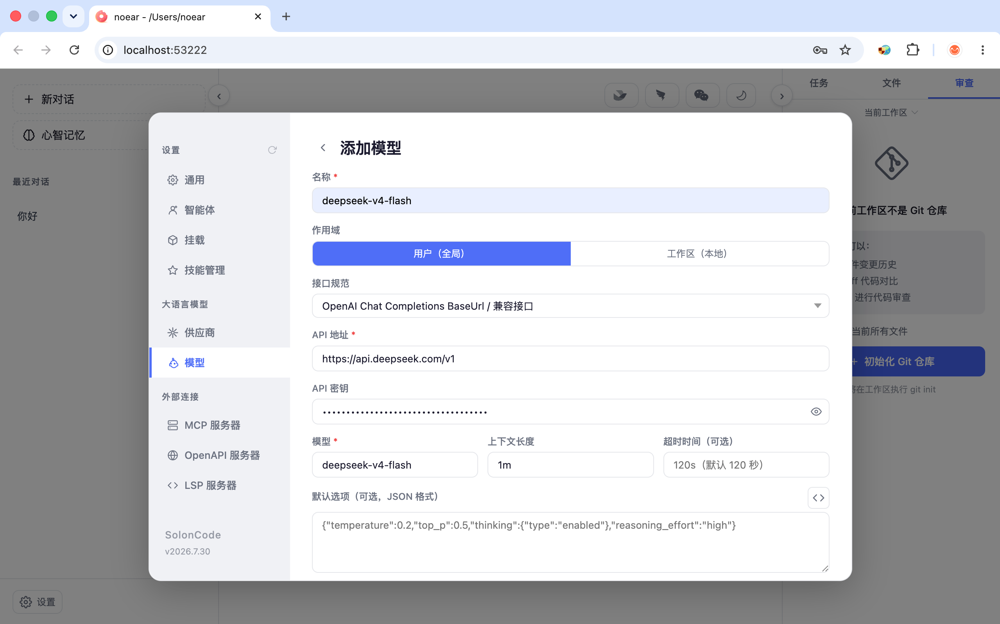

[English](./soloncode.md) | [简体中文](./soloncode.zh-CN.md) · [← 返回](../README.zh-CN.md)

# 接入 SolonCode

SolonCode 是一个基于 Java 实现的开源编码智能体，以终端命令行方式运行，帮助开发者完成代码编写、项目分析、重构、测试生成、文档编写等研发任务。

## 从零安装 SolonCode

### 1. 系统要求

- **Java 8+**（需提前安装，支持 Java 8 ~ 26）
- 支持 macOS、Linux、Windows、Harmony PC

### 2. 安装

**Mac / Linux / Harmony PC：**

```bash
curl -fsSL https://solon.noear.org/soloncode/setup.sh | bash
```

**Windows（PowerShell）：**

```powershell
irm https://solon.noear.org/soloncode/setup.ps1 | iex
```

安装完成后验证：

```bash
soloncode --version
```

### 3. 配置模型

启动 Web 设置页：

```bash
soloncode web 0
```

进入 **设置 → 模型 → 添加模型**，填写模型信息：





API Key 在 [DeepSeek 开放平台](https://platform.deepseek.com/api_keys) 获取。

### 4. 开始使用

进入项目目录，启动 SolonCode Web：

```bash
cd your-project
soloncode web 0
```


