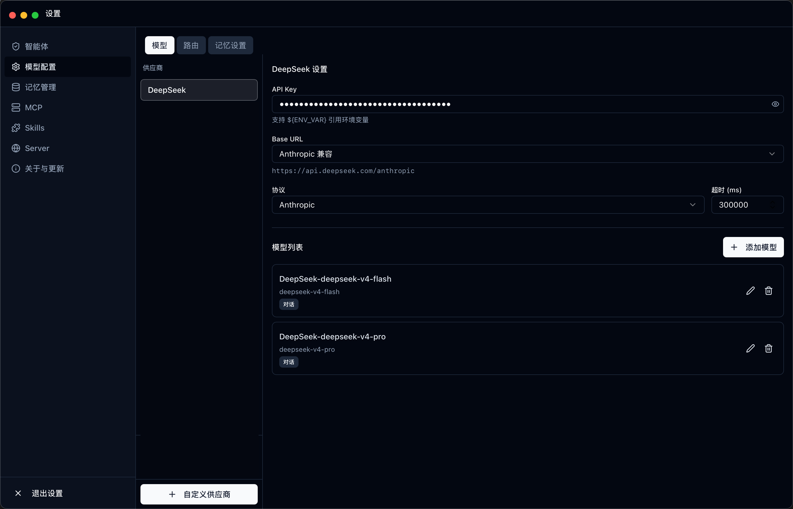
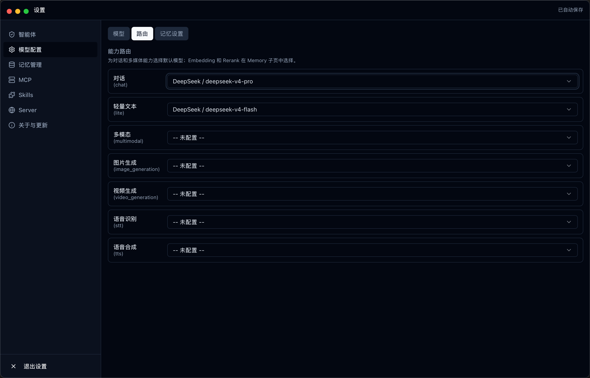

[English](./tiangong.md) | [简体中文](./tiangong.zh-CN.md) · [← Back](../README.md)

# Integrate with Tiangong

Tiangong (天工) is an open-source personal AI agent platform built in Rust with a Tauri + React desktop GUI. It runs as a desktop app, CLI, or HTTP/WS server, and supports multi-agent collaboration, MCP tools, local Skills, long-term memory, and media generation. DeepSeek is a recommended model provider.

- **GitHub:** <https://github.com/silent-rs/silent-Tiangong>

#### 1. Install Tiangong

Download the installer for your platform from [GitHub Releases](https://github.com/silent-rs/silent-Tiangong/releases):

- **macOS:** Download `.dmg`, open it, drag the app to Applications.
- **Windows:** Download `.msi` or `.exe`, run the installer.
- **Linux:** Download `.AppImage`, `.deb`, or `.rpm`.

On macOS, if the app is flagged as damaged on first launch:

```sh
xattr -cr /Applications/天工.app
```

Optionally create a CLI symlink:

```sh
ln -s /Applications/天工.app/Contents/MacOS/天工 /usr/local/bin/tiangong
```

Verify:

```sh
tiangong --help
```

#### 2. Get a DeepSeek API Key

Get your API Key from the [DeepSeek Platform](https://platform.deepseek.com/api_keys). You will need it in the next step.

#### 3. Configure DeepSeek in the desktop settings

Launch Tiangong, then open **Settings → Model** from the sidebar.

**Add the DeepSeek provider:**

Fill in the provider form with your DeepSeek credentials:



- **Name:** `deepseek`
- **Base URL:** `https://api.deepseek.com/v1`
- **API Key:** your DeepSeek API key (also supports `${DEEPSEEK_API_KEY}` environment variable syntax)
- **Protocol:** `openai_compatible`

**Configure model routing:**

Add models and assign them to routing capabilities:



- Add `deepseek-v4-pro` and route it to the **Chat** capability.
- Add `deepseek-v4-flash` and route it to the **Lite** capability.

DeepSeek V4 models support a **1M-token context window** (configured automatically by Tiangong).

#### 4. Launch and use

**Desktop GUI** — launch the app from your applications folder or run:

```sh
tiangong
```

**CLI mode** — run in the terminal:

```sh
tiangong cli
```

**Server mode** — start an HTTP/WebSocket server for remote access:

```sh
tiangong server        # foreground
tiangong server -d     # daemon
tiangong server stop   # stop daemon
```

#### Key features

| Feature | Description |
|---|---|
| **Multi-agent collaboration** | The main Agent can create Sub Agents (PM, Developer, Tester, Researcher) that work together via messages and file locks |
| **Local tools** | File read/write, command execution, code search, patch apply, web fetch, and more |
| **MCP** | Connect external MCP tool servers via `~/.tiangong/mcp.json` |
| **Skills** | Install and manage local Skills via `~/.tiangong/skills.json` |
| **Long-term memory** | SQLite + Tantivy + vector index for cross-session recall of project facts, preferences, and decisions |
| **Media generation** | Image, video, speech recognition, and TTS capabilities routed through configured providers |
| **Permission governance** | Toggle between supervised and trusted modes in desktop sessions; server mode uses controlled remote role boundaries |

#### Configuration files

All configuration is stored under `~/.tiangong/`:

| File | Purpose |
|---|---|
| `app.json` | Main app configuration (sessions, UI state) |
| `models.json` | Model providers, models, and routing |
| `skills.json` | Skill configuration |
| `mcp.json` | MCP server configuration |
| `sessions/` | Session persistence |
| `memory/` | Long-term memory data |
| `logs/` | Runtime logs |
| `media/` | Generated or archived media files |
