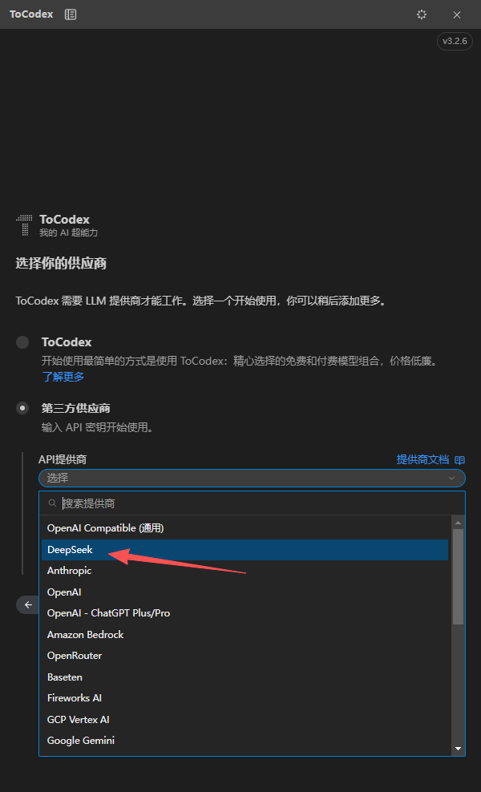
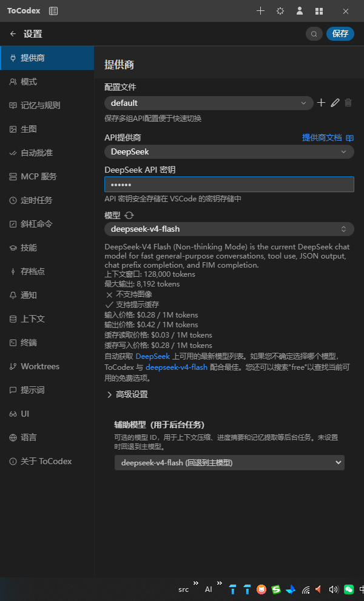
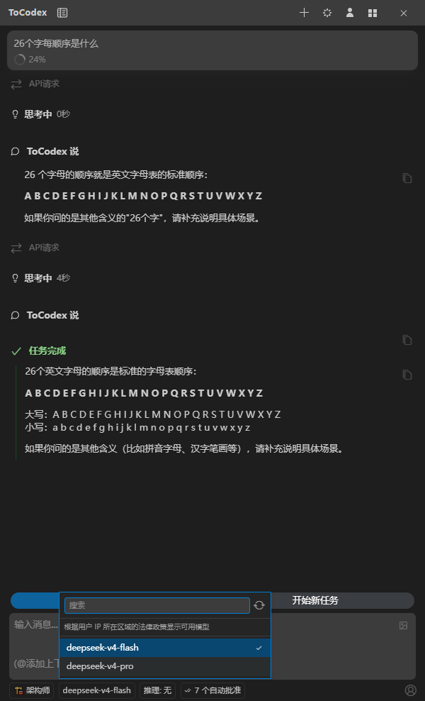

[English](./tocodex.md) | [简体中文](./tocodex.zh-CN.md) · [← Back](../README.md)

# Integrate with ToCodex

[ToCodex](https://tocodex.com) is an open-source, enterprise-grade general-purpose AI coding agent, available as a desktop app, a VS Code extension, and a CLI. DeepSeek is a **built-in, top-listed provider** in ToCodex — you only need to paste your API key, and ToCodex automatically fetches the available DeepSeek-V4 models along with their context window, reasoning levels, specs, and pricing. No proxy or forwarding layer is required.

#### 1. Install ToCodex

Pick whichever form fits your workflow:

- **VS Code extension** — open VS Code, click the **Extensions** icon (or press `Ctrl+Shift+X`), search for `ToCodex`, then click **Install**.
- **Desktop app** — download it from the [ToCodex website](https://tocodex.com/download.html).
- **CLI** — install via npm:

```shell
npm install -g @tocodex/cli
```

#### 2. Get a DeepSeek API Key

Go to the [DeepSeek Platform](https://platform.deepseek.com/api_keys), create an API key, and copy it.

#### 3. Select the DeepSeek Provider

- Launch ToCodex from the activity bar.
- On the onboarding screen — or later via **Settings → Providers → API Provider** — open the provider list.
- DeepSeek is listed as a built-in provider (shown ahead of Anthropic, OpenAI, OpenRouter, Google Gemini, and others). Select **DeepSeek**.

<div align="center">

</div>

#### 4. Configure the DeepSeek Provider

- With **DeepSeek** selected as the API Provider, paste your [DeepSeek API Key](https://platform.deepseek.com/api_keys).
- ToCodex automatically fetches the available DeepSeek models together with their specs and pricing — no manual base URL or model spec configuration is needed.

<div align="center">

</div>

#### 5. Choose a Model and Set Reasoning Effort

- Open the model selector and choose **`deepseek-v4-pro`** (most capable, recommended for coding) or **`deepseek-v4-flash`** (faster, lower cost).
- **1M context window:** ToCodex supports the full **1,000,000-token** context window of the DeepSeek-V4 series. It reads the model's context window automatically, so long-context tasks work out of the box.
- **Max reasoning effort:** for the best coding experience, set the **reasoning effort** to the highest level (`max`). ToCodex exposes this as a per-task setting in the input bar, so DeepSeek-V4-Pro performs deep thinking on complex tasks. Don't disable thinking mode to work around errors — keep it at `max`/`high` for agentic coding.
- (Optional) You can assign a separate DeepSeek model (e.g. `deepseek-v4-flash`) as the **auxiliary model** for lightweight subtasks.

<div align="center">

</div>

#### 6. First Run

Open a project folder, type a request in the ToCodex input box, and send it. ToCodex routes the request to DeepSeek-V4 and starts working across its MCP tools, custom modes, scheduled tasks, and configurable model routing.

### Pricing

DeepSeek-V4 pricing snapshot (per 1M tokens). Always verify the latest values against the official pricing pages ([English](https://api-docs.deepseek.com/quick_start/pricing) / [中文](https://api-docs.deepseek.com/zh-cn/quick_start/pricing)).

| Model | Input | Output | Cache Hit |
|-------|-------|--------|-----------|
| `deepseek-v4-pro` | $0.435 | $0.87 | $0.003625 |
| `deepseek-v4-flash` | $0.14 | $0.28 | $0.0028 |

ToCodex displays the model's price automatically once the provider is configured.

### Notes

- **Models:** `deepseek-v4-pro` and `deepseek-v4-flash` are the current DeepSeek-V4 models. The legacy `deepseek-chat` and `deepseek-reasoner` (V3) models are being deprecated — use the V4 names.

### Troubleshooting

- **`401` / authentication error** — check the DeepSeek API key in **Settings → Providers**.
- **`402` / payment error** — check your balance on the [DeepSeek Platform](https://platform.deepseek.com/).
- **Model list is empty** — re-enter the API key and confirm network access to `https://api.deepseek.com`.

### Resources

- [ToCodex](https://tocodex.com)
- [ToCodex Community (open source)](https://github.com/tocodex-ai/tocodex-community)
- [DeepSeek Platform](https://platform.deepseek.com/)
- [DeepSeek API Docs](https://api-docs.deepseek.com/)
