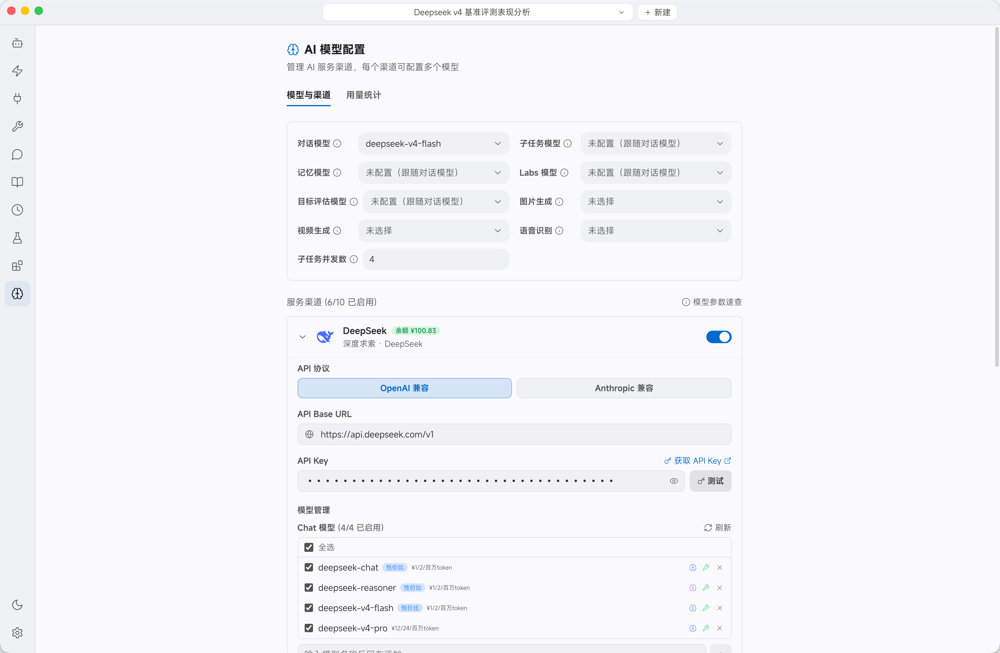
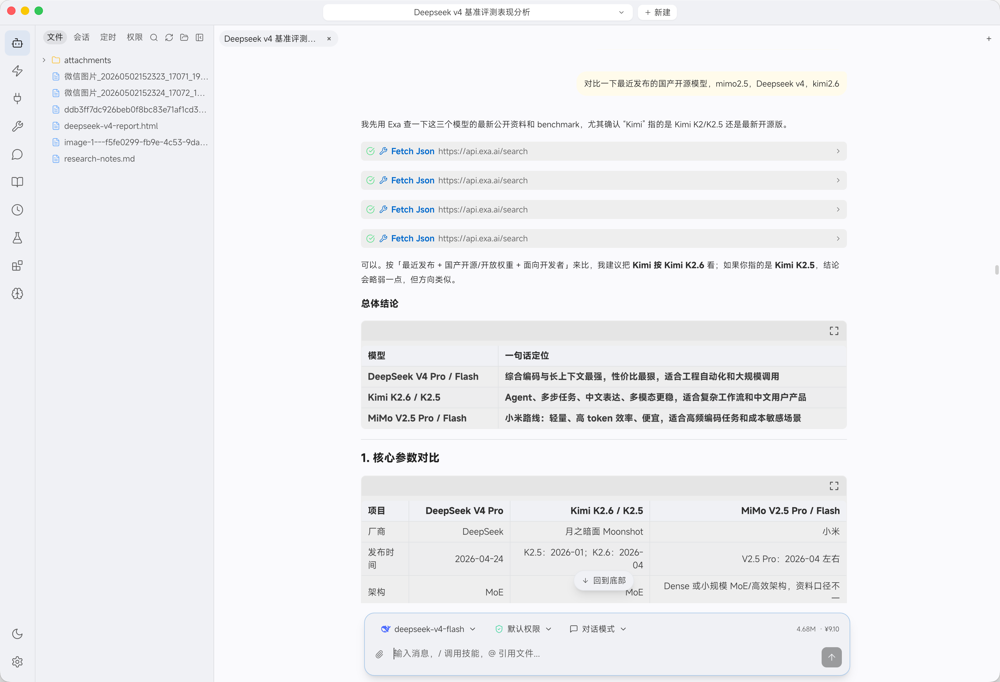

[English](./tokeny.md) | [简体中文](./tokeny.zh-CN.md) · [← Back](../README.md)

# Integrate with Tokeny

Tokeny is a cross-platform **desktop AI assistant** (Windows / macOS / Linux) that pairs a chat workspace with built-in tools (files, shell commands, web search), an open Skill system, and MCP plugins. It ships with **DeepSeek as a built-in provider**, so you only need to drop in an API key to start using DeepSeek V4.

- **Website:** <https://tokeny-ai.com>
- **Docs:** <https://tokeny-ai.com/docs>

#### 1. Install Tokeny

Download the installer for your platform from the [Tokeny download page](https://tokeny-ai.com).

Available builds:

- Windows (`.exe`, Windows 10+)
- macOS (`.dmg` — Apple Silicon and Intel)
- Linux (`.AppImage`)

#### 2. Configure the DeepSeek Provider

Open Tokeny and go to **Settings → AI Model Configuration** (the brain icon in the left sidebar). DeepSeek is already in the channel list — you don't need to add a custom provider.

1. Find the **DeepSeek** channel and keep **API Protocol** on **OpenAI-Compatible**. The **API Base URL** is pre-filled as `https://api.deepseek.com/v1`.
2. Paste your [DeepSeek API Key](https://platform.deepseek.com/api_keys) into the **API Key** field and click **Test** to verify the connection.
3. Under **Model Management**, make sure **`deepseek-v4-pro`** and **`deepseek-v4-flash`** are enabled.
4. Toggle the switch on the top-right of the DeepSeek channel to enable it.

> The older `deepseek-chat` / `deepseek-reasoner` aliases are still listed for compatibility, but you should select **`deepseek-v4-pro`** or **`deepseek-v4-flash`** — these are the current model names.

#### 3. Start Chatting

Back in the workspace, click the model selector at the bottom of the chat input and choose **`deepseek-v4-pro`** (for the strongest coding and reasoning) or **`deepseek-v4-flash`** (for fast, cost-effective tasks). Type a message and send.

DeepSeek V4 runs with the full **1 million token** context window in Tokeny out of the box — no extra configuration required. Both V4 models support **toggleable thinking mode**: keep thinking enabled to get the deepest reasoning for coding and complex tasks. Tokeny maps the toggle to DeepSeek's native `thinking` parameter automatically, and renders the model's reasoning stream inline.

You can fine-tune per-model settings (context window, max output, thinking mode) from the wrench icon next to each model in **Model Management**.

#### 4. Going Further

Once DeepSeek V4 is configured, you can use it across the rest of Tokeny:

- **Skills.** Trigger built-in skills like deep research, code review, frontend design, or PPT generation with a `/command`, or let the agent pick automatically. Community skills install from a GitHub URL.
- **MCP Plugins.** Add MCP servers (SSE or stdio) to give DeepSeek extra tools; the agent can call them mid-conversation.
- **Built-in Tools.** DeepSeek can read/write files in the workspace, run shell commands, and search the web — with a permission gate so you approve risky operations.
