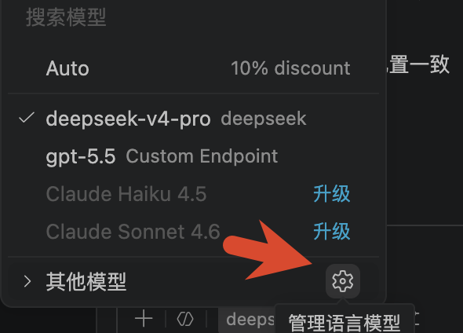
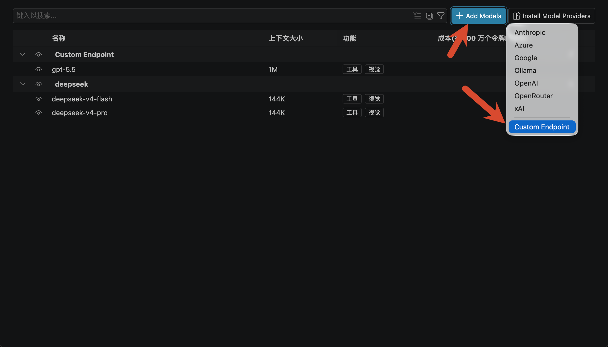
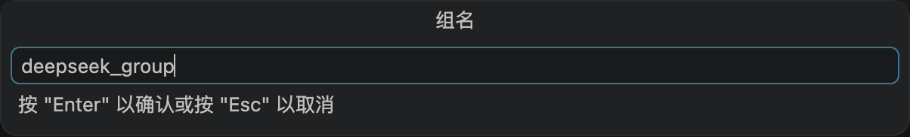
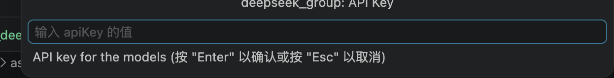
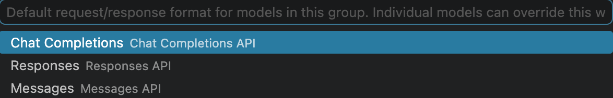
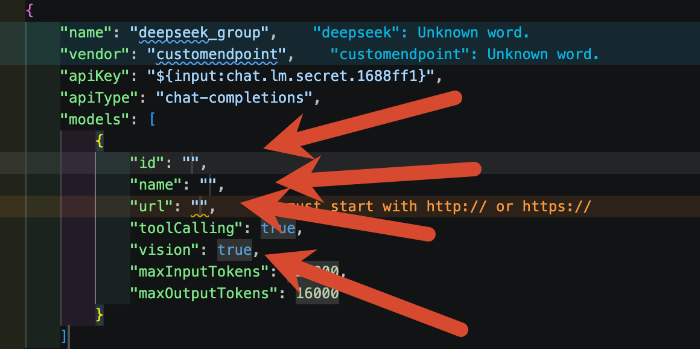

[English](./vscode_copilot.md) | [简体中文](./vscode_copilot.zh-CN.md) · [← 返回](../README.zh-CN.md)

# 接入 VS Code Copilot（原生配置）

VS Code 原生支持通过 `chatLanguageModels.json` 配置自定义 OpenAI 兼容的 API 端点——无需安装任何第三方扩展。你可以直接在 Copilot Chat 的模型选择器中使用 DeepSeek V4 模型，完整保留 Agent 模式、工具调用、MCP 等全部 Copilot 功能。

#### 1. 前提条件

- VS Code 1.100 或更高版本（自定义模型功能大约在该版本引入）。
- 拥有 GitHub Copilot 订阅（Free / Pro / Enterprise 均可，免费版即可使用）。
- 从 [platform.deepseek.com](https://platform.deepseek.com/api_keys) 获取 DeepSeek API Key。

#### 2. 打开 chatLanguageModels.json

- 打开命令面板（`Cmd+Shift+P` / `Ctrl+Shift+P`）。
- 执行 **Preferences: Configure Chat Language Models**。
- 这将在 VS Code 用户数据目录中打开 `chatLanguageModels.json`。

> **提示：** 你也可以手动找到此文件：
> - **macOS:** `~/Library/Application Support/Code/User/chatLanguageModels.json`
> - **Windows:** `%APPDATA%\Code\User\chatLanguageModels.json`
> - **Linux:** `~/.config/Code/User/chatLanguageModels.json`

<div align="center">

</div>

<div align="center">

</div>

#### 3. 添加 DeepSeek 配置

将以下 JSON 粘贴到 `chatLanguageModels.json` 的数组中。如果你已有其他自定义模型配置，将此对象并列添加即可：

```json
{
    "name": "DeepSeek",
    "vendor": "customendpoint",
    "apiKey": "${input:chat.lm.secret.deepseek}",
    "apiType": "chat-completions",
    "models": [
        {
            "id": "deepseek-v4-pro",
            "name": "DeepSeek V4 Pro",
            "url": "https://api.deepseek.com",
            "toolCalling": true,
            "vision": false,
            "thinking": true,
            "maxInputTokens": 1000000,
            "maxOutputTokens": 64000,
            "supportsReasoningEffort": [
                "low",
                "max",
                "xhigh"
            ]
        },
        {
            "id": "deepseek-v4-flash",
            "name": "DeepSeek V4 Flash",
            "url": "https://api.deepseek.com",
            "toolCalling": true,
            "vision": false,
            "thinking": true,
            "maxInputTokens": 1000000,
            "maxOutputTokens": 64000,
            "supportsReasoningEffort": [
                "low",
                "max",
                "xhigh"
            ]
        }
    ],
    "settings": {
        "deepseek-v4-pro": {
            "reasoningEffort": "xhigh"
        },
        "deepseek-v4-flash": {
            "reasoningEffort": "xhigh"
        }
    }
}
```

> **注意：** `${input:chat.lm.secret.deepseek}` 告诉 VS Code 在首次选择该模型时提示你输入 API Key。Key 将安全存储在操作系统密钥链中。

以下是在 VS Code 中逐步配置的截图：

<div align="center">

<p><em>步骤 1 — 设置组名为 "DeepSeek" 并选择供应商类型</em></p>
</div>

<div align="center">

<p><em>步骤 2 — 配置 API Key（安全存储在操作系统密钥链中）</em></p>
</div>

<div align="center">

<p><em>步骤 3 — 设置 API 端点 URL 为 https://api.deepseek.com</em></p>
</div>

<div align="center">

<p><em>步骤 4 — 添加模型配置（模型 ID、Token 限制、推理强度）</em></p>
</div>

#### 4. 设置 API Key

- 打开 Copilot Chat（`Cmd+Shift+I` / `Ctrl+Shift+I`）。
- 点击右上角的模型选择器。
- 选择 **DeepSeek V4 Pro** 或 **DeepSeek V4 Flash**。
- VS Code 会提示你输入 API Key，粘贴你的 DeepSeek API Key（以 `sk-` 开头）。

> **提示：** 如需更改或清除 API Key，从命令面板执行 **Preferences: Configure Chat Language Model Secrets**。

#### 5. 开始对话

配置完成！Agent 模式、工具调用、MCP 服务器、Skills、自定义指令——Copilot 的全部功能现在都由 DeepSeek V4 驱动。

#### 可选：配置思考深度

VS Code 原生的模型选择器支持按模型独立配置。在模型选择器中，点击 DeepSeek 模型旁的齿轮图标即可调整思考深度：

- **Low** — 最快，最小化推理。
- **Max** — 均衡深度推理。
- **XHigh** — 最深推理，适合复杂编码任务（推荐）。

你也可以通过 `chatLanguageModels.json` 中的 `settings` 字段设置默认推理强度。以上配置已将两个模型的 `"reasoningEffort"` 默认设为 `"xhigh"`。
