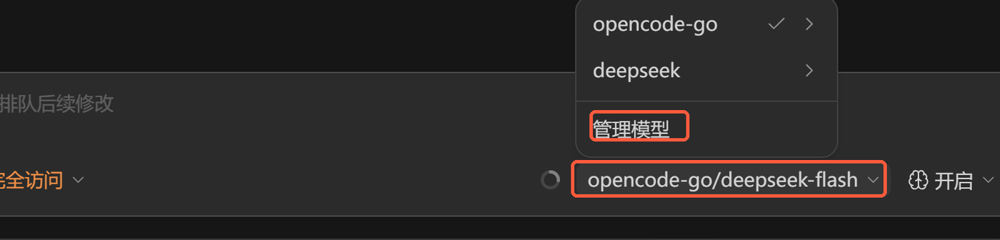
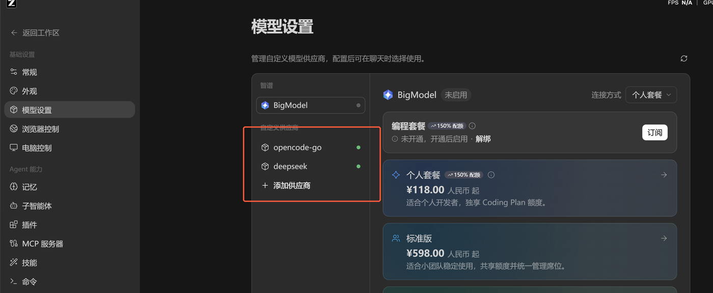
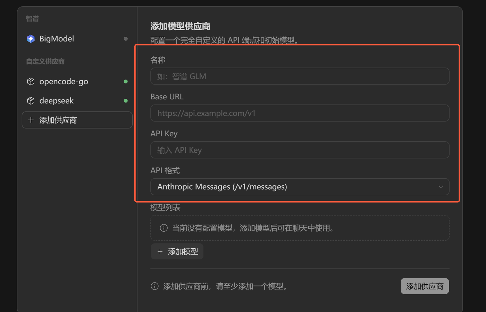
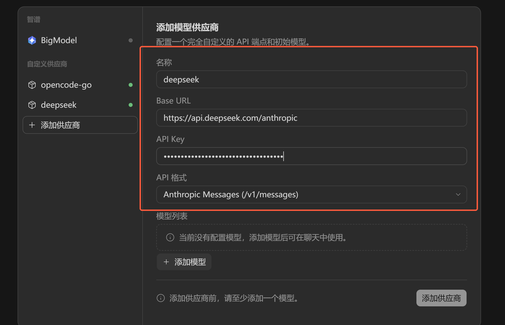
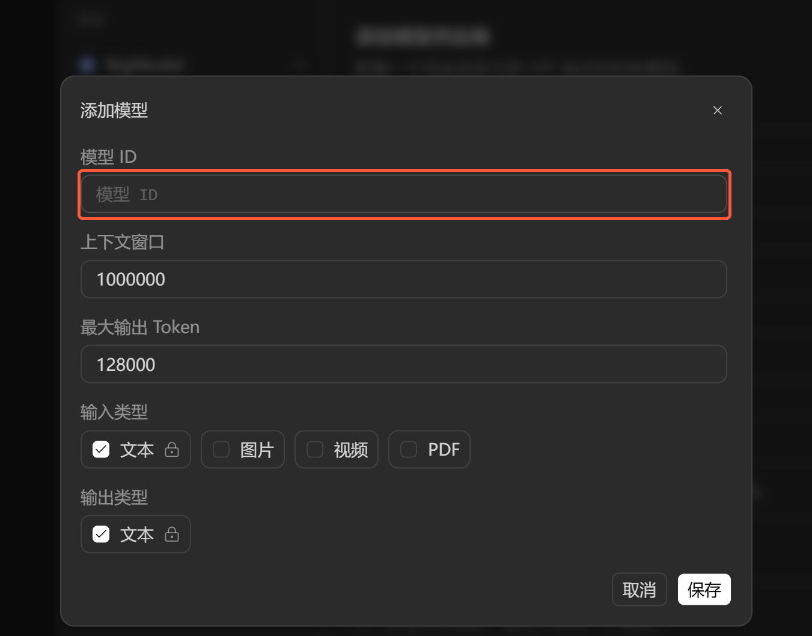
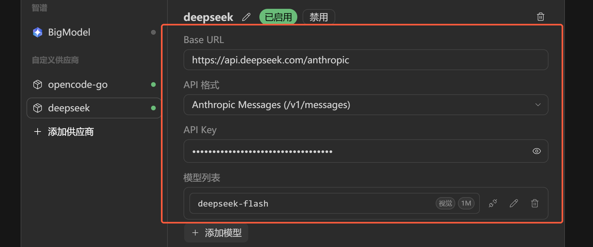
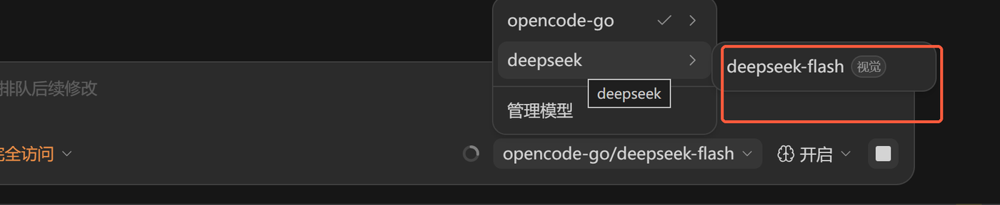

[English](./zcode.md) | [简体中文](./zcode.zh-CN.md) · [← Back](../README.md)

# 接入 ZCode

ZCode 是一款 AI 编程智能体桌面应用。除内置模型外，它还支持**自定义模型供应商**，因此可以注册 DeepSeek API，用 DeepSeek 模型驱动编程智能体。

DeepSeek 提供了 **Anthropic 兼容**接口（`/v1/messages`），ZCode 原生支持该格式，无需代理或额外工具。

#### 1. 安装 ZCode

从[官网](https://zcode.z.ai/)下载并安装 ZCode，然后登录。

#### 2. 获取 DeepSeek API Key

在 [DeepSeek 开放平台](https://platform.deepseek.com/api_keys)创建 API Key。

#### 3. 打开模型设置

点击聊天输入框底部的**模型名称**，在弹出的菜单中选择「**管理模型**」。

进入「**模型设置**」页面后，在「**自定义供应商**」分组下点击「**添加供应商**」。

#### 4. 添加 DeepSeek 供应商

按下表填写表单。「**API 格式**」默认即为 `Anthropic Messages (/v1/messages)`，这正是 DeepSeek 接口所使用的格式。

| 字段 | 取值 |
| --- | --- |
| 名称 | `deepseek` |
| Base URL | `https://api.deepseek.com/anthropic` |
| API Key | 你的 DeepSeek API Key |
| API 格式 | `Anthropic Messages (/v1/messages)` |

#### 5. 添加模型

供应商下没有模型时，「添加供应商」按钮处于禁用状态。点击「**添加模型**」并填写：

| 字段 | 取值 |
| --- | --- |
| 模型 ID | `deepseek-flash` |
| 上下文窗口 | `1000000` |
| 最大输出 Token | `128000` |
| 输入 / 输出类型 | `文本`（默认） |

`deepseek-flash` 是当前 DeepSeek V4.1 Flash 模型，支持 **1M token 上下文**——把上下文窗口设为 `1000000`，ZCode 才能用满整个窗口。若需要最强的编程能力，可以再注册一个模型 ID 为 `deepseek-v4-pro` 的模型。

> 较早的文档可能写作 `deepseek-v4-flash`；该名称已退役，现在同样指向 V4.1 Flash 模型。请以[定价页](https://api-docs.deepseek.com/zh-cn/quick_start/pricing)中的 `deepseek-flash` 为准。

点击「**保存**」关闭对话框，再点击「**添加供应商**」完成创建。

#### 6. 在聊天中使用 DeepSeek

供应商创建后即为「已启用」状态，其下会列出刚配置的模型：

在聊天输入框底部的模型菜单中选择该模型：

#### 7. 将推理强度设为「最高」

DeepSeek 会在回答前进行思考。请在聊天工具栏把「**推理强度**」设为「**最高**」，让模型使用完整的思考预算（`deepseek-v4-pro` 支持最高档位）：

> 工具栏 → **推理强度** → **最高**

如果该项为灰色不可选，说明当前模型不支持推理档位，请先切换到支持推理的 DeepSeek 模型。

#### 注意事项

- Base URL 必须以 `/anthropic` 结尾，API 格式要选 `Anthropic Messages (/v1/messages)`，而不是 OpenAI 兼容格式。
- ZCode 通过 `x-api-key` 请求头携带密钥；密钥仅保存在本地，界面上始终以掩码显示。
- DeepSeek 会把无法识别的模型名回退到 `deepseek-flash`，因此模型 ID 写错不会直接报错，请仔细核对。
- `anthropic-version`、`container`、`mcp_servers`、`top_k`、`cache_control` 等 Anthropic 专有参数会被 DeepSeek 接口忽略；`top_p` 仅在思考模式下生效。

#### 参考链接

- [DeepSeek — Using the Anthropic API](https://api-docs.deepseek.com/guides/anthropic_api)
- [DeepSeek 开放平台 — API Keys](https://platform.deepseek.com/api_keys)
- [ZCode 官网](https://zcode.z.ai/)
