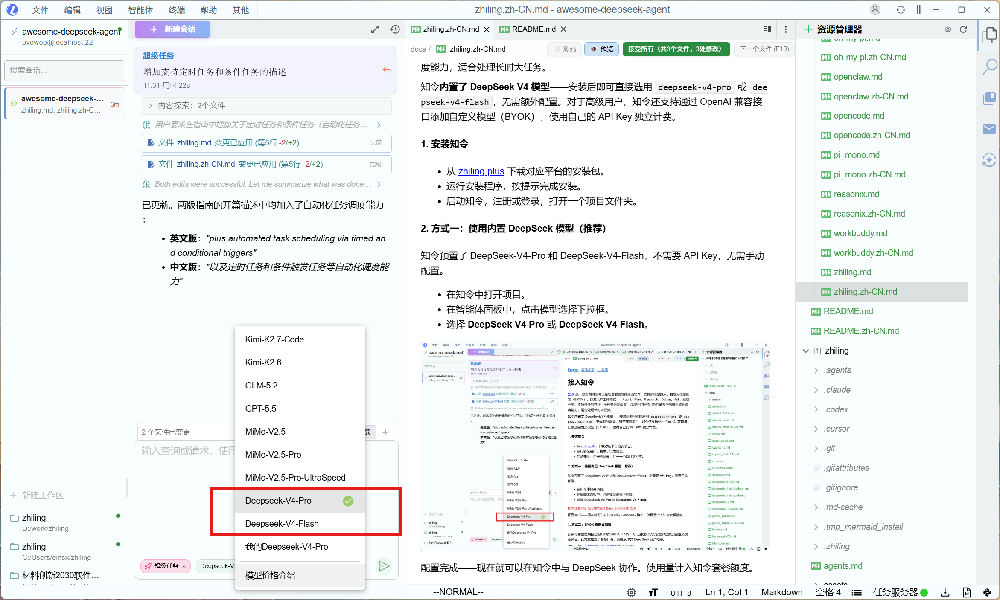
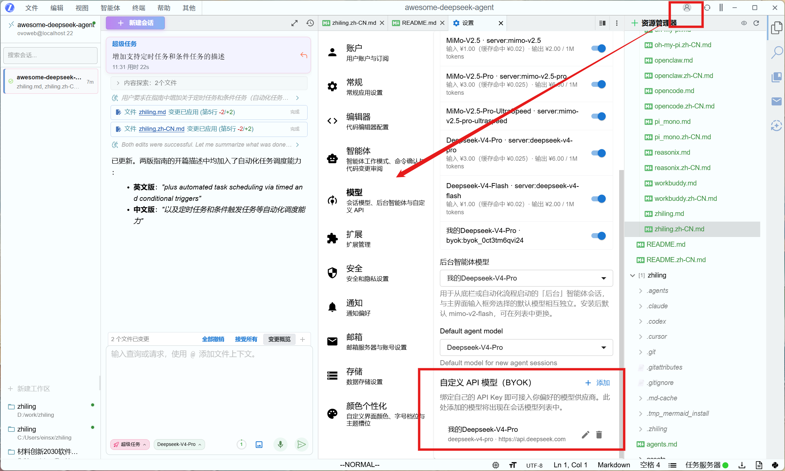
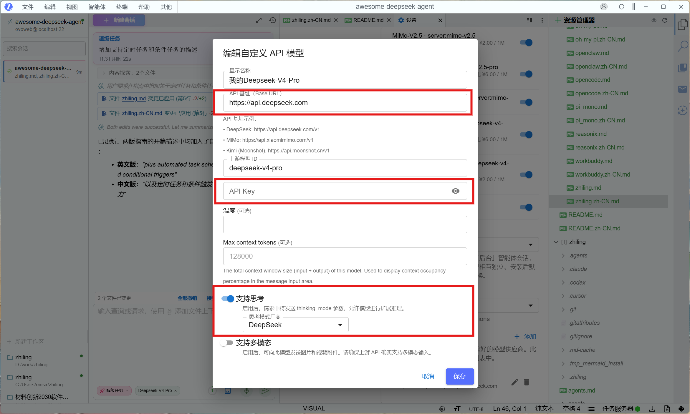
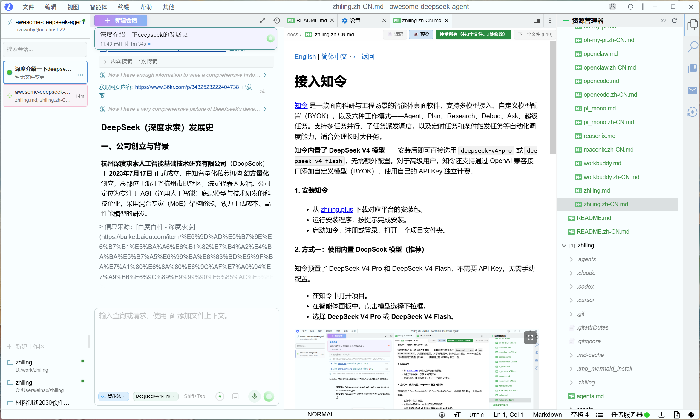

[English](./zhiling.md) | [简体中文](./zhiling.zh-CN.md) · [← Back](../README.md)

# Integrate with Zhiling

[Zhiling](https://zhiling.plus) is a smart agent desktop application designed for research and engineering workflows. It supports multiple LLM providers, custom model configuration (BYOK), and six work modes — Agent, Plan, Research, Debug, Ask, and Super Task — with capabilities for multi-task parallelism, subtask dispatch and scheduling, plus automated task scheduling via timed and conditional triggers, making it ideal for long-running complex tasks.

DeepSeek V4 models are **built into Zhiling** — you can start using `deepseek-v4-pro` or `deepseek-v4-flash` right after installation with no extra setup. For advanced users, Zhiling also supports BYOK (Bring Your Own Key) via its OpenAI-compatible custom model interface.

#### 1. Install Zhiling

- Download the latest installer for your platform from [zhiling.plus](https://zhiling.plus).
- Run the installer and follow the on-screen instructions.
- Launch Zhiling, sign up or log in, and open a project folder.

#### 2. Method 1: Built-in DeepSeek Models (Recommended)

Zhiling ships with DeepSeek-V4-Pro and DeepSeek-V4-Flash pre-configured. No API key or manual configuration is required.

- Open your project in Zhiling.
- In the agent panel, click the model selector dropdown.
- Choose **DeepSeek V4 Pro** or **DeepSeek V4 Flash**.



That's it — you can now start collaborating with DeepSeek inside Zhiling. Usage is counted against your Zhiling plan quota.

#### 3. Method 2: BYOK Custom Configuration

If you prefer to use your own DeepSeek API Key, you can add a custom model entry through Zhiling's settings. This runs independently of the plan quota and bills directly to your DeepSeek account.

First, get your API Key from the [DeepSeek Platform](https://platform.deepseek.com/api_keys).

Then, in Zhiling:

- Go to **Settings** → **Model**.



- Click **Add Custom Entry** (or the equivalent button in your version).
- Fill in the configuration fields as shown below:

| Field | Value | Notes |
|-------|-------|-------|
| Display Name | `DeepSeek V4 Pro` or `DeepSeek V4 Flash` | Any name you prefer; shown in the model selector |
| API Base URL | `https://api.deepseek.com` | Do **not** append `/v1` — Zhiling handles path construction automatically |
| Model Id | `deepseek-v4-pro` or `deepseek-v4-flash` | Must match exactly |
| API Key | `sk-xxxx...xxxx` | Your key from the DeepSeek Platform |
| Temperature | `0.6` (optional) | Controls output randomness; defaults to 0.6 |



- Save the entry. The custom model will now appear in the model selector alongside the built-in ones.
- **Keep your API Key secure**: keys are stored locally on your machine. Do not save them on shared or public devices.

#### 4. Using Zhiling with DeepSeek

- In the agent panel, confirm that a DeepSeek model is selected in the model dropdown.
- Choose a work mode (Agent, Plan, Research, Debug, Ask, or Super Task) that fits your task.
- Type your question or prompt and press Enter. Zhiling streams DeepSeek's response in real time.
- When using `deepseek-v4-pro`, Zhiling automatically enables deep thinking — you'll see the model's reasoning process alongside its final answer.



> **1M Context Window**: DeepSeek V4 models support up to **1 million tokens** of context. Zhiling passes context through without additional limits, so you get the full DeepSeek V4 context capacity.

> **Thinking Mode**: Zhiling detects the model provider and automatically adapts its thinking-mode parameters. When you select `deepseek-v4-pro`, the reasoning effort is set to `max` by default, giving you the best coding and analysis experience. You can adjust the effort level (between `high` and `max`) in the agent settings if needed.

#### Optional: Verify the Configuration

To confirm your API Key and model name are valid (for BYOK setups), you can test with `curl`:

```bash
curl https://api.deepseek.com/v1/chat/completions \
  -H "Content-Type: application/json" \
  -H "Authorization: Bearer <your-api-key>" \
  -d '{"model":"deepseek-v4-flash","messages":[{"role":"user","content":"hi"}],"stream":false}'
```

A successful response means your key and model name are ready to use.

#### Troubleshooting

- **The model selector doesn't show DeepSeek**: Make sure Zhiling is up to date. Built-in DeepSeek models are available from version 1.0+.
- **Authentication fails / 401 (BYOK only)**: Double-check that your API Key is correct and has not expired. Verify it on the [DeepSeek Platform](https://platform.deepseek.com/api_keys).
- **Model not found / 404 (BYOK only)**: Ensure the Model Id is exactly `deepseek-v4-pro` or `deepseek-v4-flash` — no typos, no extra spaces.
- **BYOK entry doesn't appear in the selector**: Go back to Settings → Model and confirm the entry was saved. You may need to restart Zhiling for the change to take effect.
- **Slow responses or timeouts**: Check your network connection. DeepSeek's API occasionally experiences high load — retrying usually resolves it.
- **API Base URL returns errors**: Make sure you entered `https://api.deepseek.com` without a trailing `/v1`. Zhiling appends the path internally — adding `/v1` yourself will cause a double-path error (e.g., `/v1/v1/chat/completions`).
